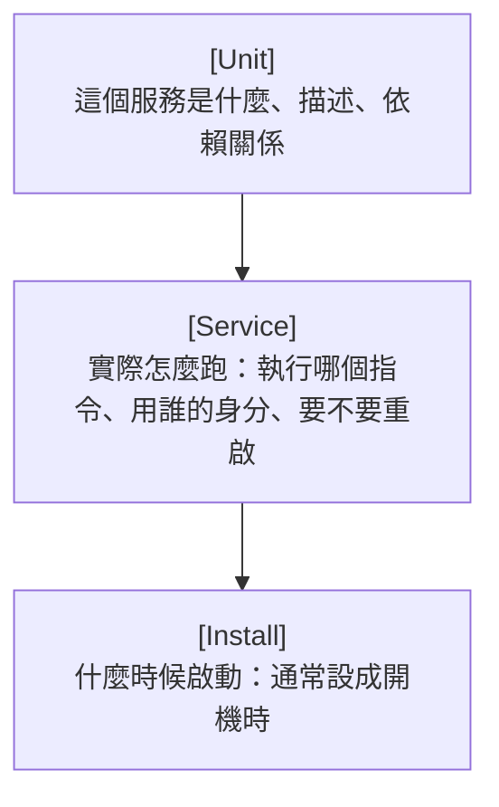

# [infra-4-2] 🔧 動手做：把你的程式寫成 systemd 服務

> **本章目標**：親手把一個程式寫成 systemd 服務，讓它背景常駐、掛掉自動重啟、開機自動啟動，並學會用 `journalctl` 看它的日誌。

## 你會學到

- systemd service 設定檔（`.service`）的結構
- 把一個程式註冊成「永遠待命」的服務
- 設定「掛掉自動重啟」
- 用 `journalctl` 查看服務的日誌

## 概念說明

### 你要做的事

上一章說過，正式服務需要「背景常駐 + 自動重啟 + 開機自啟」。這一章你就親手讓一個程式具備這三種能力——做法是寫一個 **`.service` 設定檔**，交給 systemd 這個總管。

把 `.service` 檔想成你給總管的一張**工作說明書**，上面寫清楚：

```
要跑的是哪個程式？
用哪個身分跑？
掛掉了要不要重啟？
什麼時候該啟動？
```

總管讀了這張說明書，就會照著幫你把服務顧好。

---

### 一個 service 檔的三大區塊

systemd 的 `.service` 檔有固定結構，分三段：



- **[Unit]**：服務的基本資訊（描述、要在哪個階段之後啟動）
- **[Service]**：核心——要執行什麼指令、用什麼身分、掛掉怎麼辦
- **[Install]**：什麼條件下啟動（`enable` 時會用到）

下面就一段一段把它寫出來。

## 程式碼範例

### 第一步：準備一個示範程式

為了專心學 systemd，我們用一個最簡單的程式。在 `deploy` 的家目錄建立一個小腳本（任何會「一直跑」的程式都行）：

```bash
vi /home/deploy/hello-service.sh
```

寫入一個每 10 秒印一次時間的無窮迴圈（模擬一個「常駐服務」）：

```bash
#!/bin/bash
while true; do
  echo "Hello from my service, time is $(date)"
  sleep 10
done
```

`while true` 是無窮迴圈，讓它一直跑不停——正式服務也是這樣「一直待命」。存檔後給它執行權限（還記得 Part 2-2 的 `chmod` 嗎）：

```bash
chmod +x /home/deploy/hello-service.sh
```

---

### 第二步：寫 service 設定檔

服務檔放在 `/etc/systemd/system/`（又是 `/etc` 設定大本營，Part 2-1 學過）。建立它：

```bash
sudo vi /etc/systemd/system/hello.service
```

寫入三段設定：

```ini
[Unit]
Description=My first hello service
After=network.target

[Service]
ExecStart=/home/deploy/hello-service.sh
Restart=always
User=deploy

[Install]
WantedBy=multi-user.target
```

逐行解釋最關鍵的幾個：

- `Description`：人看的說明，會出現在 `systemctl status` 裡。
- `After=network.target`：等「網路準備好」之後才啟動（很多服務需要網路）。
- `ExecStart`：**最重要的一行**——要執行的指令（用完整路徑）。
- `Restart=always`：**這就是「掛掉自動重啟」**！不管什麼原因停了，systemd 都會把它拉回來。
- `User=deploy`：用 `deploy` 這個一般使用者的身分跑（呼應 Part 2「別用 root 跑東西」的原則）。
- `WantedBy=multi-user.target`：`enable` 時，把它掛到「正常開機」這個階段，達成開機自動啟動。

---

### 第三步：讓 systemd 認得這個新服務

每次新增或修改 `.service` 檔，要叫 systemd 重新讀取設定：

```bash
sudo systemctl daemon-reload
```

`daemon-reload` 就是請總管「重新看一遍工作說明書」。然後用上一章學的指令，啟動並設定開機自啟：

```bash
sudo systemctl enable --now hello
```

確認它跑起來了：

```bash
systemctl status hello
```

看到 `active (running)`，恭喜——你的第一個自訂服務上線了。

---

### 第四步：用 journalctl 看日誌

服務在背景跑，它的輸出去哪了？systemd 幫你收集起來，用 **`journalctl`** 查看：

```bash
journalctl -u hello
```

`-u hello` 是 unit hello（指定看哪個服務）。你會看到程式印出的一行行 `Hello from my service...`。

最常用的是「即時跟看」（像看直播，新日誌會一直跑出來）：

```bash
journalctl -u hello -f
```

`-f` 是 follow（跟隨）。除錯時超好用——你可以一邊操作、一邊看服務即時吐什麼。看完按 `Ctrl+C` 離開。

---

### 第五步：驗證「自動重啟」真的有效

這是最有成就感的一步。先找出服務的行程 PID（Part 2-3 學過），然後**故意把它砍掉**，看 systemd 會不會自動把它救回來：

```bash
systemctl status hello        # 看到它的 Main PID 是多少
sudo kill 那個PID             # 故意砍掉它
systemctl status hello        # 過一兩秒再看，它又 active (running) 了！
```

你會發現 PID 變了——代表 systemd 偵測到它死了，**自動重新啟動了一個新的**。這就是 `Restart=always` 的威力，也是「正式服務」和「手動跑程式」最大的差別。

## 小練習

### 練習 1：完成整套流程

從第一步做到第五步，建立你自己的 `hello` 服務並驗證它能自動重啟。每一步都對照「這在解決上一章說的哪個問題（常駐 / 重啟 / 開機自啟）」。

---

### 練習 2：驗證「開機自動啟動」

如果你願意，重開機你的伺服器（`sudo reboot`），等它起來後重新 SSH 進去，跑 `systemctl status hello`。它應該**不用你手動啟動就自己在跑**了——這就是 `enable` 的效果。

> 注意：重開機會中斷你所有連線，確定現在重啟沒問題再做。

---

### 練習 3：清理

練習完，如果想移除這個示範服務：

```bash
sudo systemctl disable --now hello
sudo rm /etc/systemd/system/hello.service
sudo systemctl daemon-reload
```

想想看：這三行分別在做什麼？（提示：停用+停止、刪設定檔、請總管重讀。）

## 課外讀物

> 你寫的服務多半在處理 HTTP 請求，想深入理解 HTTP 的方法、標頭、狀態碼 → [課外讀物 E-3-3：HTTP 協定詳解](../../../課外讀物/E-3-network/E-3-3-http-protocol.md)
