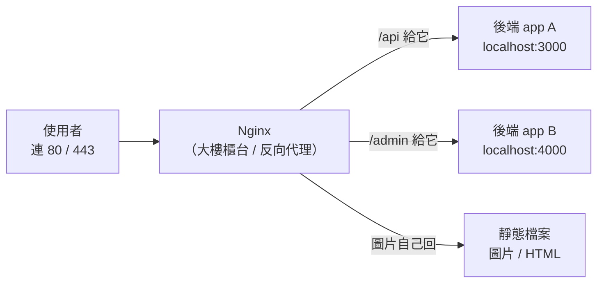

# [infra-4-3] Nginx 入門：反向代理與網站的「大樓櫃台」

> **本章目標**：理解 Nginx 在做什麼，搞懂「反向代理」這個核心概念，看懂 Nginx 設定檔的結構，並能讓它把外部請求轉給你後端的服務。

## 你會學到

- Nginx 是什麼、為什麼幾乎每個網站前面都有它
- 反向代理（Reverse Proxy）用「大樓櫃台」來理解
- Nginx 設定檔的結構與存放位置
- 讓 Nginx 把 80 port 的請求，轉給你後端的服務

## 概念說明

### 為什麼需要 Nginx？

假設你照 Part 4-2 把後端跑成了服務，它聽在 `localhost:3000`。但這有幾個問題：

1. 使用者連網站是連 **80（HTTP）/ 443（HTTPS）**，不是 3000。
2. 你可能有**好幾個**後端服務，需要有人依網址分流。
3. 你需要一個地方統一處理 **HTTPS 憑證、靜態檔案、壓縮**等等。
4. 直接把 Node/Python 程式暴露在網路最前線，**不夠安全也不夠強壯**。

這些事，交給一個專門的「門面」來處理最好——這就是 **Nginx**（唸 "engine-x"）。它是世界上最多網站在用的網頁伺服器與反向代理。

---

### 核心概念：反向代理（Reverse Proxy）

這是這一章最重要的概念，用**大樓櫃台**來理解。

想像一棟辦公大樓，裡面有很多公司（你的各個後端服務）。訪客不會自己亂闖進某間辦公室，而是：

```
訪客 → 先到「大廳櫃台」→ 櫃台依需求指引 → 帶到對的辦公室
```

**Nginx 就是這個櫃台。** 所有外部請求都先到 Nginx，由它依照網址，把請求**轉交（代理）**給後面對應的服務。



這張圖在說：使用者只跟櫃台（Nginx）打交道，Nginx 在背後把不同請求分派到對的地方。後端服務全都躲在 Nginx 後面，不直接面對網路。

> 為什麼叫「**反向**」代理？因為一般「代理」是替「使用者」出門（像 VPN）；反向代理是站在「**伺服器這一側**」，替後端服務擋在最前面、代為接客。方向相反，所以叫反向。

---

### 反向代理帶來的好處

讓 Nginx 站在前面當櫃台，你一次得到很多好處：

| 好處 | 說明 |
|------|------|
| **統一入口** | 使用者只連 80/443，不用管後面是哪個服務、哪個 port |
| **HTTPS 集中處理** | 憑證裝在 Nginx 一處就好（下一章做），後端不用各自處理 |
| **保護後端** | 後端只聽 localhost，不直接暴露在網路上，安全得多 |
| **負載平衡** | 後端有多台時，Nginx 能把流量分散過去（Part 9 會講） |
| **靜態檔案快** | 圖片、CSS 這類檔案 Nginx 自己回應，比丟給後端快 |

## 程式碼範例

### 安裝 Nginx

用 Part 2-5 學的套件管理：

```bash
sudo apt update
sudo apt install nginx
```

裝好後 Nginx 通常會自動啟動。用 Part 4-1 的指令確認：

```bash
systemctl status nginx
```

看到 `active (running)` 就成功了。這時用瀏覽器連你伺服器的 IP，應該會看到 Nginx 的歡迎頁。

> 別忘了 Part 3-3 的防火牆——要讓外部連得到，`ufw` 得放行 80/443。

---

### 認識設定檔的結構

Nginx 的設定檔放在 `/etc/nginx/`（又是 `/etc`）。結構是這樣：

```
/etc/nginx/
├── nginx.conf              ← 主設定檔（通常不用大改）
├── sites-available/        ← 「所有」網站設定（草稿區）
│   └── default
└── sites-enabled/          ← 「已啟用」的網站設定（實際生效的）
```

一個慣例：你在 `sites-available/` 寫網站設定，再「啟用」它（在 `sites-enabled/` 建一個連結指過去）。這樣可以保留多份設定，隨時切換要啟用哪些——像「草稿夾」和「已發布」的分別。

---

### 寫一個反向代理設定

假設你的後端服務（Part 4-2 那種）跑在 `localhost:3000`，你要讓 Nginx 把請求轉給它。建立一份網站設定：

```bash
sudo nano /etc/nginx/sites-available/myapp
```

寫入：

```nginx
server {
    listen 80;
    server_name myapp.com;

    location / {
        proxy_pass http://localhost:3000;
        proxy_set_header Host $host;
        proxy_set_header X-Real-IP $remote_addr;
    }
}
```

逐段解釋：

- `server { ... }`：一個網站的設定區塊。
- `listen 80`：聽 80 port（HTTP）。
- `server_name myapp.com`：這份設定負責哪個網域。
- `location / { ... }`：所有路徑（`/` 開頭，即全部）的請求這樣處理。
- `proxy_pass http://localhost:3000`：**核心這一行**——把請求轉給後端的 3000。這就是「反向代理」。
- `proxy_set_header ...`：把使用者的真實資訊（來源 IP、網域）一併轉給後端，否則後端只會看到「請求來自 localhost」。

---

### 啟用設定並重載

把設定從「草稿」變「啟用」——在 `sites-enabled/` 建一個指向它的連結：

```bash
sudo ln -s /etc/nginx/sites-available/myapp /etc/nginx/sites-enabled/
```

`ln -s` 建立的是「符號連結」（像捷徑）。接著做一件**每次改完 Nginx 設定都該做的事**——先測試設定有沒有寫錯：

```bash
sudo nginx -t
```

`-t` 是 test。如果它說 `syntax is ok` 和 `test is successful`，才安全。確認沒錯再重載設定：

```bash
sudo systemctl reload nginx
```

> 為什麼用 `reload` 不用 `restart`？`reload` 是「不中斷服務地重新載入設定」，現有連線不會斷；`restart` 會整個重啟。改設定優先用 `reload`。

## 小練習

### 練習 1：用「大樓櫃台」解釋反向代理

不看上面，用「大樓櫃台」的類比，向朋友解釋什麼是反向代理、為什麼後端服務要躲在 Nginx 後面。

---

### 練習 2：安裝並確認 Nginx

在你的伺服器上裝好 Nginx，確認 `systemctl status nginx` 是 running，並從瀏覽器連你的 IP 看到歡迎頁。如果連不到，回想 Part 3-3——是不是防火牆沒開 80？

---

### 練習 3：理解設定流程

用自己的話排出「修改 Nginx 設定」的正確步驟順序，並說明每一步的目的：

```
reload nginx ／ nginx -t ／ 編輯 sites-available ／ 建立 sites-enabled 連結
```

> 提示：寫設定 → 啟用 → **先測試** → 再重載。那個「先測試」是老手不會跳過的保命步驟。

## 課外讀物

> 想深入理解 Nginx 在轉發的那些 HTTP 標頭、方法、狀態碼到底是什麼 → [課外讀物 E-3-3：HTTP 協定詳解](../../../課外讀物/E-3-network/E-3-3-http-protocol.md)
