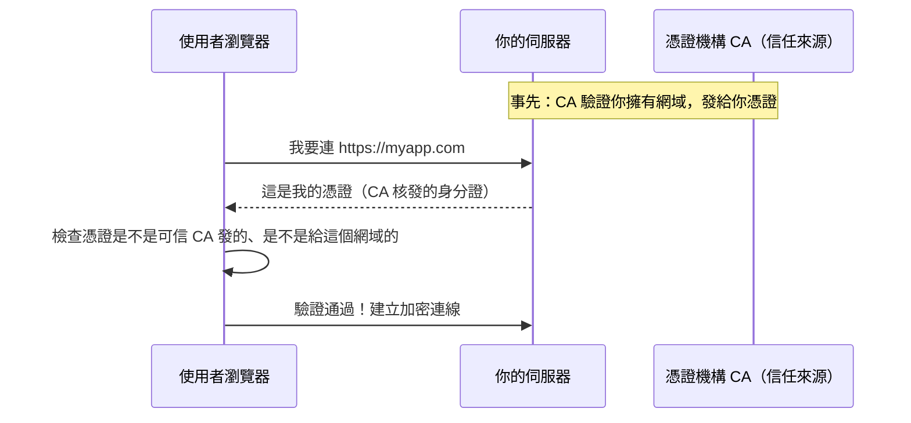

# [infra-4-4] HTTPS 憑證：用 Let's Encrypt 免費上鎖

> **本章目標**：理解 HTTPS 與憑證在做什麼，用 Let's Encrypt + certbot 免費幫你的網站加上 HTTPS，並讓它自動續期。

## 你會學到

- HTTP 與 HTTPS 的差別，以及「憑證」是什麼
- 為什麼瀏覽器會信任一個網站的 HTTPS
- 用 certbot 一鍵幫 Nginx 申請並安裝免費憑證
- 憑證會過期——怎麼設定自動續期

## 概念說明

### HTTP 的問題：所有東西都用「明信片」寄

Part 4-3 我們讓網站在 80 port（HTTP）跑起來了。但 HTTP 有個大問題：**它傳輸的內容是「裸奔」的**——中間任何一個經手的人（你連的 Wi-Fi、沿途的網路設備）都能看到、甚至竄改你傳的東西。

用類比：HTTP 就像寄**明信片**——郵差和經手的每個人都能讀你寫了什麼。你登入時的密碼、信用卡卡號，全都這樣裸著傳，非常危險。

**HTTPS（HTTP Secure）** 則像把信裝進**上鎖的保險箱**再寄。中間就算被攔截，也只看到一團加密的亂碼，解不開。現代網站幾乎都必須用 HTTPS——瀏覽器甚至會對純 HTTP 網站標示「不安全」。

> HTTPS 的加密技術細節（TLS、加密如何運作）這裡不展開，課外讀物 E-3-2 有完整說明。這一章我們專注「怎麼幫你的網站裝上它」。

---

### 憑證：證明「你真的是你」

HTTPS 除了加密，還要解決一個信任問題：**使用者怎麼確定，他連到的真的是 `myapp.com`，而不是假冒的釣魚網站？**

答案是**憑證（Certificate）**。它像一張由公信單位核發的**身分證**：一個叫 **CA（Certificate Authority，憑證頒發機構）** 的可信任機構，驗證你真的擁有這個網域後，發給你一張憑證。瀏覽器內建信任這些 CA，所以看到合法憑證就會顯示那個「鎖頭」圖示。



這張圖在說：伺服器出示 CA 核發的憑證，瀏覽器驗證無誤後，才建立加密連線。

---

### Let's Encrypt：免費、自動的憑證

以前憑證要花錢買、手動安裝，很麻煩。現在有 **Let's Encrypt**——一個**免費**、自動化的 CA，專門讓大家輕鬆上 HTTPS。

搭配一個叫 **certbot** 的工具，它能幫你：自動向 Let's Encrypt 申請憑證 → 自動改好 Nginx 設定 → 自動設定續期。幾乎一鍵搞定。

> **前提**：申請憑證需要你**擁有一個網域**（如 `myapp.com`），而且它的 DNS 已指向你伺服器的 IP（還記得 Part 3-1 的 DNS 嗎）。Let's Encrypt 要靠這個來驗證「這個網域真的是你的」。

## 程式碼範例

### 第一步：安裝 certbot

```bash
sudo apt update
sudo apt install certbot python3-certbot-nginx
```

`python3-certbot-nginx` 是讓 certbot 能「自動改 Nginx 設定」的外掛。

---

### 第二步：一鍵申請並安裝憑證

```bash
sudo certbot --nginx -d myapp.com
```

`--nginx` 告訴 certbot「我用 Nginx，請幫我自動設定」；`-d myapp.com` 指定要保護的網域（換成你的）。

執行後它會問你幾個問題：填一個聯絡 email（憑證快過期會通知你）、同意服務條款。然後 certbot 會自動：

1. 向 Let's Encrypt 驗證你擁有這個網域
2. 拿到憑證
3. **自動修改你的 Nginx 設定**，加上 443（HTTPS）的設定、並把 HTTP 自動轉址到 HTTPS

成功後，你用瀏覽器連 `https://myapp.com`，就會看到那個安全鎖頭了。

> 別忘了防火牆（Part 3-3）要放行 443，否則外部連不到 HTTPS。

---

### 第三步：確認自動續期

Let's Encrypt 的憑證**只有 90 天有效**（這是它的安全設計）。但你不用手動續——certbot 安裝時會自動設定一個排程，定期幫你續期。

確認這個自動續期機制有在運作：

```bash
sudo systemctl status certbot.timer
```

`certbot.timer` 是 systemd 的「定時器」（Part 6 會深入排程概念）。看到它 `active` 就代表自動續期已就緒。

你也可以「演練」一次續期，確認流程沒問題（`--dry-run` 是模擬、不真的續）：

```bash
sudo certbot renew --dry-run
```

看到 successful 就代表將來會自動續期成功，你不用再操心。

## 小練習

### 練習 1：用類比解釋 HTTPS

用「明信片 vs 上鎖保險箱」和「身分證」這兩個類比，向朋友解釋：

1. HTTPS 比 HTTP 多了什麼保護？
2. 「憑證」解決了什麼信任問題？

---

### 練習 2：幫你的網站上 HTTPS

如果你有網域且已指向你的伺服器，跑完整流程，讓 `https://你的網域` 出現安全鎖頭。

> 沒有網域的話：可以先去申請一個便宜的網域，或把這章當概念理解，等 Part 4-5 的總整理專案一起做。

---

### 練習 3：理解「為什麼要自動續期」

Let's Encrypt 憑證 90 天就過期。回答：

1. 如果沒設自動續期，90 天後會發生什麼事？（提示：使用者連網站會看到什麼可怕的警告）
2. 為什麼「自動化」這件事，對 infra 工程師這麼重要？

> 提示：這呼應了 Part 1-1 說的——現代 infra 的核心就是「能自動就別手動」，因為人會忘記。

## 課外讀物

> 想深入理解 HTTPS 背後的 TLS、加密如何運作 → [課外讀物 E-3-2：HTTPS 與 TLS](../../../課外讀物/E-3-network/E-3-2-https-tls.md)
