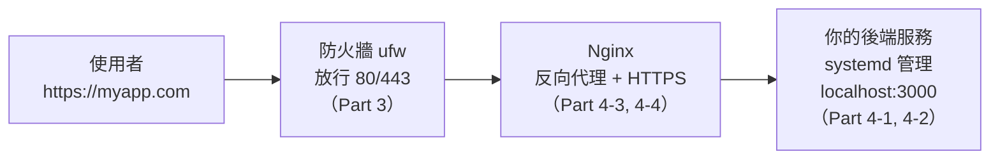

# [infra-4-5] 🏆 動手做：用 Nginx + systemd + HTTPS 跑起一個對外網站

> **本章目標**：把整個 Part 4 串起來——在你的伺服器上，從零部署一個真正對外、有 HTTPS、會自動重啟的網站。這是你第一個完整的 infra 成果。

## 你會學到

- 把 systemd、Nginx、HTTPS 三個技能整合成一條完整的部署流程
- 一個請求從使用者到你後端的完整路徑
- 部署後的驗證與基本除錯
- 建立一份可重複的「部署檢查清單」

## 概念說明

### 你要組裝的完整架構

前面四章學的每塊拼圖，這一章要拼成一張完整的圖。先看清楚最終長什麼樣：



這張圖就是這一章的藍圖。一個請求的旅程是：使用者 → 穿過防火牆（只有 80/443 開著）→ 到 Nginx（解開 HTTPS、依網址轉發）→ 交給躲在後面、由 systemd 顧著的後端服務。

每一段你都學過了，現在把它們接起來。

---

### 完整部署流程總覽

```
① 準備後端程式，跑在 localhost:3000
② 用 systemd 把它變成「常駐 + 自動重啟」的服務   ← Part 4-1, 4-2
③ 裝 Nginx，設定反向代理把請求轉給 :3000        ← Part 4-3
④ 確認防火牆放行 80/443                          ← Part 3-3
⑤ 用 certbot 加上 HTTPS                          ← Part 4-4
⑥ 驗證整條路徑都通
```

## 程式碼範例

> 以下假設你有一個網域並已指向伺服器 IP。沒有的話，前 4 步（到反向代理）仍可用 IP 測試，HTTPS 那步等有網域再補。

### ① 準備一個後端程式

用任何你會的語言都行。這裡用一個極簡的 Node 後端當例子，放在 `/home/deploy/myapp/server.js`：

```javascript
const http = require("http");

const server = http.createServer((req, res) => {
  res.writeHead(200, { "Content-Type": "text/plain; charset=utf-8" });
  res.end("我的網站上線了！這個回應來自 systemd 管理的後端服務。\n");
});

// 只聽 localhost，不直接對外——對外的事交給 Nginx
server.listen(3000, "127.0.0.1", () => {
  console.log("後端服務啟動，聽在 127.0.0.1:3000");
});
```

注意 `server.listen(3000, "127.0.0.1", ...)`——它**只聽 localhost**，刻意不直接對外，把「對外接客」這件事完全交給 Nginx（呼應 4-3 的「後端躲在 Nginx 後面」）。

---

### ② 用 systemd 讓它常駐

建立服務檔（做法同 Part 4-2）：

```bash
sudo nano /etc/systemd/system/myapp.service
```

```ini
[Unit]
Description=My web app backend
After=network.target

[Service]
ExecStart=/usr/bin/node /home/deploy/myapp/server.js
Restart=always
User=deploy

[Install]
WantedBy=multi-user.target
```

啟動並設開機自啟：

```bash
sudo systemctl daemon-reload
sudo systemctl enable --now myapp
systemctl status myapp
```

在伺服器上先自測後端有沒有活（用 Part 3-4 的 curl）：

```bash
curl http://localhost:3000
```

看到「我的網站上線了！」就代表 ② 完成。

---

### ③ 設定 Nginx 反向代理

建立網站設定（做法同 Part 4-3）：

```bash
sudo nano /etc/nginx/sites-available/myapp
```

```nginx
server {
    listen 80;
    server_name myapp.com;

    location / {
        proxy_pass http://localhost:3000;
        proxy_set_header Host $host;
        proxy_set_header X-Real-IP $remote_addr;
    }
}
```

啟用、測試、重載：

```bash
sudo ln -s /etc/nginx/sites-available/myapp /etc/nginx/sites-enabled/
sudo nginx -t
sudo systemctl reload nginx
```

---

### ④ 確認防火牆放行

```bash
sudo ufw allow 'Nginx Full'    # 一次開 80 + 443
sudo ufw status
```

現在從你自己電腦的瀏覽器連 `http://myapp.com`（或伺服器 IP），應該看到後端的回應——代表「使用者 → Nginx → 後端」整條通了。

---

### ⑤ 加上 HTTPS

```bash
sudo certbot --nginx -d myapp.com
```

certbot 會自動改好 Nginx 設定、加上 443 並把 HTTP 轉址到 HTTPS。完成後連 `https://myapp.com`，看到安全鎖頭就大功告成。

---

### ⑥ 驗證整條路徑

用 Part 3-4 的工具，從外到內驗證每一段：

```bash
# DNS 有指對嗎？
dig +short myapp.com

# HTTPS 回應正常嗎？（從你自己電腦）
curl -I https://myapp.com

# 後端服務還活著嗎？（在伺服器上）
systemctl status myapp

# Nginx 健康嗎？
systemctl status nginx
```

全部正常，你就完成了人生第一個「自架、對外、加密、會自動重啟」的網站部署。🎉

## 小練習

### 練習 1：完成部署

在你的伺服器上，從 ① 做到 ⑥，把網站完整部署上線。卡關時，用 Part 3-4 的分層排查（DNS → 網路 → 服務在聽嗎 → 服務回應嗎）定位問題。

---

### 練習 2：驗證韌性

部署完成後，故意「破壞」再觀察自癒：

```bash
# 找出後端 PID 並砍掉
systemctl status myapp
sudo kill 那個PID
# 立刻重新整理網站——可能瞬斷一下，但很快又正常
# 因為 Restart=always 讓 systemd 自動把它救回來
```

體會一下：因為有 systemd，你的服務「死了會自己活過來」。這就是正式部署和「手動跑一下」的本質差別。

---

### 練習 3：寫下你的「部署檢查清單」

把這次部署的步驟，整理成一份你自己的 checklist（後端 → systemd → Nginx → 防火牆 → HTTPS → 驗證）。

> 提示：這份清單在 Part 5（容器化）和 Part 6（Ansible 自動化）會不斷進化——你會發現「手動做一次很有感，但做十次就該自動化」，這正是 infra 思維的成長軌跡。

## 課外讀物

> 想理解你這個網站背後，從使用者按下 Enter 到看到頁面的完整網路旅程 → [課外讀物 E-3-1：網際網路是怎麼運作的？](../../../課外讀物/E-3-network/E-3-1-how-internet-works.md)
