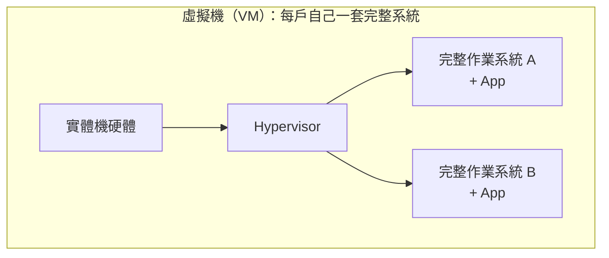
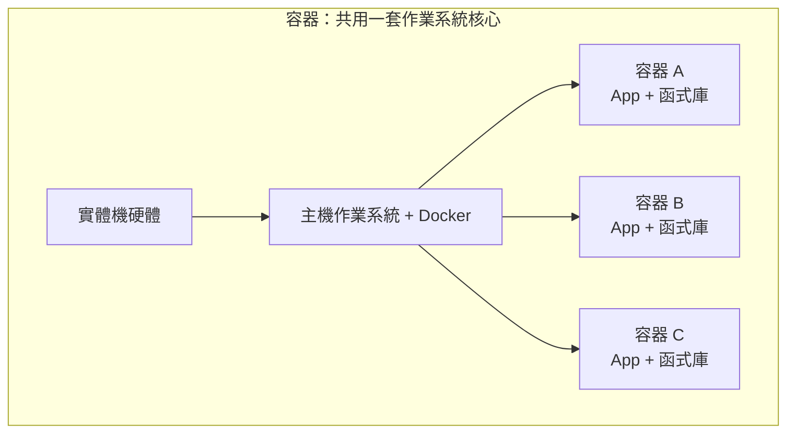

# [infra-5-1] 為什麼要 Docker？解決「在我電腦上明明可以跑」

> **本章目標**：理解 Docker 解決的核心問題，搞懂「容器」和前面學的虛擬機差在哪，知道為什麼現代部署幾乎都用容器。

## 你會學到

- 「在我電腦上明明可以跑」這個世紀難題到底是什麼
- Docker 用「貨櫃」的概念怎麼解決它
- 容器（Container）和虛擬機（VM）的關鍵差別
- 為什麼容器又輕又快，成為現代部署的主流

## 概念說明

### 世紀難題：「在我電腦上明明可以跑」

幾乎每個工程師都遇過這個惡夢：

> 你在自己電腦把程式寫好、跑得好好的。一部署到伺服器，就壞了。
> 你說「可是在我電腦上明明可以跑啊？！」

為什麼會這樣？因為**你的電腦和伺服器，環境不一樣**：

- Node 版本不同（你的是 20，伺服器是 16）
- 少裝了某個系統工具或函式庫
- 作業系統不同（你的 Mac，伺服器 Ubuntu）
- 環境變數、設定檔的差異

程式跑起來，靠的不只是你寫的那幾行碼，還有它**周圍一整套環境**。環境一變，就出事。

---

### Docker 的解法：把「環境」一起打包帶走

Docker 的核心點子非常簡單也非常強大：

> **既然環境不一致是問題，那就把「程式 + 它需要的整套環境」打包成一個盒子，整盒搬到哪都一樣。**

這個「盒子」就是**容器（Container）**。

用**航運貨櫃**來類比（Docker 的 logo 就是鯨魚馱著貨櫃，不是沒原因的）：

以前運貨，每件貨物形狀大小不一，搬上船、轉火車、卸貨都要重新喬，超麻煩。**貨櫃**發明後，不管裡面裝什麼，外箱規格統一——船、港口、卡車只要會處理「標準貨櫃」就好，裡面是什麼都不影響搬運。

Docker 把你的應用程式裝進「標準貨櫃」：不管裡面是 Node、Python 還是 Java，**對外都是一個標準容器**。你的電腦、測試機、正式伺服器，只要會跑 Docker，就能跑這個容器——而且**裡面的環境完全一致**。「在我電腦上可以跑」從此變成「在哪都能跑」。

---

### 容器 vs 虛擬機：又是「住的地方」

還記得 Part 1-3 用「住的地方」比喻過 VM 和容器嗎？這裡更深入比較，因為這是理解容器的關鍵。





關鍵差別在於：

| | 虛擬機（VM） | 容器（Container） |
|---|------------|------------------|
| 包含什麼 | **整套作業系統** + App | 只有 **App + 它需要的函式庫** |
| 大小 | 很大（好幾 GB） | 很小（常常幾十 MB） |
| 啟動速度 | 慢（要開機一整個系統，幾十秒） | 快（幾秒甚至更快） |
| 一台機器能跑幾個 | 少（每個都很重） | 多（很輕，能塞幾十個） |
| 隔離程度 | 非常徹底 | 夠用，但共用核心 |

**最核心的一句話**：VM 連「作業系統」都自己帶一套，所以重；容器**共用主機的作業系統核心**，只帶自己的應用層，所以又輕又快。

---

### 為什麼容器成為主流

把上面的好處整理一下，你就懂為什麼現在大家都用容器：

- **一致性**：開發、測試、正式環境完全一樣，告別「在我電腦上可以跑」。
- **輕量快速**：秒級啟動，一台機器能跑很多個。
- **好複製、好擴展**：要多開 10 個一模一樣的，輕而易舉（這對 Part 9 的擴展、AWS 的容器平台是基礎）。
- **乾淨**：容器刪掉，環境就乾乾淨淨，不會在主機留一堆垃圾。

> 容器多到一台機器放不下、需要跨多台協調管理時，就需要「容器編排」工具（如 Kubernetes）——那是 AWS 課程和進階主題的範疇。這個 Part 我們先把單機的 Docker 學紮實。

## 程式碼範例

這一章先建立觀念，動手從下一章開始。但你可以先在伺服器上把 Docker 裝起來，並驗證它能動。

安裝 Docker（Ubuntu 上最簡單的官方安裝腳本）：

```bash
curl -fsSL https://get.docker.com | sudo sh
```

這行會下載 Docker 官方的安裝腳本並執行。裝完後，把你的使用者加進 `docker` 群組，這樣不用每次都 `sudo`（呼應 Part 2-2 的群組概念）：

```bash
sudo usermod -aG docker deploy
```

> 改群組後要**重新登入**才會生效。

驗證 Docker 裝好了、而且能動——跑一個官方的測試容器：

```bash
docker run hello-world
```

如果看到一段「Hello from Docker!」的訊息，代表 Docker 成功下載了一個容器、跑起來、印出訊息然後結束。你的容器世界正式開張。

## 小練習

### 練習 1：用「貨櫃」解釋 Docker

不看上面，用「航運貨櫃」的類比，向朋友解釋：

1. Docker 解決了什麼問題？
2. 「把環境一起打包」為什麼能解決「在我電腦上可以跑」？

---

### 練習 2：說清楚容器和 VM 的差別

回答這兩題：

1. 為什麼容器比 VM 小很多、快很多？（關鍵字：作業系統核心）
2. 如果你要在一台機器上跑 20 個小服務，用 VM 還是容器比較合適？為什麼？

---

### 練習 3：裝好 Docker

在你的伺服器上裝好 Docker，跑 `docker run hello-world` 確認成功。再跑一個試試看：

```bash
docker run -it ubuntu bash
```

`-it` 讓你能「進到」這個容器裡互動。你會發現自己進到了一個乾淨的 Ubuntu 環境裡——這就是一個容器。打 `exit` 離開，想想看：這個臨時的 Ubuntu，跟你的主機系統是同一個嗎？

## 課外讀物

> 想了解容器多到一台機器放不下時，怎麼用 Kubernetes 跨機器協調管理 → [課外讀物 E-13-3：Kubernetes 概念入門](../../../課外讀物/E-13-scaling/E-13-3-kubernetes-intro.md)
