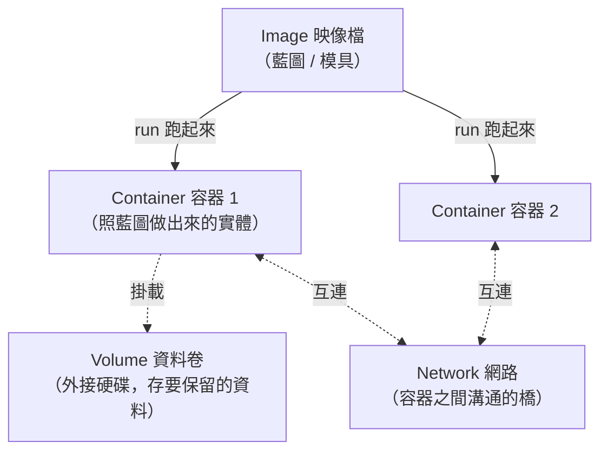

# [infra-5-2] 四大概念：Image、Container、Volume、Network

> **本章目標**：搞懂 Docker 最核心的四個名詞——Image、Container、Volume、Network，它們各自是什麼、彼此什麼關係，之後看任何 Docker 指令都不會迷路。

## 你會學到

- Image（映像檔）與 Container（容器）的關係
- 為什麼容器「刪掉資料就不見」，以及 Volume 怎麼解決
- 容器之間怎麼互相溝通（Network）
- 用幾個指令實際操作這四個概念

## 概念說明

### 先建立全景：四個概念怎麼串

Docker 的世界有四個你天天會碰到的名詞。先用一張圖看它們的關係，再逐一拆解：



下面一個一個講清楚。

---

### Image 與 Container：模具與成品

這是最重要、也最容易混的一對。用 Part 2-3 學過的類比延伸：

- **Image（映像檔）**：一個**唯讀的「模具/藍圖」**，裡面打包好了「程式 + 環境」。它是靜態的、不會動的。像一個**做餅乾的模具**。
- **Container（容器）**：用 Image **跑起來**的那個「活的實體」。像用模具壓出來的**一塊真正的餅乾**。

關鍵關係：**一個 Image 可以跑出很多個 Container**。就像一個模具能壓出無數塊餅乾。你下 `docker run`，就是「拿這個 image 當模具，做出一個正在跑的 container」。

（如果你記得 Part 2-3「程式 vs 行程」——Image 之於 Container，就像 程式 之於 行程。靜態的範本 vs 動態的實例。）

Image 從哪來？通常從 **Docker Hub**（一個公開的 image 倉庫，像 image 版的 App Store）下載別人做好的，例如官方的 `nginx`、`postgres`；或你自己用 Dockerfile 做（下一章）。

---

### Volume：容器的「外接硬碟」

容器有一個一開始會嚇到人的特性：**容器刪掉，裡面的資料就全部消失。**

這其實是**刻意的設計**——容器被設計成「用完即丟、隨時可重建」。但問題來了：資料庫的資料、使用者上傳的檔案，這些**不能跟著容器一起消失**啊！

解法是 **Volume（資料卷）**：一塊**獨立於容器之外**的儲存空間，「掛」到容器裡。容器把重要資料寫進 Volume，這樣就算容器被刪掉重建，**資料還在 Volume 裡，安然無恙**。

用類比：容器像一台**隨時可能格式化重灌的電腦**，Volume 是你的**外接硬碟**——重灌電腦，外接硬碟的檔案不受影響。

> 這呼應了 Part 2-4 學的「掛載」概念：Volume 就是把一塊獨立儲存「掛載」進容器的某個路徑。

---

### Network：容器之間的「溝通橋樑」

真實應用通常不只一個容器：一個跑你的後端、一個跑資料庫、一個跑快取。它們需要**互相溝通**——後端要連資料庫。

Docker 的 **Network（網路）** 就是讓容器之間能對話的橋。當你把幾個容器放進同一個 Docker 網路，它們就能**用「容器名稱」當作位址互相連線**（不用記 IP）。

用類比：Docker 網路像一個**內部對講機系統**。後端容器要找資料庫容器，不用知道它的 IP，直接喊它的名字「db」就通了。這在下一章 Docker Compose 會變得超方便。

## 程式碼範例

### Image 相關

從 Docker Hub 下載一個 image（例如官方 nginx）：

```bash
docker pull nginx
```

看看你本機現在有哪些 image：

```bash
docker images
```

---

### Container 相關

用 image 跑出一個 container。下面這行用 `nginx` image 跑一個網頁伺服器容器：

```bash
docker run -d -p 8080:80 --name web nginx
```

逐個拆解這幾個常用選項：

- `-d`：detached（背景執行），不然會卡住你的終端機。
- `-p 8080:80`：**埠映射**——把「主機的 8080」接到「容器內的 80」。容器內 nginx 聽 80，你從主機 8080 連它。（格式是 `主機port:容器port`。）
- `--name web`：給這個容器取名叫 `web`，方便之後指定它。
- `nginx`：用哪個 image。

跑起來後，看看目前正在跑的容器（像容器版的 `ps`，Part 2-3）：

```bash
docker ps
```

進到一個正在跑的容器裡面看看（像 SSH 進去）：

```bash
docker exec -it web bash
```

`exec` 是在容器裡執行指令、`-it` 是互動模式、`bash` 是要跑的指令。你就進到容器內部了，打 `exit` 出來。

停止並刪除容器：

```bash
docker stop web
docker rm web
```

---

### Volume 相關

建立一個 volume，並在跑容器時掛載它：

```bash
docker volume create mydata
docker run -d -v mydata:/var/lib/data --name app nginx
```

`-v mydata:/var/lib/data` 的意思是：把名為 `mydata` 的 volume，掛到容器內的 `/var/lib/data` 路徑。容器寫進這個路徑的東西，會存在 volume 裡——容器刪了也還在。

---

### Network 相關

建立一個網路，讓容器們能互相溝通：

```bash
docker network create mynet
```

之後啟動容器時加上 `--network mynet`，在同一個網路裡的容器就能用名字互相連線。

## 小練習

### 練習 1：分清 Image 與 Container

用「模具與餅乾」的類比回答：

1. 一個 Image 可以跑出幾個 Container？
2. `docker run nginx` 這個動作，用模具/餅乾的話來說是在做什麼？

---

### 練習 2：理解「為什麼需要 Volume」

回答：

1. 容器被刪掉時，裡面的資料會怎樣？
2. 如果你在容器裡跑資料庫，卻沒用 Volume，重建容器後會發生什麼災難？
3. Volume 怎麼解決這個問題？

---

### 練習 3：實際操作四大概念

在你的伺服器上跑一輪：

```bash
docker run -d -p 8080:80 --name web nginx   # 跑一個容器
docker ps                                    # 確認它在跑
curl http://localhost:8080                   # 用 Part 3-4 的 curl 測它有沒有回應
docker stop web && docker rm web             # 收掉它
```

`curl` 應該看到 nginx 的歡迎 HTML。想想看：你只下了一行 `docker run`，就有了一個完整的網頁伺服器——這比 Part 4 手動裝 nginx 快多少？

## 課外讀物

> 一個應用拆成「後端 + 資料庫 + 快取」多個容器，背後其實是「微服務 vs 單體」的架構取捨 → [課外讀物 E-13-4：Monolith vs Microservices](../../../課外讀物/E-13-scaling/E-13-4-monolith-vs-microservices.md)
