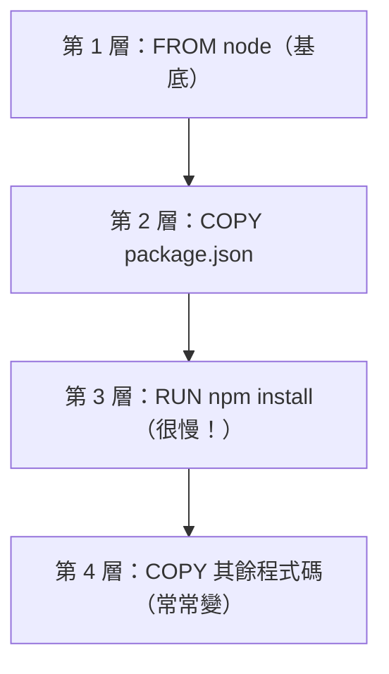

# [infra-5-3] Dockerfile：把你的服務打包成 image

> **本章目標**：學會寫一個 Dockerfile，把你自己的應用程式打包成一個 Docker image，並理解「映像分層」為什麼能讓 build 又快又省。

## 你會學到

- Dockerfile 是什麼——「打包食譜」
- 常見指令：`FROM`、`WORKDIR`、`COPY`、`RUN`、`CMD`
- 用 `docker build` 把程式變成 image、`docker run` 跑起來
- 映像分層（layer）與快取，以及怎麼利用它加速

## 概念說明

### Dockerfile 是「打包食譜」

前一章你用了別人做好的 image（nginx）。但你自己的應用程式呢？你得**自己做一個 image**，把「你的程式 + 它需要的環境」打包進去。

做 image 的方法，就是寫一個 **Dockerfile**——一份**一步步的「打包食譜」**，告訴 Docker：

```
從哪個基底環境開始？
把我的程式碼放進去
裝好需要的套件
容器啟動時要跑什麼指令？
```

Docker 照著這份食譜，一步步「煮」出一個 image。這呼應了 basic 課程一直在用的「食譜」比喻——只是這次煮出來的是一個可以到處搬的環境。

---

### 一個 Dockerfile 長什麼樣

先看完整範例（這是一個 Node 應用的典型 Dockerfile），下面再逐行解釋：

```dockerfile
# 1. 從官方 Node 環境開始（基底 image）
FROM node:20-alpine

# 2. 設定容器裡的工作目錄
WORKDIR /app

# 3. 先只複製套件清單
COPY package*.json ./

# 4. 安裝套件
RUN npm install

# 5. 再複製其餘所有程式碼
COPY . .

# 6. 容器啟動時要執行的指令
CMD ["node", "server.js"]
```

逐行看每個指令在做什麼：

| 指令 | 作用 | 食譜類比 |
|------|------|---------|
| `FROM` | 指定**基底環境**（站在別人肩膀上） | 「先準備一鍋高湯底」 |
| `WORKDIR` | 設定容器內的工作資料夾 | 「在這張料理檯上做事」 |
| `COPY` | 把主機的檔案複製進 image | 「把食材放上檯面」 |
| `RUN` | **build 時**執行指令（裝套件等） | 「現在先把料炒好」 |
| `CMD` | **容器啟動時**要跑的指令 | 「上菜時這樣擺盤」 |

> 容易混的兩個：`RUN` 是「**做 image 的時候**」執行（例如裝套件，做一次就好）；`CMD` 是「**容器跑起來時**」執行（每次啟動都跑，例如啟動你的 server）。

`FROM node:20-alpine` 的 `alpine` 是一個超小的 Linux 版本，用它當基底能讓 image 更小——這是常見的好習慣。

---

### 為什麼要「先複製 package.json，再複製其餘程式碼」？

你可能注意到上面食譜很奇怪：第 3 步先只複製 `package*.json`、裝完套件（第 4 步），第 5 步才複製全部程式碼。為什麼不一次複製就好？

這跟 Docker 的**分層（layer）與快取**機制有關，這是 Dockerfile 最重要的優化觀念。

**映像分層**：Dockerfile 的每一行指令，都會建立一個「層」，疊起來組成最終 image。關鍵是——**Docker 會把每一層快取起來；只要某一層和它之前的都沒變，重新 build 時就直接用快取，不重跑。**



`npm install` 很慢。如果你「先複製 package.json、再裝套件」，那麼**只要套件清單沒變，這層就會吃快取、跳過漫長的安裝**——即使你改了程式碼（那只會讓最後一層失效）。

反之，如果一開始就 `COPY . .` 再 `npm install`，那你**每改一行程式碼，整個 install 就要重跑一次**，慢到崩潰。

**口訣：把「不常變、又很慢」的步驟放前面，把「常變」的放後面。** 這樣能最大化利用快取。

## 程式碼範例

### 第一步：準備程式與 Dockerfile

用 Part 4 那個簡單的 Node 後端。在專案資料夾 `/home/deploy/myapp/` 裡，除了 `server.js` 和 `package.json`，再建一個 Dockerfile：

```bash
vi /home/deploy/myapp/Dockerfile
```

填入前面那份範例內容。

順便建一個 `.dockerignore`（像 `.gitignore`，告訴 Docker 哪些別打包進去）：

```bash
vi /home/deploy/myapp/.dockerignore
```

```
node_modules
.git
```

`node_modules` 不打包（反正會在容器裡重新 `npm install`），避免把一大包東西塞進 image（呼應課外讀物 E-2-3「node_modules 為什麼那麼大」）。

---

### 第二步：build 成 image

在專案資料夾裡執行：

```bash
docker build -t myapp:1.0 .
```

拆解：`build` 是依 Dockerfile 做 image；`-t myapp:1.0` 是給 image 命名「`myapp`」、標籤「`1.0`」（tag 通常用來標版本）；最後的 `.` 是「用目前資料夾當作打包來源」（這個點很常被忘記）。

build 時你會看到它**一層一層**執行 Dockerfile 的每個步驟。完成後用上一章的指令確認 image 做好了：

```bash
docker images
```

應該看到一個 `myapp` `1.0`。

---

### 第三步：跑起來

用你自己做的 image 跑一個容器：

```bash
docker run -d -p 3000:3000 --name myapp myapp:1.0
```

測試它（Part 3-4 的 curl）：

```bash
curl http://localhost:3000
```

看到你 server.js 的回應，代表你成功把自己的程式打包成 image 並跑起來了。

---

### 第四步：感受快取的威力

故意改一下 `server.js`（隨便改個回應文字），然後**重新 build**：

```bash
docker build -t myapp:1.1 .
```

注意觀察——前面「裝套件」那幾層會顯示 `CACHED`（用快取，瞬間跳過），只有「複製程式碼」之後的層才重跑。這就是「先 package.json 後程式碼」帶來的加速。

## 小練習

### 練習 1：讀懂一個 Dockerfile

不看上面的表，解釋這幾行各在做什麼：

```dockerfile
FROM python:3.12-alpine
WORKDIR /app
COPY requirements.txt ./
RUN pip install -r requirements.txt
COPY . .
CMD ["python", "app.py"]
```

（提示：這是 Python 版的，邏輯和 Node 版一模一樣。）

---

### 練習 2：理解分層快取

回答：

1. `RUN` 和 `CMD` 的差別是什麼？
2. 為什麼要「先 COPY package.json、裝套件，再 COPY 其餘程式碼」？如果反過來會怎樣？

---

### 練習 3：打包你自己的程式

把你 Part 4 的網站程式寫一個 Dockerfile，build 成 image 並跑起來，用 curl 確認能回應。然後改一行程式碼重新 build，觀察哪些層吃了快取（`CACHED`）。

> 提示：這個你親手做的 image，下一章會用 Docker Compose 把它和資料庫「組」在一起，變成完整一套環境。

## 課外讀物

> 想知道為什麼 `node_modules` 那麼大、為什麼要用 `.dockerignore` 排除它 → [課外讀物 E-2-3：node_modules 為什麼那麼大？](../../../課外讀物/E-2-npm/E-2-3-node-modules-size.md)
