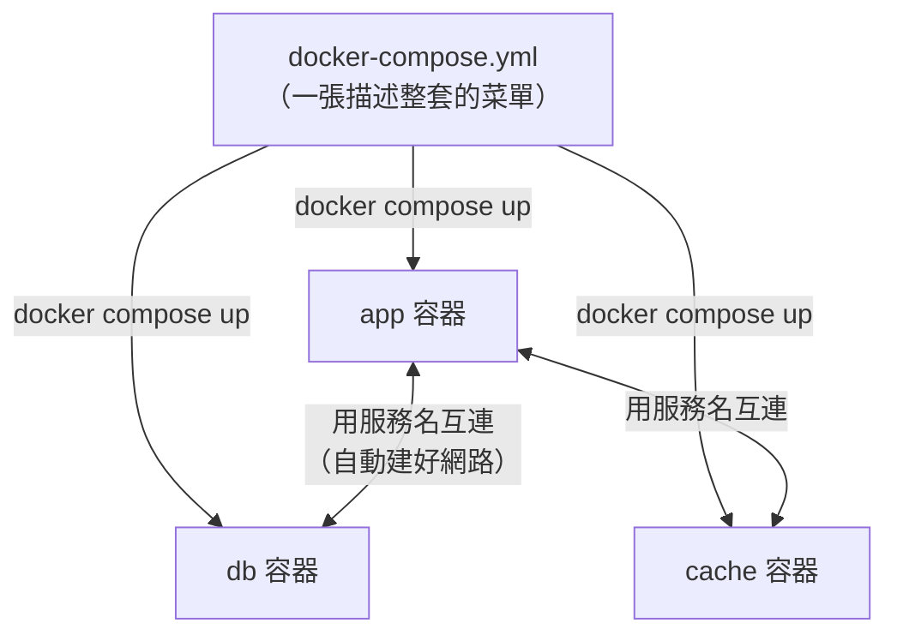

# [infra-5-4] Docker Compose：一個檔案編排多個容器

> **本章目標**：理解多容器應用的痛點，學會用 `docker-compose.yml` 一個檔案描述「app + 資料庫 + 快取」整套服務，並用一行指令全部啟動。

## 你會學到

- 為什麼「手動一個個 docker run」會變成惡夢
- Docker Compose 用一個 YAML 檔描述整套服務
- 容器之間怎麼用「服務名稱」互相連線
- `docker compose up` / `down` 一鍵啟停整套環境

## 概念說明

### 痛點：真實應用不只一個容器

到目前為止你都只跑一個容器。但真實的應用通常是**一組**容器：

```
你的後端 app（一個容器）
   ↓ 連到
資料庫 PostgreSQL（一個容器）
   ↓ 還可能加
快取 Redis（一個容器）
```

如果用上一章的 `docker run` 手動一個個開，會變成這樣：

```bash
docker network create myapp-net
docker run -d --name db --network myapp-net -e POSTGRES_PASSWORD=... -v dbdata:/var/lib/postgresql/data postgres
docker run -d --name cache --network myapp-net redis
docker run -d --name app --network myapp-net -p 80:3000 -e DATABASE_URL=... myapp:1.0
```

問題一大堆：指令又長又容易打錯、要記得先建網路、順序有講究、關掉要一個個 stop……。換台機器重來一次，簡直惡夢。**這正是 Part 4-5 結尾說的「做一次很有感，做十次就該自動化」。**

---

### 解法：用一個檔案描述「整套」

**Docker Compose** 讓你把上面那一大串，寫成**一個設定檔 `docker-compose.yml`**——清楚描述「我這套應用有哪些服務、它們各自怎麼設定、彼此怎麼連」。然後：

```bash
docker compose up      # 一行，全部啟動
docker compose down    # 一行，全部關閉
```

用類比：`docker run` 是「一個個點菜」；Docker Compose 是「**直接點一套套餐**」——套餐內容、份量、搭配都寫在菜單（yml）上，一句話全部上齊。



這張圖在說：一個 yml 檔描述全部，一行指令把整套拉起來，而且 Compose **自動幫你建好網路**，容器之間直接用名字溝通。

---

### 最大的便利：用「服務名稱」互連

還記得 Part 5-2 說容器能用名字互相找嗎？Docker Compose 把這點發揮到極致。

在 Compose 裡，你的後端要連資料庫，**連線位址直接寫服務的名字就好**。例如資料庫服務你取名叫 `db`，後端的資料庫連線就寫：

```
DATABASE_URL = postgres://user:pass@db:5432/mydb
                                    ↑
                            直接用服務名 "db" 當主機名
```

你**完全不用管 IP**——Compose 自動建好內部網路、自動讓 `db` 這個名字解析到資料庫容器。這是手動 `docker run` 做起來很麻煩、但 Compose 免費送你的便利。

## 程式碼範例

### 一個完整的 docker-compose.yml

在專案資料夾建立：

```bash
nano /home/deploy/myapp/docker-compose.yml
```

寫入一套「後端 + 資料庫」的設定：

```yaml
services:
  app:
    build: .
    ports:
      - "80:3000"
    environment:
      DATABASE_URL: postgres://myuser:mypass@db:5432/mydb
    depends_on:
      - db

  db:
    image: postgres:16
    environment:
      POSTGRES_USER: myuser
      POSTGRES_PASSWORD: mypass
      POSTGRES_DB: mydb
    volumes:
      - dbdata:/var/lib/postgresql/data

volumes:
  dbdata:
```

逐段解釋這份「菜單」：

- `services:` 底下列出每個容器服務。
- **`app` 服務**：
  - `build: .` —— 用目前資料夾的 Dockerfile 來 build（上一章那個）。
  - `ports: "80:3000"` —— 埠映射，主機 80 接到容器 3000。
  - `environment:` —— 設環境變數，注意 `DATABASE_URL` 裡主機名直接寫 `db`（服務名！）。
  - `depends_on: db` —— 先啟動 `db` 再啟動 `app`（控制順序）。
- **`db` 服務**：
  - `image: postgres:16` —— 直接用官方 PostgreSQL image，不用自己做。
  - `environment:` —— 設定資料庫的帳密與資料庫名。
  - `volumes: dbdata:/var/lib/postgresql/data` —— **把資料存進 volume**（Part 5-2 學的），這樣資料庫資料不會隨容器消失。
- 最底下的 `volumes: dbdata:` —— 宣告這個 volume 給上面用。

> YAML 用「縮排」表示層次，**縮排錯了就會解析失敗**，要特別小心（用空格，別用 tab）。

---

### 一鍵啟動整套

在有 `docker-compose.yml` 的資料夾裡：

```bash
docker compose up -d
```

`-d` 一樣是背景執行。這一行會：build 你的 app image → 下載 postgres image → 建好網路和 volume → 依順序啟動兩個容器。全部自動。

看這套服務的狀態：

```bash
docker compose ps
```

看某個服務的日誌（例如 app）：

```bash
docker compose logs -f app
```

---

### 一鍵關閉

```bash
docker compose down
```

這會停止並移除這套的所有容器和網路。**注意：volume 預設會保留**（所以你的資料庫資料還在）——這正是我們要的。如果連 volume 都想清掉，才加 `-v`：`docker compose down -v`（這會刪資料，小心用）。

## 小練習

### 練習 1：理解 Compose 解決的痛點

用自己的話回答：

1. 用 `docker run` 手動管理一套（app+db+cache）三個容器，有哪些麻煩？
2. Docker Compose 怎麼解決這些麻煩？

---

### 練習 2：看懂服務名連線

在上面的 yml 裡，`DATABASE_URL` 的主機名是 `db`。回答：

1. 這個 `db` 是哪來的？
2. 為什麼後端不用寫資料庫容器的 IP，直接寫 `db` 就能連到？

---

### 練習 3：理解 down 與 down -v 的差別

回答：

1. `docker compose down` 之後，資料庫的資料還在嗎？為什麼？
2. 什麼情況你才會想用 `docker compose down -v`？用之前要先確認什麼？

> 提示：這跟 Part 5-2 的 Volume「容器可丟、資料要留」是同一個道理。搞錯這個，可能把正式資料庫的資料整個刪掉——這是真實世界的重大事故。

## 課外讀物

> 把應用拆成「後端 + 資料庫 + 快取」多個服務，是「微服務」思維的入門；想了解它和單體架構的取捨 → [課外讀物 E-13-4：Monolith vs Microservices](../../../課外讀物/E-13-scaling/E-13-4-monolith-vs-microservices.md)
