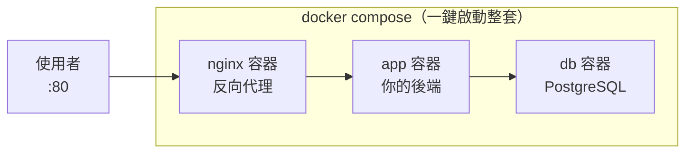

# [infra-5-5] 🔧 動手做：把你的網站容器化，一鍵啟動

> **本章目標**：把 Part 4 手動部署的網站，改造成「容器化 + Docker Compose」版本，用一行指令啟動整套，並親身比較兩種做法的差異。

## 你會學到

- 把整個 Part 5 串起來：Dockerfile + Compose + Nginx + 資料庫
- 用容器重現 Part 4-5 的網站，但變成「一鍵啟動、可重現」
- 親手對比「手動部署」與「容器化部署」的差別
- 容器化部署後的驗證與除錯

## 概念說明

### 你要做的改造

Part 4-5 你手動部署了一個網站：手動裝 Nginx、手動寫 systemd、手動設定。能跑，但**換台機器就得整套重來**。

這一章你要把同一個網站，改造成**容器化版本**：



差別在於：Part 4 的每個東西都「裝在主機上」，這次每個東西都**裝在容器裡**，由一個 `docker-compose.yml` 統一描述。最大的好處是——**這整套，在任何裝了 Docker 的機器上，一行指令就能重現。**

---

### 容器化前後對比

先有個心理準備，感受這次改造的價值：

| | Part 4-5 手動部署 | 這章 容器化部署 |
|---|------------------|----------------|
| 裝 Nginx | 手動 `apt install` + 設定 | 用官方 nginx image |
| 跑後端 | 手動寫 systemd service | 寫進 compose，自動管理 |
| 裝資料庫 | 手動安裝設定 | 用官方 postgres image |
| 啟動全部 | 一個個 systemctl start | `docker compose up` 一行 |
| 換台機器重來 | 整套重做，可能漏步驟 | 複製檔案 + 一行指令 |
| 自動重啟 | systemd 的 `Restart` | compose 的 `restart` |

## 程式碼範例

### 專案結構

在 `/home/deploy/myapp/` 整理出這樣的結構：

```
myapp/
├── server.js              ← 你的後端程式
├── package.json
├── Dockerfile             ← Part 5-3 寫的
├── .dockerignore
├── docker-compose.yml     ← 這章的主角
└── nginx/
    └── default.conf       ← 給 nginx 容器的設定
```

---

### 第一步：給 nginx 容器準備設定

建立 `nginx/default.conf`：

```bash
mkdir -p /home/deploy/myapp/nginx
vi /home/deploy/myapp/nginx/default.conf
```

```nginx
server {
    listen 80;
    server_name _;

    location / {
        proxy_pass http://app:3000;
        proxy_set_header Host $host;
        proxy_set_header X-Real-IP $remote_addr;
    }
}
```

注意 `proxy_pass http://app:3000`——主機名直接寫 `app`（服務名！還記得 Part 5-4 嗎），Nginx 容器就能找到後端容器。`server_name _` 是「接受任何網域」的意思。

---

### 第二步：寫 docker-compose.yml

```bash
vi /home/deploy/myapp/docker-compose.yml
```

```yaml
services:
  nginx:
    image: nginx:alpine
    ports:
      - "80:80"
    volumes:
      - ./nginx/default.conf:/etc/nginx/conf.d/default.conf:ro
    depends_on:
      - app
    restart: always

  app:
    build: .
    environment:
      DATABASE_URL: postgres://myuser:mypass@db:5432/mydb
    depends_on:
      - db
    restart: always

  db:
    image: postgres:16
    environment:
      POSTGRES_USER: myuser
      POSTGRES_PASSWORD: mypass
      POSTGRES_DB: mydb
    volumes:
      - dbdata:/var/lib/postgresql/data
    restart: always

volumes:
  dbdata:
```

幾個跟前一章不同、值得注意的點：

- **`nginx` 服務**：它才是對外開 80 的（`ports: 80:80`）。`app` 不開 port，只透過內部網路給 nginx 連——後端躲在 nginx 後面（呼應 Part 4-3）。
- `volumes: ./nginx/default.conf:/etc/nginx/conf.d/default.conf:ro` —— 把你寫的設定檔掛進 nginx 容器，`:ro` 是 read-only（唯讀，容器不能改它）。
- **`restart: always`** —— 三個服務都加上，等於 Part 4-2 systemd 的「掛掉自動重啟」，但這次是 Compose 幫你做。
- `app` 拿掉了對外 `ports`，因為它只需要被 nginx 連，不需要直接對外。

---

### 第三步：一鍵啟動整套

```bash
cd /home/deploy/myapp
docker compose up -d --build
```

`--build` 確保先 build 你的 app image。這一行會把 nginx、app、db 三個容器全部拉起來、串好網路。

確認三個都在跑：

```bash
docker compose ps
```

---

### 第四步：驗證

從伺服器本機測（Part 3-4 的 curl）：

```bash
curl http://localhost
```

應該透過「nginx → app」拿到你後端的回應。從你自己電腦的瀏覽器連伺服器 IP 也應該看得到（記得 Part 3-3 防火牆要開 80）。

看整套的日誌：

```bash
docker compose logs -f
```

---

### 第五步：體會「可重現」的威力

這是最有感的一步。想像你要換一台全新的伺服器：

**Part 4-5 的手動做法**：重新 SSH、裝 Nginx、寫 systemd、裝 Node、裝資料庫、一個個設定……可能花一兩小時，還可能漏步驟。

**容器化做法**：只要新機器裝了 Docker，把這個 `myapp/` 資料夾複製過去，然後：

```bash
docker compose up -d --build
```

**一行指令，整套網站在幾分鐘內重現，每次都一模一樣。** 這就是容器化最大的價值——也是為什麼它成為現代部署的標準。

## 小練習

### 練習 1：完成容器化改造

把你 Part 4 的網站，依本章步驟改造成 Compose 版本，用 `docker compose up -d --build` 一鍵啟動，並從瀏覽器確認能連到。

---

### 練習 2：驗證自動重啟

故意砍掉 app 容器，觀察它自己回來（呼應 Part 4-5）：

```bash
docker compose ps           # 看 app 容器
docker kill myapp-app-1     # 砍掉它（名字以你的為準）
docker compose ps           # 過一下再看，它又起來了（restart: always）
```

---

### 練習 3：寫下「兩種部署」的比較心得

你現在親手做過「手動部署」（Part 4-5）和「容器化部署」（這章）。用自己的話寫下：

1. 容器化在「換機器重現」上贏在哪？
2. 有沒有什麼是手動部署反而比較單純的情況？（提示：只有一個極簡服務、且不常變動時）

> 提示：容器化解決了「可重現」，但「複製檔案 + 跑指令」這件事本身還是手動的。下一個 Part 6（Ansible）就要把「連複製和執行都自動化」——讓你對著一台全新機器，一鍵裝好 Docker、拉好程式碼、啟動整套。

## 課外讀物

> 當這套容器需要跨多台機器跑、自動擴縮、自我修復時，就需要容器編排 → [課外讀物 E-13-3：Kubernetes 概念入門](../../../課外讀物/E-13-scaling/E-13-3-kubernetes-intro.md)
