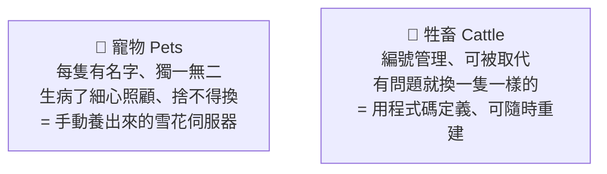

# [infra-6-3] 設定漂移與 IaC：為什麼手動設定遲早會出事

> **本章目標**：理解「手動設定機器」會帶來的長期災難（設定漂移），並建立「Infrastructure as Code（基礎設施即代碼）」的核心思維，為下一章的 Ansible 鋪路。

## 你會學到

- 設定漂移（configuration drift）是什麼、為什麼可怕
- 「寵物 vs 牲畜」——兩種對待伺服器的心態
- Infrastructure as Code（IaC）的核心思想
- 宣告式（declarative）與命令式（imperative）的差別

## 概念說明

### 一個你已經隱約感覺到的問題

前面幾個 Part，你手動做了好多設定：建使用者、設防火牆、裝 Nginx、寫 systemd……。每一步都是「SSH 進機器、手動敲指令」。

現在想像幾個情境：

- 過了三個月，你還記得當初到底改了哪些設定嗎？
- 你有三台機器，每台都手動設，它們真的「設得一模一樣」嗎？
- 機器突然掛了要重建，你能把當初那幾十個步驟**完全正確地**重做一遍嗎？

這些問題的答案通常都是「**不太行**」。這就是手動設定的根本問題。

---

### 設定漂移（Configuration Drift）

當你長期靠手動管理機器，會發生一種現象叫**設定漂移**：

> 每台機器經過無數次「臨時手動微調」之後，**漸漸偏離了原本的樣子，而且每台偏的方向還不一樣**。最後沒有人說得清「這台機器到底是什麼狀態」。

用類比：就像三份原本一樣的文件，被不同人手動改來改去，半年後變成三個不同版本，誰也不知道哪份才對。

設定漂移會導致一個經典慘劇——「**雪花伺服器（snowflake server）**」：每台機器都像雪花一樣**獨一無二、無法複製**。這台跑得好好的服務，搬到另一台就壞，因為兩台的設定早就不一樣了，而且沒人知道差在哪。這正是 Part 5-1「在我電腦上明明可以跑」的伺服器版。

---

### 兩種心態：寵物 vs 牲畜

infra 圈有個很有名的比喻，一句話點破現代與傳統的差別：



| | 寵物模式（舊） | 牲畜模式（現代） |
|---|--------------|----------------|
| 怎麼對待機器 | 手動細心照顧每一台 | 用程式碼統一定義 |
| 機器掛了 | 緊張搶救，因為無法複製 | 直接砍掉，重建一台一樣的 |
| 設定在哪 | 在某人腦袋裡、在機器上 | 在**版本控制的程式碼裡** |

不是說寵物不好——而是當你要管的機器變多，「把機器當牲畜」（可拋棄、可重建）才撐得住。而做到這件事的關鍵，就是 **IaC**。

---

### Infrastructure as Code（基礎設施即代碼）

**IaC 的核心思想一句話**：

> **把「機器該長什麼樣」寫成程式碼，而不是靠手動操作。**

機器的設定——裝哪些套件、開哪些服務、防火牆規則——全部寫進檔案、用 Git 管理（呼應你學過的版本控制）。這帶來巨大的好處：

| 好處 | 說明 |
|------|------|
| **可重現** | 機器掛了？跑一次程式碼，分鐘級重建一台一模一樣的 |
| **可版本控制** | 用 Git 追蹤每次改動，誰改的、改了什麼、能回溯 |
| **是文件** | 程式碼本身就是「這台機器怎麼設定」最準確的說明書 |
| **可複製** | 要 10 台一樣的？跑 10 次。徹底消滅設定漂移 |
| **可審查** | 改設定前先 review 程式碼，像 review PR 一樣 |

這正是 Part 1-1 開頭說的——**現代 infra 工程師和老派機房管理員最大的分水嶺：用程式碼，不用雙手。**

---

### 宣告式 vs 命令式：IaC 的關鍵思維轉變

IaC 工具（如下一章的 Ansible）多半採用**宣告式**思維，這跟你寫腳本的**命令式**思維不同，值得先理解：

- **命令式（imperative）**：你描述「**怎麼做**」的每一步。像 Part 6-1 的腳本：「先檢查資料夾在不在，不在就建立，然後……」。你要顧到所有步驟和狀況。
- **宣告式（declarative）**：你描述「**最終要長什麼樣**」，工具自己想辦法達成。像跟人說「我要這台機器裝好 Nginx 並啟動」，至於「它現在裝了沒、要不要重裝」，工具自己判斷。

用類比：命令式像給司機**逐步路線指示**（「前面右轉、再直走 500 公尺……」）；宣告式像直接給**目的地**（「載我到車站」），怎麼開交給司機。

宣告式的最大好處是**冪等（idempotent）**——同一份設定跑幾次，結果都一樣（已經是目標狀態就不重複做）。這讓「重複執行」變得很安全，是下一章 Ansible 的核心特性。

## 程式碼範例

這一章是觀念轉換，沒有新指令。但你可以做一件事，親身體會「設定該被記錄」的價值——把你之前的設定步驟，整理成一份**文件**（這是邁向 IaC 的第一步）。

在你的練習資料夾建一份：

```bash
vi ~/infra-practice/server-setup-notes.md
```

把你在 Part 2~4 做過的設定，憑記憶條列出來：

```markdown
# 我的伺服器設定步驟

## 使用者（Part 2-6）
- 建立 deploy 使用者，加入 sudo 群組
- 設定 SSH 金鑰登入，關閉密碼登入

## 防火牆（Part 3-3）
- ufw 放行 22 / 80 / 443
- 預設拒絕 incoming

## 服務（Part 4）
- 安裝 nginx
- 設定反向代理到 localhost:3000
- ...（你還記得多少？）
```

**寫的時候你會發現**：有些步驟你已經記不太清了——這正是「設定漂移」的起點，也正是為什麼我們需要把設定變成程式碼。這份手寫筆記，下一章就會升級成「能自動執行」的 Ansible playbook。

## 小練習

### 練習 1：解釋設定漂移

用自己的話回答：

1. 什麼是設定漂移？它怎麼一步步發生的？
2. 「雪花伺服器」為什麼是個問題？

---

### 練習 2：寵物還是牲畜

判斷下面的做法比較像「寵物」還是「牲畜」心態：

1. 伺服器掛了，熬夜手動搶修，因為重建太麻煩
2. 伺服器有異狀，直接砍掉，用程式碼重建一台新的
3. 所有設定都寫在 Git 裡，機器只是「執行這些設定的載體」

---

### 練習 3：宣告式思維

用「給司機指示」的類比，解釋命令式和宣告式的差別。然後想想：為什麼「宣告最終狀態」比「描述每個步驟」更適合管理大量機器？

> 提示：想想「我有 50 台機器，狀態各不相同」時，你會想逐步指示每一台，還是只說「全部都給我變成這個樣子」？

## 課外讀物

> IaC 的核心是「把設定用版本控制管起來」，想複習 Git 怎麼追蹤每次改動 → [課外讀物 E-8-1：Git 的內部運作](../../../課外讀物/E-8-git/E-8-1-git-internals.md)
