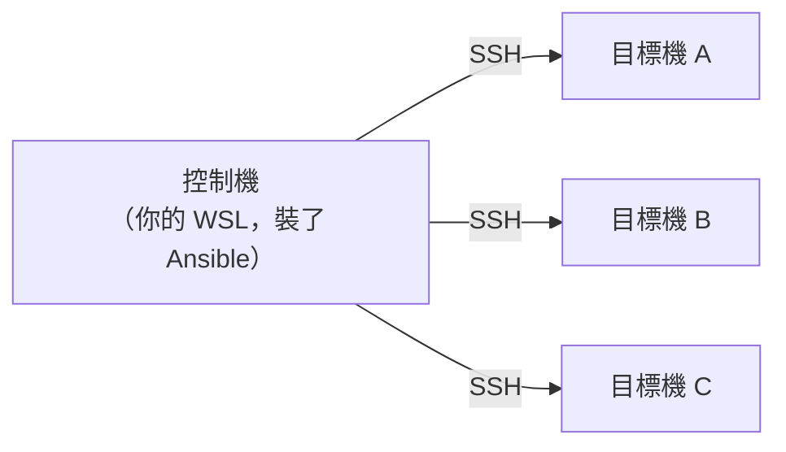

# [infra-6-4] Ansible 入門：一次設定多台機器

> **本章目標**：理解 Ansible 在做什麼，搞懂 inventory、playbook、module、冪等性這些核心概念，看懂一份 playbook 長什麼樣。

## 你會學到

- Ansible 是什麼、為什麼它「不用在被管理的機器上裝東西」
- 三個核心：inventory（清單）、playbook（劇本）、module（模組）
- 冪等性（idempotency）為什麼是 Ansible 的超能力
- 看懂一份 playbook 的結構

## 概念說明

### 從「一台台手動」到「一次搞定全部」

上一章你理解了 IaC 思維：設定該變成程式碼。**Ansible** 就是實現這件事最受歡迎的工具之一。

它解決的核心痛點是：你有很多台機器要設定，總不能一台台 SSH 進去、把同樣的指令打一遍吧？Ansible 讓你**寫一份設定，一次套用到所有機器上**。

用類比：Ansible 像一個**能同時指揮很多台機器的遙控器**。你寫好一份「劇本」（要做哪些事），按下執行，它就自動連到清單上的每一台機器，把劇本演一遍——不管是 1 台還是 100 台，都是同一份劇本。

---

### Ansible 最聰明的地方：agentless（免代理）

很多同類工具，要求你**先在每台被管理的機器上裝一個「代理程式」**，很麻煩。Ansible 不用——它是 **agentless（免代理）** 的。

它靠的是你已經很熟的東西：**SSH**（Part 2-6、Part 3-2 學的）。Ansible 從你的「控制機」，透過 SSH 連到目標機器、執行動作。目標機器**什麼都不用裝**，只要能被 SSH 連、有 Python（Linux 幾乎都內建）就行。



這張圖在說：你只在「控制機」裝 Ansible，它透過 SSH 去設定所有目標機。**你的 WSL 就是一台完美的控制機**——從 WSL 用 Ansible 去設定你的 AWS EC2，是非常標準的組合。

---

### 三個核心概念

**1. Inventory（清單）**：一份「我要管哪些機器」的名單。可以分組，例如把機器分成 `webservers`、`databases` 群組，之後可以「只對某一組」執行。就像遙控器要先知道「有哪些電器、各在哪」。

**2. Playbook（劇本）**：用 YAML 寫的「要做哪些事」的劇本（你在 Part 5-4 的 docker-compose 已經見過 YAML 了）。一份 playbook 包含一連串 **task（任務）**，每個 task 描述一個「期望的狀態」。

**3. Module（模組）**：Ansible 內建幾千個「做特定事情的工具」，叫 module。例如 `apt` module 管套件、`service` module 管服務、`copy` module 複製檔案。你在 task 裡呼叫 module，告訴它「我要的結果」，它負責達成。

---

### 冪等性（Idempotency）：Ansible 的超能力

這是 Ansible 最重要、也最體現上一章「宣告式」思維的特性。

**冪等（idempotent）** 的意思是：**同一份 playbook，跑一次和跑十次，結果完全一樣。**

舉例：你的 task 寫「確保 nginx 已安裝」。

- 第一次跑：nginx 還沒裝 → Ansible 幫你裝（狀態：`changed`，有改動）。
- 第二次跑：nginx 已經裝了 → Ansible **發現已達成目標，什麼都不做**（狀態：`ok`，沒改動）。

對比 Part 6-1 的 shell 腳本：如果你寫 `apt install nginx`，它每次都會去跑一遍。但 Ansible 是「**先檢查現況，只在還沒達標時才動手**」——這就是宣告式（描述目標）vs 命令式（描述步驟）的差別。

冪等性帶來一個巨大的安全感：**你可以放心地一跑再跑**。不用擔心「重複執行會不會把東西搞壞」，因為已經是目標狀態的，它就不碰。這讓「修正設定」變得超簡單——改一行 playbook、重跑，Ansible 只會處理「有變的部分」。

---

### 看懂一份 playbook

先看一個簡單的 playbook，下面解釋（細節下一章動手做）：

```yaml
- name: 設定網頁伺服器
  hosts: webservers
  become: yes
  tasks:
    - name: 安裝 nginx
      apt:
        name: nginx
        state: present

    - name: 確保 nginx 正在運行且開機自啟
      service:
        name: nginx
        state: started
        enabled: yes
```

逐段看：

- `name`：這個 play 的描述（給人看的）。
- `hosts: webservers`：對 inventory 裡的 `webservers` 這組機器執行。
- `become: yes`：用管理員權限執行（相當於 `sudo`，呼應 Part 2-2）。
- `tasks:`：要做的事，一個個列出。
- 每個 task 有個 `name`（描述）+ 呼叫一個 module：
  - `apt: name=nginx state=present` —— 用 apt module，**確保** nginx 是「present（已安裝）」狀態。
  - `service: state=started enabled=yes` —— 用 service module，**確保** nginx「正在跑」且「開機自啟」。

注意所有 task 都在描述「**狀態**」（present、started、enabled），而不是「步驟」——這就是宣告式。你說要什麼結果，Ansible 自己判斷該不該動手。

## 程式碼範例

### 在你的 WSL（控制機）裝 Ansible

```bash
sudo apt update
sudo apt install ansible -y
```

確認裝好：

```bash
ansible --version
```

> 只要在控制機（你的 WSL）裝。目標機器（EC2）什麼都不用裝——這就是 agentless 的好處。

---

### 建立 inventory

建立一份機器清單：

```bash
nano ~/infra-practice/inventory.ini
```

```ini
[webservers]
myserver ansible_host=203.0.113.10 ansible_user=deploy
```

這定義了一個 `webservers` 群組，裡面有一台叫 `myserver` 的機器（換成你的 EC2 IP 和使用者）。

---

### 測試連線：ping module

Ansible 有個 `ping` module，測試「控制機能不能透過 SSH 管到目標機」：

```bash
ansible webservers -i ~/infra-practice/inventory.ini -m ping
```

拆解：`webservers` 是目標群組；`-i` 指定 inventory 檔；`-m ping` 是用 ping module。如果回 `SUCCESS` 和 `"pong"`，代表 Ansible 已經能透過 SSH 控制你的伺服器了——連線打通，下一章就能跑完整的 playbook。

## 小練習

### 練習 1：解釋 agentless

用自己的話回答：

1. Ansible 為什麼不用在目標機器上裝代理程式？它靠什麼連過去？
2. 為什麼「你的 WSL」很適合當 Ansible 的控制機？

---

### 練習 2：理解冪等性

回答：

1. 什麼是冪等性？為什麼它讓你能「放心地重複執行」？
2. 同一個 task「確保 nginx 已安裝」，第一次跑和第二次跑，Ansible 的行為有什麼不同？

---

### 練習 3：裝好並連通

在你的 WSL 裝好 Ansible，建立 inventory，用 `-m ping` 成功 ping 到你的伺服器（EC2）。

> 提示：如果 ping 失敗，多半是 SSH 連線設定問題——回想 Part 3-2，先確認你能用 `ssh` 手動連進去，Ansible 才連得到。

## 課外讀物

> playbook 應該用 Git 版本控制管理（這才是真正的 IaC），想複習團隊協作的 Git 流程 → [課外讀物 E-8-7：Git Flow 與 GitHub Flow](../../../課外讀物/E-8-git/E-8-7-git-flow.md)
