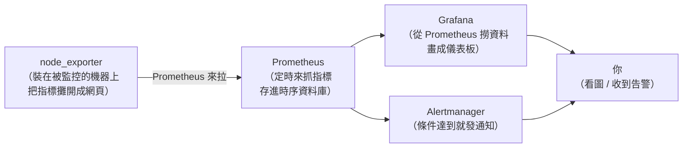

# [infra-7-3] Prometheus + Grafana 入門：從人工巡檢到自動監控

> **本章目標**：理解 Prometheus 和 Grafana 各自的角色，搞懂「自動收集指標、畫成圖、出事主動告警」這套現代監控是怎麼運作的。

## 你會學到

- 為什麼「手動巡檢」撐不起真正的監控
- Prometheus 的角色：收集並儲存指標
- Grafana 的角色：把指標畫成儀表板
- exporter、PromQL、告警（alerting）是什麼

## 概念說明

### 手動巡檢的天花板

上一章你學會用指令看四大生命徵象。但這種「手動看」有三個無法克服的問題：

1. **你不可能 24 小時盯著**——半夜飽和了你在睡覺。
2. **看不到歷史**——`top` 只給你「此刻」，但「昨天下午為什麼變慢」你查不到。
3. **要主動去看才知道**——問題發生時不會有人通知你。

真正的監控系統要做到三件事：**自動持續收集、保留歷史、出事主動通知**。這就是 Prometheus + Grafana 這個黃金組合在做的事。

---

### 兩個工具，各司其職

很多人會把這兩個搞混，先一句話分清楚：

- **Prometheus**：負責**收集**和**儲存**指標（資料的大腦）。它不漂亮，但很會記數字。
- **Grafana**：負責把指標**畫成漂亮的圖表**（資料的臉）。它自己不存資料，只負責呈現。

用類比：**Prometheus 是不斷記錄數據的「黑盒子記錄器」，Grafana 是把這些數據畫成「儀表板」的螢幕。** 一個負責記、一個負責看。

---

### 完整架構：資料怎麼流動



順著箭頭看這套怎麼運作：

**① Exporter（指標輸出器）**：要被監控的機器上，跑一個 exporter。最常見的是 **node_exporter**，它把這台機器的 CPU、記憶體、磁碟等指標（就是上一章那四大生命徵象）「攤開」成一個網頁，等人來抓。

**② Prometheus 拉取（pull）**：Prometheus 每隔幾秒，主動去各個 exporter「抓」一次最新指標，存進它的**時序資料庫**（time-series database，專門存「隨時間變化的數值」）。

> 注意這個「**拉（pull）**」的設計——是 Prometheus 主動去抓，不是機器主動回報。好處是 Prometheus 能集中管理「要監控誰、多久抓一次」，加一台機器只要在它的設定裡登記即可。

**③ Grafana 呈現**：Grafana 連到 Prometheus，把存起來的指標撈出來，畫成折線圖、儀表盤等。你打開瀏覽器就能看到漂亮的即時 + 歷史圖表。

**④ Alertmanager 告警**：你設定規則（例如「磁碟使用率 > 90% 持續 5 分鐘」），條件一達到，它就主動發通知（email、Slack 等）。這解決了「出事主動通知」——你不用一直盯著，它會來找你。

---

### PromQL：查詢指標的語言

Prometheus 有自己的查詢語言 **PromQL（Prometheus Query Language）**，用來「問」它存的資料。例如：

```
100 - (avg(rate(node_cpu_seconds_total{mode="idle"}[5m])) * 100)
```

這串（看不懂沒關係）大致是在算「CPU 使用率百分比」。Grafana 的圖表，背後就是一條條 PromQL 查詢。

入門階段你不用自己寫 PromQL——社群有大量現成的**儀表板範本**可以直接匯入（下一章會用），裡面的查詢都幫你寫好了。等熟悉後，再學著自己調整查詢。

---

### 為什麼這套這麼受歡迎

- **開源免費**，社群超大，幾乎是雲原生監控的業界標準。
- **node_exporter** 一裝，主機所有指標自動有。
- **現成儀表板**多到不行，匯入就能用。
- 和容器、Kubernetes（AWS 課程主題）整合得極好。

> 這套也是 **SRE 課程**的核心工具——SRE 用它來實現「四個黃金訊號」的監控與告警。infra 這裡先學會「把它架起來、監控主機」，SRE 再教你「該監控什麼、怎麼設計告警才不會擾民」。

## 程式碼範例

這一章是觀念，實作在下一章（用 Docker Compose 一次把整套拉起來）。但先建立一個重要的心智對照——**這套監控，其實就是把你前面學的東西自動化**：

| 你之前手動做的 | 這套監控自動化的版本 |
|--------------|-------------------|
| `top` 看 CPU（Part 2-3） | node_exporter 持續收集 CPU 指標 |
| `free -h` 看記憶體 | 記憶體指標自動入庫、畫成歷史曲線 |
| `df -h` 看磁碟（Part 2-4） | 磁碟使用率自動監控 + 超標告警 |
| 寫腳本巡檢（Part 6-1） | Prometheus 定時自動抓，不用你跑 |
| 半夜手動檢查 | Alertmanager 半夜出事自動叫醒你 |

換句話說，你不是在學全新的東西——你是在把「手動的健康檢查」升級成「自動、持續、會通知」的系統。

## 小練習

### 練習 1：分清兩個工具的角色

用自己的話回答：

1. Prometheus 和 Grafana 各自負責什麼？為什麼需要兩個？
2. 如果只有 Prometheus 沒有 Grafana，你會少了什麼？

---

### 練習 2：理解 pull 模型

回答：

1. Prometheus 是「主動去抓」還是「等機器回報」指標？
2. node_exporter 在這套架構裡扮演什麼角色？

---

### 練習 3：對應你的手動經驗

把 Part 2 你學過的四大生命徵象指令（`top`、`free`、`df`、`ss`），各自對應到「這套監控系統會怎麼自動取代它」。想想看：自動化之後，多了哪些手動做不到的能力？（提示：歷史、告警。）
