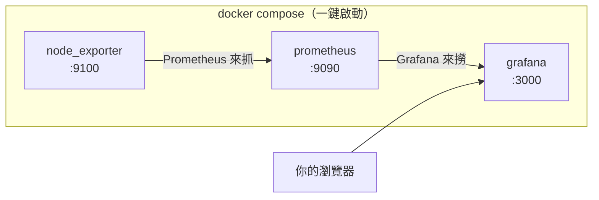

# [infra-7-4] 🔧 動手做：用 Docker Compose 架起一套監控

> **本章目標**：用 Docker Compose 一次把 Prometheus + Grafana + node_exporter 跑起來，監控你自己的伺服器，並在 Grafana 看到即時的主機儀表板。

## 你會學到

- 用 Docker Compose 部署一整套監控系統（複用 Part 5 技能）
- 設定 Prometheus 去抓 node_exporter 的指標
- 在 Grafana 連資料來源、匯入現成儀表板
- 設定一個基本告警規則

## 概念說明

### 這一章漂亮在哪：用容器一鍵架好整套

還記得 Part 5 學的 Docker Compose 嗎？這一章正是它的最佳舞台。Prometheus、Grafana、node_exporter 三個元件，我們**用一個 `docker-compose.yml` 全部拉起來**——這比手動一個個安裝設定簡單太多，而且「可重現」（換台機器一行指令重來）。



這張圖就是你這章要架起來的東西——對照上一章的架構圖，只是現在全跑在容器裡。

> 在 WSL 上練完全可以（你 Part 0 裝好了 Docker）。若要監控你的 EC2，把這套架在 EC2 上即可，做法一樣。

## 程式碼範例

### 專案結構

在練習資料夾建立：

```
monitoring/
├── docker-compose.yml
└── prometheus.yml
```

```bash
mkdir -p ~/infra-practice/monitoring
cd ~/infra-practice/monitoring
```

---

### 第一步：Prometheus 的設定檔

建立 `prometheus.yml`，告訴 Prometheus「要去抓誰」：

```bash
nano ~/infra-practice/monitoring/prometheus.yml
```

```yaml
global:
  scrape_interval: 15s        # 每 15 秒抓一次指標

scrape_configs:
  - job_name: 'node'           # 監控主機
    static_configs:
      - targets: ['node_exporter:9100']

  - job_name: 'prometheus'     # 順便監控 Prometheus 自己
    static_configs:
      - targets: ['localhost:9090']
```

重點：`targets: ['node_exporter:9100']`——主機名直接寫 `node_exporter`（服務名！還記得 Part 5-4 的服務名互連嗎），Prometheus 容器就能找到 node_exporter 容器。

---

### 第二步：docker-compose.yml

```bash
nano ~/infra-practice/monitoring/docker-compose.yml
```

```yaml
services:
  node_exporter:
    image: prom/node-exporter:latest
    container_name: node_exporter
    ports:
      - "9100:9100"
    restart: always

  prometheus:
    image: prom/prometheus:latest
    container_name: prometheus
    ports:
      - "9090:9090"
    volumes:
      - ./prometheus.yml:/etc/prometheus/prometheus.yml:ro
    restart: always

  grafana:
    image: grafana/grafana:latest
    container_name: grafana
    ports:
      - "3000:3000"
    volumes:
      - grafana-data:/var/lib/grafana
    restart: always

volumes:
  grafana-data:
```

對照你 Part 5-4、5-5 學的，這份很眼熟：三個服務、用官方 image、`prometheus.yml` 用唯讀掛載進去、Grafana 的資料存進 volume（這樣容器重建儀表板不會丟）、全部 `restart: always`。

---

### 第三步：一鍵啟動

```bash
cd ~/infra-practice/monitoring
docker compose up -d
docker compose ps
```

三個容器都 `running` 就成功了。

> 防火牆（Part 3-3）：如果要從別台電腦的瀏覽器連 Grafana，記得放行 3000。在 WSL 本機練的話，直接用 `localhost:3000` 即可。

---

### 第四步：進 Grafana 設定

1. 瀏覽器打開 `http://伺服器IP:3000`（WSL 本機就用 `http://localhost:3000`）。
2. 預設帳密都是 `admin` / `admin`，第一次登入會要你改密碼。
3. **連接資料來源**：左側選 Connections → Data sources → Add data source → 選 **Prometheus** → URL 填 `http://prometheus:9090`（又是服務名！）→ Save & test，看到綠色成功訊息。
4. **匯入現成儀表板**：左側 Dashboards → New → Import → 在 "Import via grafana.com" 填入 **`1860`**（這是超經典的 Node Exporter Full 儀表板 ID）→ Load → 選剛建的 Prometheus 資料來源 → Import。

完成後，你會看到一個**琳瑯滿目的主機監控儀表板**——CPU、記憶體、磁碟、網路全部即時畫成圖。這就是上一章那四大生命徵象，從「手動 `top` 看一眼」變成「持續、視覺化、有歷史」的監控。🎉

---

### 第五步：設定一個告警

監控的最後一塊是「出事主動通知」。Grafana 內建告警功能，做一個簡單的：

1. 在儀表板找一個面板（例如「磁碟使用率」），編輯它。
2. 切到 **Alert** 分頁 → New alert rule。
3. 設條件，例如「磁碟使用率 > 90% 持續 5 分鐘」。
4. 設定通知管道（Contact point，可設 email 等）。

設好後，當條件達成，Grafana 就會主動通知你——你不用再半夜爬起來看 `df`。

> 告警「該設哪些條件、怎麼設才不會擾民（半夜被無意義的告警吵醒）」是一門大學問，那是 **SRE 課程** Part 4 的主題。這裡先讓你體會「會自動通知」這件事。

## 小練習

### 練習 1：架起整套監控

照本章步驟，用 Docker Compose 把 Prometheus + Grafana + node_exporter 跑起來，在 Grafana 匯入 1860 儀表板，看到你伺服器的即時指標。

---

### 練習 2：圖文對照

在 Grafana 儀表板找到「記憶體使用」的圖，同時在終端機跑 `free -h`。比對兩邊的數字對不對得上。體會：同一個指標，一個是「此刻一個數字」，一個是「會動的歷史曲線」。

---

### 練習 3：製造一點負載，看圖反應

在伺服器上故意製造 CPU 負載，看 Grafana 的圖會不會跟著跳：

```bash
# 製造一個吃 CPU 的程序（跑幾秒後 Ctrl+C 停掉）
yes > /dev/null
```

`yes > /dev/null` 會讓一顆 CPU 滿載。觀察 Grafana 的 CPU 圖在幾秒內竄高，停掉後又降回來。**你親眼看到了監控系統「即時反映系統狀態」的威力。**

> 提示：你現在有了「觀測」能力——能看到系統發生什麼。但「看到問題」之後呢？怎麼確保系統就算出事也能撐住、能還原？這就是下一個 Part 8（可靠性與安全：備份、加固、災難復原）要回答的。

## 課外讀物

> 監控常和「效能優化」一起出現——當你從圖表看到瓶頸，下一步往往是優化 → [課外讀物 E-11-3：Redis 與快取策略](../../../課外讀物/E-11-performance/E-11-3-redis-cache.md)
