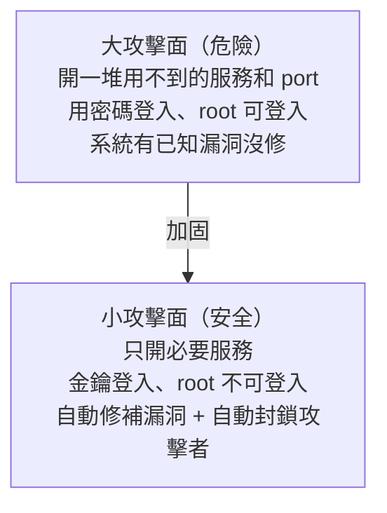

# [infra-8-3] 伺服器加固：把攻擊面縮到最小

> **本章目標**：學會「伺服器加固（hardening）」的核心思維與具體做法——關閉沒用的服務、自動安全更新、用 fail2ban 擋暴力破解，把機器被攻破的機會降到最低。

## 你會學到

- 「加固（hardening）」是什麼、「攻擊面」的概念
- 關閉不必要的服務與 port
- 設定自動安全更新
- 用 fail2ban 自動封鎖暴力破解的攻擊者

## 概念說明

### 你的伺服器，無時無刻被攻擊

這不是嚇你——任何一台有公開 IP 的伺服器，**上線幾分鐘內**就會開始被全世界的自動化程式掃描、嘗試入侵。你在 Part 7-1 用 `grep "Failed" /var/log/auth.log` 可能已經看到滿滿的失敗登入——那些都是機器人在猜你的密碼。

**加固（hardening）** 就是有系統地把機器「武裝」起來，讓這些攻擊更難得逞。

---

### 核心思維：縮小「攻擊面」

加固最重要的觀念叫**攻擊面（attack surface）**：

> 攻擊面 = 攻擊者「可能下手的所有入口」的總和。**入口越少，越安全。**

用類比：一棟房子，門窗越多越難守。加固就是**把不用的門窗都封死，只留必要的、而且每個都裝好鎖**。



好消息是，你**已經做了一大半加固**了：

| 你做過的加固 | 在哪學的 |
|------------|---------|
| 不用 root、改用一般使用者 + sudo | Part 2-6 |
| 金鑰登入、關閉密碼登入 | Part 2-6 |
| 防火牆只開必要 port | Part 3-3 |

這一章再補上三招，把加固做完整。

---

### 加固三招

**第一招：關閉不必要的服務**

每多跑一個服務，就多一個潛在入口。原則：**用不到的就關掉、移除**。例如機器上裝了某個你根本沒在用的服務，它卻開著 port 聽著——這就是白白多出來的攻擊面。用 Part 3-1 的 `ss -tlnp` 盤點「開了哪些門」，把不認得、用不到的關掉。

**第二招：自動安全更新**

軟體會不斷被發現漏洞，廠商會發布修補（這就是 Part 2-5 的 `apt upgrade`）。但你不可能天天手動更新。**自動安全更新**讓系統自己安裝重要的安全修補，把「有漏洞卻沒修」這個大洞補起來。

**第三招：fail2ban——自動封鎖攻擊者**

就算你用了金鑰登入，那些猜密碼的機器人還是會一直敲門、塞爆你的日誌。**fail2ban** 會盯著日誌（Part 7-1 的 auth.log），發現「某個 IP 短時間內失敗太多次」，就**自動把那個 IP 封鎖**一段時間。等於請了一個保全，看到有人一直試錯鑰匙，就直接把他擋在門外。

## 程式碼範例

> ⚠️ 加固涉及「對外伺服器」的防護，這章建議在你的 **EC2** 上練（WSL 不對外，這些防護意義不大）。

### 第一招：盤點並關閉沒用的服務

看目前開了哪些 port（Part 3-1）：

```bash
sudo ss -tlnp
```

如果發現某個用不到的服務在聽，停掉並停用它（Part 4-1）：

```bash
sudo systemctl disable --now 服務名
```

`disable --now` = 立刻停止 + 取消開機自啟。

---

### 第二招：開啟自動安全更新

Ubuntu 上裝 `unattended-upgrades`：

```bash
sudo apt update
sudo apt install unattended-upgrades -y
sudo dpkg-reconfigure --priority=low unattended-upgrades
```

最後一行會跳出設定畫面，選「Yes」啟用自動安全更新。之後系統會自動安裝重要的安全修補，你不用記得手動做。

---

### 第三招：安裝設定 fail2ban

```bash
sudo apt install fail2ban -y
```

fail2ban 裝好後預設就會保護 SSH。看它的運作狀態：

```bash
sudo systemctl status fail2ban
sudo fail2ban-client status sshd
```

第二行會顯示 SSH 這個「監獄（jail）」目前封鎖了哪些 IP、擋下了多少次嘗試。跑一下你可能會驚訝——它已經默默幫你擋掉一堆攻擊了。

如果要調整封鎖規則（例如失敗幾次才封、封多久），複製設定檔來改（別直接改原始檔，這是好習慣）：

```bash
sudo cp /etc/fail2ban/jail.conf /etc/fail2ban/jail.local
sudo nano /etc/fail2ban/jail.local
```

在 `jail.local` 裡可調 `maxretry`（容許失敗次數）、`bantime`（封鎖時長）等。改完重啟：

```bash
sudo systemctl restart fail2ban
```

> 用 `.local` 覆蓋 `.conf` 是 fail2ban 的慣例——這樣套件更新時不會蓋掉你的設定。這跟 Part 4-3 Nginx 的 `sites-available` 概念類似：把「自己的設定」和「預設的」分開。

## 小練習

### 練習 1：盤點你已完成的加固

對照本章開頭的表格，列出你在 Part 2-6、3-3 已經做過的加固項目。你會發現自己其實已經做了不少——這一章只是補完。

---

### 練習 2：看看你被攻擊得多兇

在你的 EC2 上跑：

```bash
sudo grep "Failed password" /var/log/auth.log | wc -l
sudo fail2ban-client status sshd
```

第一行數有多少次失敗登入嘗試，第二行看 fail2ban 擋了多少。感受一下「公開伺服器無時無刻被攻擊」是真的。

---

### 練習 3：完成三招加固

在你的 EC2 上完成：關閉一個沒用的服務（如果有）、開啟自動安全更新、裝好 fail2ban。完成後，你的伺服器攻擊面就縮到很小了。

> 提示：加固不是一次做完就結束，而是持續的習慣。但你現在已經把「最關鍵的幾道防線」都建立起來了。

## 課外讀物

> 想建立完整的 Web 安全攻防觀念，了解攻擊者都用哪些手法 → [課外讀物 E-10-1：Web 安全總覽 — OWASP Top 10](../../../課外讀物/E-10-security/E-10-1-web-security-overview.md)
