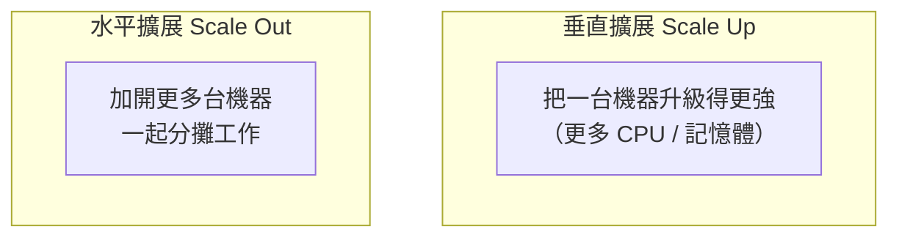
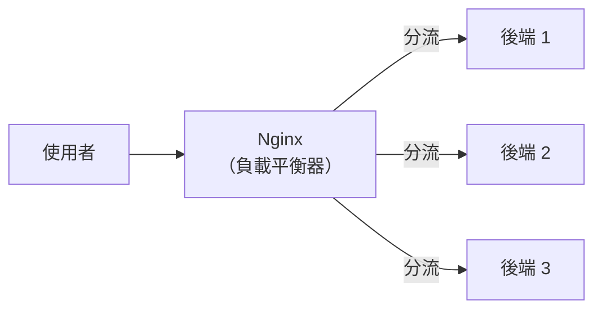

# [infra-9-1] 反向代理與負載平衡：把流量分給多台

> **本章目標**：理解為什麼一台機器會不夠用，學會用負載平衡（load balancing）把流量分散到多台後端，並看懂它和你 Part 4 學的反向代理是同一個 Nginx 的延伸。

## 你會學到

- 為什麼「加機器」是擴展的常見手段（水平擴展）
- 負載平衡（Load Balancing）是什麼
- 常見的分流策略
- 用 Nginx 把流量分給多台後端（延伸 Part 4-3）

## 概念說明

### 一台機器的極限

到目前為止，你的服務都跑在**一台**機器上。這在流量小時很好，但會遇到兩個天花板：

1. **效能天花板**：使用者越來越多，一台機器的 CPU、記憶體再強也有上限，最後撐不住、變慢。
2. **可靠性天花板**：只有一台機器，它一掛，**整個服務就全掛**（這就是下一章要講的「單點故障」）。

解法很直覺：**多開幾台機器一起分攤**。但這帶來新問題——使用者的請求進來，**該送到哪一台**？這就需要「負載平衡」。

---

### 兩種長大的方式：垂直 vs 水平

先建立一個重要的擴展觀念（呼應課外讀物 E-13 規模化）：



| | 垂直擴展（Scale Up） | 水平擴展（Scale Out） |
|---|---------------------|----------------------|
| 做法 | 把單台機器升級得更強 | 加開更多台機器 |
| 比喻 | 把小貨車換成大卡車 | 多派幾台小貨車 |
| 極限 | 有硬體上限，且越高階越貴 | 理論上可無限加 |
| 可靠性 | 還是只有一台（單點） | 多台，一台掛了還有別台 |

水平擴展是現代主流——但它的前提，就是要有人「把工作分配給多台」。這個角色就是**負載平衡器**。

---

### 負載平衡：分流的「交通指揮」

**負載平衡（Load Balancing）** 就是把進來的流量，**平均分配給後面的多台伺服器**，讓大家一起分攤、沒有人累死也沒有人閒著。

用類比：負載平衡器像超市門口的**排隊引導員**——「這位往 3 號櫃台、那位往 5 號櫃台」，讓每個櫃台的負擔均衡，整體結帳更快。

好消息是：**你已經認識這個工具了**。Part 4-3 的 Nginx 反向代理（大樓櫃台），只要稍微設定一下，就能從「轉發給一台後端」升級成「分流給多台後端」——同一個 Nginx，多了一個能力。



---

### 常見的分流策略

負載平衡器怎麼決定「這個請求給誰」？幾種常見策略：

| 策略 | 怎麼分 | 適合 |
|------|--------|------|
| **輪詢（Round Robin）** | 一台一個輪流發 | 最簡單，後端都差不多時很好用（預設） |
| **最少連線（Least Connections）** | 發給目前最閒的那台 | 各請求耗時差很多時 |
| **IP 雜湊（IP Hash）** | 同一個使用者固定到同一台 | 需要「黏住」同一台時（例如登入狀態） |

入門用預設的輪詢就很夠了。

## 程式碼範例

### 用 Nginx 設定負載平衡

延伸 Part 4-3 的設定。假設你有三台後端（或同一台上跑三個容器，分別在 3001/3002/3003），在 Nginx 設定裡這樣寫：

```nginx
# 定義一組後端（upstream = 上游伺服器群）
upstream myapp_backend {
    server 127.0.0.1:3001;
    server 127.0.0.1:3002;
    server 127.0.0.1:3003;
}

server {
    listen 80;
    server_name myapp.com;

    location / {
        proxy_pass http://myapp_backend;     # 轉給這組後端（自動分流）
        proxy_set_header Host $host;
        proxy_set_header X-Real-IP $remote_addr;
    }
}
```

關鍵差別在 `upstream`：

- `upstream myapp_backend { ... }` 定義了一**組**後端伺服器（取名 `myapp_backend`）。
- `proxy_pass http://myapp_backend`——注意這裡指向的不再是單一位址（Part 4-3 是 `localhost:3000`），而是這**整組**。Nginx 會自動用輪詢把請求分給組裡的三台。

想換策略？在 upstream 裡加一行，例如改用「最少連線」：

```nginx
upstream myapp_backend {
    least_conn;
    server 127.0.0.1:3001;
    server 127.0.0.1:3002;
    server 127.0.0.1:3003;
}
```

改完記得 `sudo nginx -t` 測試、`sudo systemctl reload nginx`（Part 4-3 的保命習慣）。

---

### 健康檢查：自動跳過掛掉的後端

負載平衡還有個隱藏好處：如果某台後端掛了，Nginx 會（在請求失敗時）**自動跳過它、把流量導到還活著的機器**。使用者幾乎無感。這正是水平擴展帶來的可靠性——下一章會深入這個「沒有單點故障」的概念。

## 小練習

### 練習 1：分清兩種擴展

用「貨車」的比喻回答：

1. 垂直擴展和水平擴展的差別？
2. 為什麼水平擴展在「可靠性」上比垂直擴展好？

---

### 練習 2：理解 upstream

對照 Part 4-3 的單台設定，回答：

1. `upstream` 區塊的作用是什麼？
2. `proxy_pass http://myapp_backend` 和 Part 4-3 的 `proxy_pass http://localhost:3000` 差在哪？

---

### 練習 3：動手做負載平衡

在你的機器上，用 Docker（Part 5）跑三個同樣的後端容器，分別對應 3001/3002/3003，設定 Nginx 負載平衡到這組。然後連續重新整理網頁，想辦法觀察請求被分到不同容器（提示：可以讓每個容器回應帶上自己的編號）。

## 課外讀物

> 想了解流量變大時，從一台到多台、再到全球規模的完整演進 → [課外讀物 E-13-4：Monolith vs Microservices](../../../課外讀物/E-13-scaling/E-13-4-monolith-vs-microservices.md)
