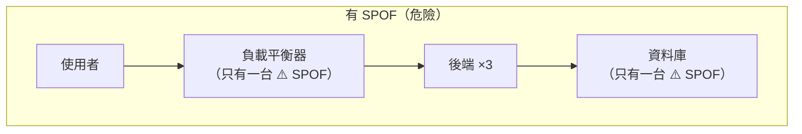
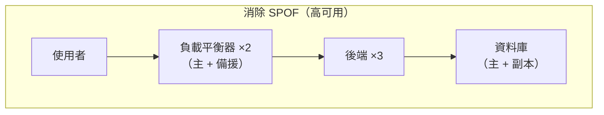

# [infra-9-2] 高可用：消滅單點故障

> **本章目標**：理解「單點故障（SPOF）」為什麼是可靠性的頭號敵人，學會用「冗餘」來消除它，建立「高可用（High Availability）」的設計直覺。

## 你會學到

- 單點故障（SPOF）是什麼、怎麼找出系統裡的 SPOF
- 冗餘（Redundancy）——用「多一份」換可靠
- 高可用（High Availability, HA）的核心思維
- 可靠性常用「幾個 9」來衡量

## 概念說明

### 鏈條最弱的一環：單點故障

有句話說「一條鏈條的強度，取決於最弱的一環」。系統可靠性也是——只要有**任何一個環節，它一掛整個服務就掛**，那個環節就是**單點故障（Single Point of Failure，SPOF）**。

上一章你用負載平衡讓後端變成多台，很好。但想想看：

- 後端有三台了，但**負載平衡器只有一台**——它掛了呢？整個服務還是全掛。
- 資料庫只有一台——它掛了呢？所有後端都沒資料可用。

這些「只有一個、掛了就全完」的地方，就是 SPOF。**高可用設計的核心工作，就是找出所有 SPOF，然後消滅它們。**



上圖雖然後端有三台，但負載平衡器和資料庫各只有一台——它們就是還沒解決的 SPOF。

---

### 解法：冗餘（Redundancy）

消滅 SPOF 的方法就一個字：**多一份**。這在 infra 叫**冗餘（Redundancy）**——關鍵環節都準備備援，一個掛了另一個立刻頂上。

用類比：飛機為什麼有多具引擎？因為「一具引擎故障，飛機還能飛」。這就是冗餘——**不是為了平常用，而是為了「出事時還有得用」**。



對照上一張圖，差別是：負載平衡器變兩台（一台掛了另一台接手）、資料庫有副本（主資料庫掛了，副本頂上）。每個關鍵環節都不再是「只有一個」。

---

### 高可用（High Availability）

當系統透過冗餘，做到「**任何單一元件故障，整體服務都還能繼續運作**」，就叫**高可用（High Availability，HA）**。

HA 的目標不是「永遠不出事」（不可能），而是「**出事了，使用者幾乎無感**」。某台機器半夜掛了，備援自動頂上，使用者根本沒注意到——這就是高可用的境界。

要達成 HA，通常需要：

- **冗餘**：關鍵元件都有備份（上面說的）。
- **故障轉移（Failover）**：偵測到某個元件掛了，自動切換到備援。
- **健康檢查**：持續確認每個元件還活著（呼應 Part 7 監控、Part 9-1 Nginx 跳過壞掉的後端）。

---

### 可靠性怎麼衡量：「幾個 9」

業界用**可用率（availability）**百分比衡量可靠性，常說「幾個 9」：

| 可用率 | 俗稱 | 一年可容許的停機時間 |
|--------|------|--------------------|
| 99% | 兩個 9 | 約 3.65 天 |
| 99.9% | 三個 9 | 約 8.76 小時 |
| 99.99% | 四個 9 | 約 52 分鐘 |
| 99.999% | 五個 9 | 約 5 分鐘 |

每多一個 9，難度和成本都**大幅**上升。重點不是盲目追求更多 9，而是**根據服務的重要性，選一個合理的目標**——一個個人部落格和一個銀行系統，需要的可靠性天差地遠。

> 「該追求幾個 9、可靠性與成本怎麼權衡」是 **SRE 課程**的核心議題（SLO / 錯誤預算）。infra 這裡先建立「用冗餘消除 SPOF」的設計直覺。

## 程式碼範例

高可用偏向「架構設計」，沒有單一指令。但你可以練習最重要的技能——**在一張架構圖裡找出所有 SPOF**。

以你目前的網站為例，把架構列出來，逐一檢查每個環節「如果只有一個、它掛了會怎樣」：

```
使用者
  → Nginx（幾台？只有一台 → ⚠️ SPOF）
  → 後端 app（Part 9-1 已做成三台 → ✅ 沒問題）
  → 資料庫（幾台？只有一台 → ⚠️ SPOF）
  → 那台機器本身（在同一個機房？機房斷電 → ⚠️ SPOF）
```

找出來之後，對每個 SPOF 想「怎麼加冗餘」：

| SPOF | 怎麼消除 |
|------|---------|
| 單一 Nginx | 開兩台 + 故障轉移機制 |
| 單一資料庫 | 主從複製（主庫掛了副本頂上，呼應 AWS RDS Multi-AZ） |
| 單一機房 | 把機器分散到不同機房（Multi-AZ） |

> 你會發現，要做到完整的高可用，自架其實很費工——這正好帶出下一章的問題：**什麼時候該把這些交給雲端託管服務（如 AWS 的 ALB、RDS Multi-AZ）來做？**

## 小練習

### 練習 1：找出 SPOF

畫出你 Part 4~7 部署的網站架構，標出所有「只有一個、掛了就全完」的單點故障。

---

### 練習 2：設計冗餘

針對上題找出的每個 SPOF，寫出「要怎麼加冗餘來消除它」。

---

### 練習 3：選一個合理的可靠性目標

回答：

1. 如果是你的個人專案，你覺得需要幾個 9？為什麼？
2. 為什麼「五個 9」對大多數服務來說是過度（且昂貴）的目標？

> 提示：每多一個 9，要投入的冗餘、人力、成本都指數成長。可靠性是「買來的」，要花得值得。

## 課外讀物

> 高可用與規模化是一體兩面，想看分散式系統怎麼面對故障 → [課外讀物 E-13-4：Monolith vs Microservices](../../../課外讀物/E-13-scaling/E-13-4-monolith-vs-microservices.md)
