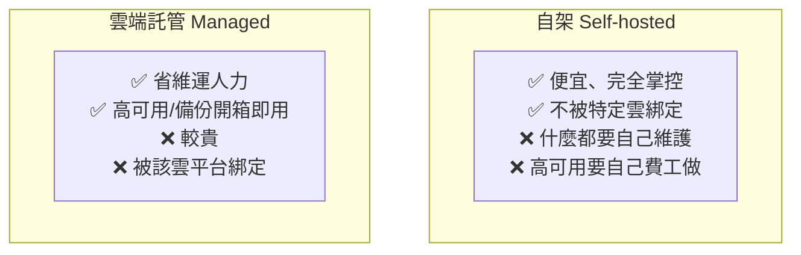

# [infra-9-3] 自架 vs 雲端：什麼時候該搬上雲？

> **本章目標**：理解「自架（self-hosted）」和「雲端託管」各自的取捨，知道什麼時候該把自己扛的東西交給雲端服務，並看清這門 infra 課和 AWS 課的銜接點。

## 你會學到

- 自架與雲端託管的真實取捨（不是誰比較好，是各有適用）
- 「受管服務」幫你扛走了什麼
- 一個判斷「該不該上雲」的思考框架
- 為什麼「先學會自架，再上雲」會讓你更強

## 概念說明

### 你現在站在一個分岔路口

走到這裡，你已經能**親手**做出一套完整的服務：架伺服器、設網路、跑服務、容器化、自動化、監控、備份、甚至高可用。這是真功夫。

但你在上一章也發現了——要做到**完整的高可用**（兩台負載平衡器、資料庫主從複製、跨機房…），自架其實**非常費工、也很花錢**。每一個 SPOF 都要自己加冗餘、自己維護、自己處理故障轉移。

這就帶出一個現代 infra 工程師天天在做的決策：**哪些自己扛，哪些交給雲端？**

---

### 受管服務：花錢買「別人幫你扛」

雲端商（如 AWS）提供大量**受管服務（managed service）**——你之前自己架的東西，它幫你架好、顧好、做好高可用。例如：

| 你自架的（這門課教的） | 對應的 AWS 受管服務 | 它幫你扛走了什麼 |
|---------------------|-------------------|----------------|
| 自己裝 PostgreSQL + 設主從複製 + 備份 | **RDS** | 高可用、自動備份、自動修補 |
| 自己架 Nginx 負載平衡器 ×2 | **ALB**（Application Load Balancer） | 負載平衡器本身的高可用 |
| 自己架 Prometheus/Grafana | **CloudWatch** | 監控基礎設施 |
| 自己處理 Redis 快取的維運 | **ElastiCache** | 受管的 Redis |

用類比：自架像**自己開伙**——便宜、完全掌控、但什麼都要自己來（買菜、煮、洗碗）。受管服務像**上餐廳**——貴一點，但有人幫你處理所有麻煩，你專心吃（專心做產品）。

---

### 取捨：沒有誰絕對好



| 面向 | 自架 | 雲端託管 |
|------|------|---------|
| 成本 | 機器費便宜，但**人力維運成本高** | 服務費較貴，但**省下維運人力** |
| 掌控度 | 完全掌控，想怎麼調都行 | 受限於服務提供的設定 |
| 高可用 | 要自己費工打造 | 多半開箱即用 |
| 維運負擔 | 全部自己扛 | 雲端幫你扛大半 |
| 綁定 | 不被綁，隨時可搬 | 容易被特定平台綁定 |

---

### 一個判斷框架

該自架還是上雲？問自己幾個問題：

1. **這件事是我的核心價值嗎？** 如果不是（例如「維護資料庫」不是你的產品重點），那交給受管服務、把時間花在真正重要的事上，通常划算。
2. **我有足夠人力維運嗎？** 自架的隱藏成本是「**有人要 24 小時顧它**」。小團隊往往撐不起。
3. **可靠性要求多高？** 要做到真正的高可用，受管服務通常比自己土法煉鋼更穩、更省事。
4. **成本算過了嗎？** 小規模自架便宜；但算進「人力 + 出事的損失」，雲端有時反而划算。

**沒有標準答案**——這正是 infra 工程師的價值：能依情況做出對的取捨。

---

### 為什麼「先學自架，再上雲」讓你更強

你可能會想：「既然雲端這麼方便，那我何必學自架？」

因為——**只會點雲端按鈕，和真懂底層發生什麼事，是兩種工程師。**

你學過自架，所以你**真的懂** RDS 背後的主從複製在做什麼、ALB 背後的負載平衡原理、為什麼要 Multi-AZ。當雲端服務出問題時，只會點按鈕的人束手無策，而你能判斷問題、知道怎麼查。

**這門 infra 課給你的，是看穿雲端「魔法」背後原理的能力。** 接下來的 AWS 課程，會帶你把這些原理對應到雲端的真實服務——你會學得又快又紮實，因為地基已經打好了。

> 準備好把這些落地到雲端了嗎 → 參見 **AWS 課程**：`lessons/aws/課程大綱.md`。你會發現很多概念「啊，這不就是 infra 學過的那個嗎」——只是換成 AWS 幫你管。

## 程式碼範例

這一章是決策思維，沒有指令。但你可以做一個很有價值的練習——**幫你的服務做一次「自架 vs 上雲」的取捨分析表**。

針對你部署的網站，把每個元件列出來評估：

```
元件          | 自架成本/難度        | 上雲選項      | 我的決定 + 理由
------------- | ------------------- | ------------ | ----------------
網頁伺服器     | 低（已會 Nginx）     | EC2/ALB      | 自架（簡單、可控）
資料庫        | 高（主從、備份難）    | RDS          | 上雲（高可用太費工）
負載平衡      | 中（要做冗餘）       | ALB          | 上雲（省得自己做 HA）
監控          | 中（已會 Grafana）   | CloudWatch   | 看情況
快取          | 中                  | ElastiCache  | 看規模
```

寫這張表的過程，就是在訓練 infra 工程師最值錢的能力：**不是「會不會做」，而是「該不該自己做」的判斷。**

## 小練習

### 練習 1：理解受管服務的價值

用「自己開伙 vs 上餐廳」的類比，解釋受管服務（如 RDS）幫你扛走了什麼、代價是什麼。

---

### 練習 2：做取捨決策

針對「資料庫」這個元件，用本章的判斷框架（核心價值？人力？可靠性？成本？）分析：對一個 3 人小團隊的產品，你會自架還是用 RDS？寫出你的理由。

---

### 練習 3：完成你的取捨分析表

幫你部署的網站，完成上面那張「自架 vs 上雲」分析表。沒有標準答案，重點是你能說出每個決定背後的理由。

> 提示：帶著這張表去學 AWS 課程，你會對每個服務「為什麼存在、解決什麼痛點」特別有感——因為你親手體會過自架的痛。

## 課外讀物

> 想了解雲端如何用全球節點加速服務（自架很難做到的事） → [課外讀物 E-11-5：CDN 是什麼？](../../../課外讀物/E-11-performance/E-11-5-cdn.md)
