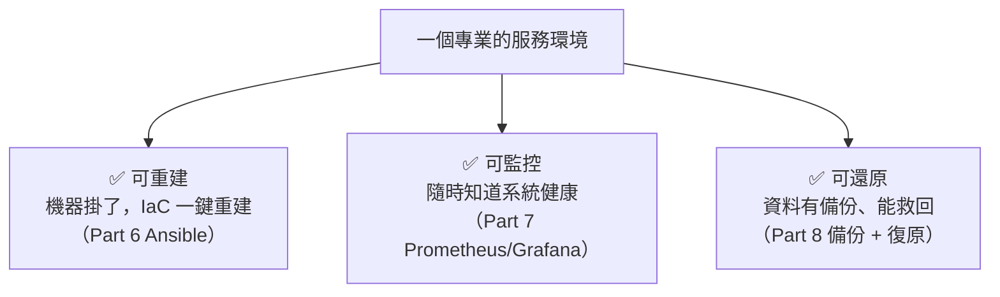
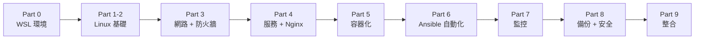

# [infra-9-4] 🏆 總整理專案：可重建、可監控、可還原的完整環境

> **本章目標**：把整個 infra 課程學的所有技能，整合成一個完整的專案——用 IaC 一鍵建好、有監控、有自動備份、出事能還原的服務環境。這是你成為稱職 infra 工程師的畢業考。

## 你會學到

- 把 Part 0~8 的技能整合成一套完整、專業的環境
- 一個真實 infra 專案該有的所有要素
- 怎麼驗收「我真的具備 infra 工程師的能力了」
- 你的下一步學習方向

## 概念說明

### 這是你的畢業專案

恭喜你走到這裡。回頭看，你從「打開 WSL、認識一台機器」開始，一路學到自動化、監控、可靠性與安全。這一章，我們把所有東西**組裝成一個完整的作品**。

目標是打造一個具備「**三可**」的服務環境：



做到這「三可」，你的環境就不再是「祈禱它別出事」的脆弱系統，而是「**出事也能從容應對**」的專業基礎建設。

---

### 這個專案用到你學過的全部



每一個 Part 都是這個專案的一塊拼圖。下面把它們拼起來。

## 程式碼範例

### 專案藍圖

你要交付的，是一個 Git repo，裡面有「一鍵建立整套環境」所需的一切：

```
my-infra-project/
├── README.md                  ← 專案說明 + 如何使用
├── DISASTER-RECOVERY.md       ← 災難復原計畫（Part 8-4）
├── ansible/
│   ├── inventory.ini          ← 機器清單（Part 6）
│   ├── site.yml               ← 主 playbook：建好整套環境
│   └── files/
│       └── nginx.conf         ← Nginx 設定（Part 4 + 9-1 負載平衡）
├── app/
│   ├── Dockerfile             ← 應用打包（Part 5-3）
│   └── docker-compose.yml     ← app + db + nginx（Part 5-5）
├── monitoring/
│   └── docker-compose.yml     ← Prometheus + Grafana（Part 7-4）
└── scripts/
    └── backup.sh              ← 自動備份腳本（Part 8-2）
```

每個檔案你都寫過了——這個專案是「把它們收進一個 repo、用 Git 管起來」。

---

### 整合的核心：一份主 playbook 串起一切

專案的靈魂是 `ansible/site.yml`，它把所有設定一次套用。延伸 Part 6-5，加入安全加固與監控：

```yaml
- name: 打造完整的服務環境
  hosts: webservers
  become: yes

  tasks:
    # === 基礎安全（Part 2-6, 3-3, 8-3）===
    - name: 安裝必要套件
      apt:
        name: [nginx, ufw, fail2ban, docker.io]
        state: present
        update_cache: yes

    - name: 防火牆放行 SSH/HTTP/HTTPS
      ufw:
        rule: allow
        port: "{{ item }}"
      loop: ["22", "80", "443"]

    - name: 啟用防火牆
      ufw:
        state: enabled
        default: deny
        direction: incoming

    - name: 啟用 fail2ban（自動擋暴力破解）
      service:
        name: fail2ban
        state: started
        enabled: yes

    # === 部署應用（Part 5）===
    - name: 部署 Nginx 設定
      copy:
        src: files/nginx.conf
        dest: /etc/nginx/sites-available/myapp

    # === 自動備份（Part 8-2）===
    - name: 部署備份腳本
      copy:
        src: ../scripts/backup.sh
        dest: /home/deploy/backup.sh
        mode: "0755"

    - name: 設定每日自動備份（cron，Part 6-2）
      cron:
        name: "daily backup"
        hour: "2"
        minute: "0"
        job: "/home/deploy/backup.sh >> /home/deploy/logs/backup.log 2>&1"
```

看出來了嗎？這一份 playbook，把你**整門課**學的東西——安全加固、防火牆、服務部署、自動備份排程——全部變成「一個指令就完成」。`ansible-playbook -i inventory.ini site.yml` 跑下去，一台全新機器就武裝完整了。

---

### 完整交付流程

把整個專案串起來，你的「從零到完整服務」流程是：

```bash
# 1. 開一台新機器（或用 EC2），設好 SSH
# 2. 用 Ansible 一鍵建好基礎環境（安全 + 服務 + 備份排程）
cd ansible
ansible-playbook -i inventory.ini site.yml

# 3. 部署應用（容器化）
cd ../app
docker compose up -d --build

# 4. 啟動監控
cd ../monitoring
docker compose up -d

# 5. 驗證（Part 3-4 的分層排查）
curl -I https://myapp.com          # 服務通嗎
# 打開 Grafana 看監控有沒有上來
# 確認備份 cron 已設定
```

跑完這幾步，你就擁有一個**可重建（IaC）、可監控（Grafana）、可還原（備份 + DR 計畫）**的完整環境。

---

### 驗收清單：你真的會了嗎？

對照這份清單，每一項你都能做到，就代表你具備了稱職 infra 工程師的核心能力：

- [ ] 能用 WSL/雲端開好 Linux 環境，自在地用命令列（Part 0-2）
- [ ] 看得懂權限、行程、磁碟，能排查資源問題（Part 2）
- [ ] 能設定網路與防火牆，會用工具排查連線問題（Part 3）
- [ ] 能讓服務常駐、自動重啟、對外提供 HTTPS（Part 4）
- [ ] 能把應用容器化、用 Compose 一鍵啟動（Part 5）
- [ ] 能用 Ansible 把設定變成可重複執行的程式碼（Part 6）
- [ ] 能架起監控、看懂系統健康、設定告警（Part 7）
- [ ] 能設計備份、演練還原、加固伺服器（Part 8）
- [ ] 能設計負載平衡、判斷自架 vs 上雲（Part 9）

---

### 你的下一步

走到這裡，你已經是一個能獨當一面的 infra 工程師了。接下來可以往三個方向深化：

| 方向 | 學什麼 | 去哪 |
|------|--------|------|
| **上雲** | 把這些落地到 AWS 真實服務（VPC/EC2/RDS/EKS） | **AWS 課程**：`lessons/aws/課程大綱.md` |
| **可靠性工程** | SLO、告警設計、事故處理、混沌工程 | **SRE 課程**：`lessons/sre/課程大綱.md` |
| **容器編排** | 容器多到要跨機器管理時的 Kubernetes | 課外讀物 E-13-3 |

你在這門課打下的底層功夫，會讓這三條路都走得又快又穩——因為你不是「只會點按鈕」，而是**真的懂機器在做什麼**。

## 小練習

### 練習 1：完成總整理專案

把你整門課做過的東西，整理成一個 Git repo，達成「可重建、可監控、可還原」三可。這是你最好的作品集——面試時可以直接展示。

---

### 練習 2：對照驗收清單

老實對照上面的驗收清單，哪幾項你還不夠熟？回去重看對應的 Part，把它補強。

---

### 練習 3：（終極挑戰）完整災難演練

開一台全新機器，**只用你的 Git repo**（Ansible + Compose + 備份），把整套服務從零重建起來，並還原資料。計時——這就是你的 RTO。能順利做到，你就通過了 infra 工程師的畢業考。🎓

> 恭喜你完成整門 infra 課程！你從「一台機器是什麼」開始，到能打造一套專業、可靠、自動化的基礎建設。這是真本事——去把它用在你的專案、你的伺服器、你的職涯上吧。

## 課外讀物

> 想看這套基礎建設在「全球規模」會演化成什麼樣 → [課外讀物 E-13-3：Kubernetes 概念入門](../../../課外讀物/E-13-scaling/E-13-3-kubernetes-intro.md)
