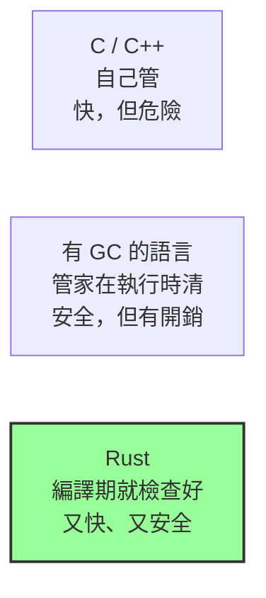

# [rust-0-1] 為什麼學 Rust？它想同時解決「快」與「安全」這對老冤家

> **本章目標**：理解 Rust 為什麼存在——它想打破程式語言界長久以來「要快就不安全、要安全就不快」的取捨，以及它憑什麼做到。

## 你會學到

- 程式語言長久以來「執行速度」與「記憶體安全」的兩難
- 垃圾回收（GC）是什麼，它幫你解決了什麼、又付出什麼代價
- Rust 用「所有權」走第三條路的核心點子（先有個直覺就好）
- Rust 適合拿來做什麼

## 概念說明

### 一個長久的兩難：快 vs 安全

想像你在管理一間倉庫，倉庫的空間（記憶體）很寶貴，東西用完要記得清掉、騰出空間。歷史上，程式語言大致分成兩種管理風格：

**風格一：什麼都自己來（C / C++）**

你親手決定「什麼時候拿一塊空間、什麼時候還回去」。

```
拿一塊空間放資料
... 使用它 ...
用完了，親手把它還回去
```

好處是**快**——沒有任何多餘的管家在旁邊盯著，效率拉到滿。
壞處是**危險**——只要你忘記還、還太早、或還了又再用一次，就會出現經典的記憶體 bug：

- **記憶體洩漏**：忘記還，空間越用越少，程式越跑越腫。
- **懸空指標（use after free）**：還回去了卻又去用它——讀到垃圾資料，甚至被駭客利用。

這些 bug 惡名昭彰，是無數當機與資安漏洞的根源。

**風格二：請一位管家（Java / C# / JavaScript / Python…）**

你不用管「什麼時候還空間」，語言內建一位叫 **垃圾回收（GC，Garbage Collection）** 的管家，會定期巡視倉庫，把「沒人用的東西」自動清掉。

```
拿一塊空間放資料
... 使用它 ...
（不用管，管家會自己來清）
```

好處是**安全又省心**——你幾乎不會踩到上面那些記憶體地雷。
壞處是**有代價**——這位管家要花 CPU 時間巡視，而且巡視時可能讓你的程式**短暫暫停一下（GC pause）**。大多數應用感覺不到，但對「要求極致效能、不能有突然卡頓」的場景（遊戲引擎、作業系統、高頻交易、嵌入式裝置）就是問題。

> 想知道「堆疊、堆積、記憶體到底怎麼運作」的底層原理 → [cs 課程 計算機概論 Part 3、5]（同一作者的計算機概論書，會把這塊講透）

### Rust 的第三條路：讓編譯器當管家，但不收執行期的費用

Rust 的想法很大膽：**「不要在程式執行時才管記憶體，而是在『編譯』的時候就把規則檢查好。」**

它有一套叫 **所有權（Ownership）** 的規則。你寫程式時遵守這套規則，**編譯器**就會在你按下編譯的當下，幫你檢查「每塊記憶體誰擁有、什麼時候該還」。檢查通過後，編譯器自動在正確的位置插入「歸還」的動作——所以：



這張圖在說：C/C++ 換來速度卻犧牲安全，GC 語言換來安全卻付出執行期開銷，而 Rust 把檢查搬到**編譯期**——程式跑起來時既沒有 GC 管家的開銷（快得像 C），又不會有記憶體地雷（安全）。

代價是什麼？**你要先學會那套所有權規則**，而且編譯器很嚴格——一開始它會一直「拒絕」你的程式。這就是 Rust「學習曲線陡」的名聲來源。但好消息是：**一旦編譯通過，你就排除掉了一整類最難抓的 bug**。Rust 社群有句話：「如果它能編譯，它大概就能正確跑。」

## 程式碼範例

先別擔心看不懂語法（後面會慢慢教），這裡只是讓你**感受一下**「編譯器幫你擋 bug」是什麼意思。下面這段 Rust 故意犯了「東西已經還回去了卻又拿來用」的錯：

```rust
fn main() {
    let s1 = String::from("哈囉");
    let s2 = s1;          // s1 的所有權「移動」給了 s2
    println!("{}", s1);   // ❌ 想再用 s1 —— 編譯器會在這裡擋下來
}
```

在 C++ 裡類似的寫法會「能編譯、執行時才出事」（甚至悄悄出事）。但 Rust 連編譯都不讓你過，會直接告訴你：

```
error[E0382]: borrow of moved value: `s1`
```

意思是「`s1` 的值已經被移走了，你不能再借用它」。**Bug 在上線前、甚至在你還在打字時就被攔下了**——這就是 Rust 的價值主張。這段程式碼背後的「移動（move）」規則，正是 Part 2 整章要講的主角，現在看不懂完全沒關係。

## 小練習

1. 用自己的話，向一個沒學過程式的朋友解釋：「GC 像請了一位管家」這個比喻好在哪、又有什麼代價？
2. 查一查（或回想）：你聽過哪些軟體是用 Rust 寫的？（提示：搜尋「Rust in production」，看看作業系統、瀏覽器引擎、雲端服務有沒有它的身影。）
3. 思考題：如果一個專案「對效能要求普通、團隊也習慣寫 Python」，硬要換成 Rust 一定划算嗎？想想看「選語言」除了快不快，還要考慮什麼。

## 課外讀物

> 想搞懂「堆疊 vs 堆積、記憶體到底怎麼配置」的底層原理 → **cs 課程（計算機概論）Part 3：硬體構造、Part 5：作業系統**（這會讓你之後學「所有權」事半功倍）

> 想對照「有 GC 的應用層語言」是怎麼寫後端的 → **basic 課程（TypeScript）** 與 **csharp 課程（C#）**
