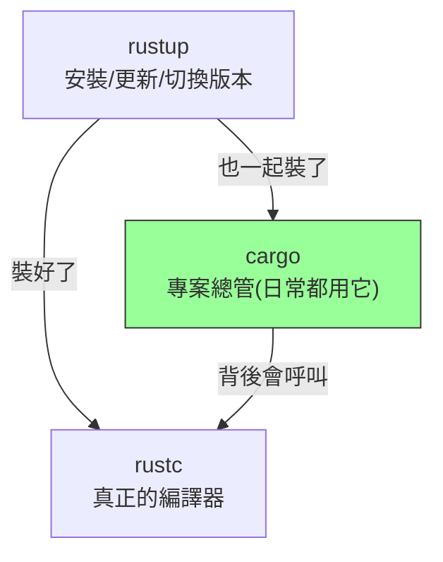

# [rust-0-3] 環境準備：安裝 rustup、cargo，跑出第一個 Hello World

> **本章目標**：把 Rust 開發環境裝起來，理解 `rustup` / `rustc` / `cargo` 各是什麼，並親手編譯、執行你的第一支 Rust 程式。

## 你會學到

- `rustup`、`rustc`、`cargo` 三個工具分別負責什麼
- 怎麼安裝 Rust（含 Windows / WSL / Mac）
- 用最原始的方式寫一支程式、手動編譯、執行
- 怎麼確認環境裝好了

## 概念說明

### 三個名字先分清楚

剛接觸 Rust 會看到三個指令，先用一個比喻分清楚它們的角色：

```
rustup ── 像「版本管理員」：負責安裝、更新、切換 Rust 的版本
rustc  ── 像「編譯器本人」：把你的 .rs 原始碼變成可執行檔
cargo  ── 像「專案總管」：建專案、編譯、執行、管理套件、跑測試，一條龍
```



這張圖的重點：你用 `rustup` 一次把整套裝好；**日常開發幾乎只會用到 `cargo`**（它背後會自動幫你呼叫 `rustc`）。`rustc` 你很少直接碰，但這章先用它一次，讓你看清「編譯」這件事的本質。

> 為什麼需要「編譯」這個步驟？因為 CPU 看不懂你寫的 Rust，要先翻譯成機器碼。想深入「編譯 vs 直譯」 → [課外讀物路徑見下方課外讀物區] 或 **cs 課程 Part 4：程式如何執行**。

## 程式碼範例

### 步驟一：安裝 Rust

官方推薦用 `rustup` 安裝。打開終端機：

**Mac / Linux / WSL**（推薦你用 WSL，和本系列其他課程一致）：

```bash
curl --proto '=https' --tlsv1.2 -sSf https://sh.rustup.rs | sh
```

它會問你安裝選項，直接選預設（按 Enter）即可。裝完照提示讓設定生效：

```bash
source "$HOME/.cargo/env"
```

**Windows（原生，不透過 WSL）**：到 <https://rustup.rs> 下載 `rustup-init.exe` 跑起來，依指示安裝。

> 安裝過程會從網路下載工具鏈，需要一點時間是正常的。

### 步驟二：確認裝好了

關掉終端機再重開（讓環境變數生效），輸入：

```bash
rustc --version
cargo --version
```

如果各印出一個版本號（例如 `rustc 1.xx.x`），就代表裝好了。之後想更新 Rust 到最新版，隨時可以：

```bash
rustup update
```

### 步驟三：用最原始的方式寫第一支程式

為了讓你看清「原始碼 → 編譯 → 執行」的本質，這次我們**先不用 cargo**，純手動來一次。

新建一個檔案 `main.rs`，內容如下：

```rust
fn main() {
    println!("Hello, Rust!");
}
```

逐行說明這段在做什麼：

- `fn main() { ... }`：定義一個叫 `main` 的函式。**每支 Rust 執行程式都從 `main` 開始跑**（這是約定，就像故事的第一頁）。
- `println!("Hello, Rust!");`：印出一行字。注意 `println` 後面那個 **`!`**——它代表這是一個「巨集（macro）」而不是普通函式，[rust-1-6] 會解釋差別，現在先照打。
- 每行敘述結尾要有 **分號 `;`**。

### 步驟四：手動編譯並執行

在 `main.rs` 所在的資料夾，執行：

```bash
rustc main.rs      # 編譯，產生一個可執行檔
./main             # 執行它（Windows 是 main.exe）
```

你應該會看到：

```
Hello, Rust!
```

恭喜，你剛剛完成了「寫原始碼 → `rustc` 編譯成執行檔 → 執行」的完整一輪。**注意一個關鍵差異**：跟 TypeScript / Python 不同，Rust 程式是**先編譯成一個獨立的執行檔**，這個檔案可以直接拿去別台（同型）機器跑，不需要安裝 Rust——這正是「編譯式語言」的特性。

> 下一章 [rust-0-4] 會告訴你：真實專案沒人這樣一個一個檔手動 `rustc`，而是用 `cargo` 一鍵搞定。

## 小練習

1. 把 `Hello, Rust!` 改成印出你的名字，重新 `rustc` 編譯、執行，確認改動生效。
2. 試著在 `main` 裡多加一行 `println!`，印出兩行字。觀察：是不是每行敘述都要分號？
3. 故意把某行結尾的分號刪掉，重新編譯，**讀讀看編譯器的錯誤訊息**。Rust 的錯誤訊息以「友善、會教你怎麼修」聞名，習慣去讀它是學 Rust 的重要技能。

## 課外讀物

> 想理解「編譯 vs 直譯、原始碼怎麼變成執行檔」 → **cs 課程（計算機概論）Part 4：電腦如何執行你的程式**

> 對終端機指令還不熟 → [課外讀物 E-1：終端機操作](../../../課外讀物/E-1-terminal/E-1-1-what-is-terminal.md)

> 想在 Windows 上用 Linux 環境練習（推薦） → **infra 課程 Part 0：WSL 介紹**
