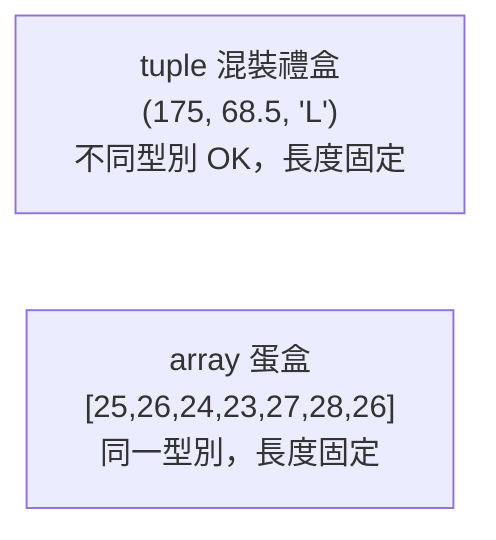

# [rust-1-3] 複合型別：tuple（元組）與 array（陣列）

> **本章目標**：學會把多個值「打包成一個」的兩種基本方式——元組（tuple）與陣列（array），以及它們各自適合裝什麼。

## 你會學到

- 元組（tuple）：把「幾個不同型別的值」綁成一組
- 陣列（array）：把「一排相同型別的值」排在一起
- 怎麼取出裡面的值
- 陣列為什麼「固定長度」，以及它和之後的 `Vec` 差在哪

## 概念說明

純量型別（上一章）一次只裝一個值。但現實常常要「一組值」。Rust 有兩種最基本的打包方式：

```
tuple（元組）：像一個「混裝禮盒」——可以裝不同種類的東西，但數量固定
              例：(身高, 體重, 名字縮寫) = (175, 68.5, 'L')

array（陣列）：像一個「蛋盒」——每格裝同一種東西，格數固定
              例：一週氣溫 [25, 26, 24, 23, 27, 28, 26]
```



這張圖的重點：**tuple 可混不同型別、array 必須同型別**，但兩者**長度都固定**（編譯時就決定，不能中途增減）。要能動態增減的，是之後 [rust-6-1] 的 `Vec`。

## 程式碼範例

### Tuple：混裝不同型別

```rust
fn main() {
    let person = (175, 68.5, 'L');   // (i32, f64, char) 混在一起
    // 用「點 + 索引」取出，從 0 開始數
    println!("身高 {}", person.0);
    println!("體重 {}", person.1);
    println!("縮寫 {}", person.2);
}
```

說明：tuple 用 `.0`、`.1`、`.2` 這種「點加位置」取值，位置從 0 開始。

也可以一次「拆開」成多個變數，這叫**解構（destructuring）**：

```rust
fn main() {
    let person = (175, 68.5, 'L');
    let (height, weight, initial) = person;   // 一次拆成三個變數
    println!("{} {} {}", height, weight, initial);
}
```

> tuple 很適合「函式想一次回傳好幾個值」的時候——把它們包成一個 tuple 回傳即可。[rust-1-4] 函式會用到。

### Array：一排相同型別

```rust
fn main() {
    let week_temps = [25, 26, 24, 23, 27, 28, 26];  // 7 個 i32
    println!("星期一氣溫 {}", week_temps[0]);          // 用 [索引] 取值
    println!("星期日氣溫 {}", week_temps[6]);
    println!("這週共 {} 天", week_temps.len());        // .len() 取長度
}
```

說明：陣列用 `[索引]` 取值（一樣從 0 開始），`.len()` 拿到長度。陣列的長度是型別的一部分——上面是「7 個 i32 的陣列」，你不能事後塞第 8 個進去。

### 陣列越界：Rust 幫你擋下

很多語言裡，讀取超出範圍的索引會讀到垃圾或引發詭異行為。Rust 會在執行時檢查並**直接中止程式並告訴你哪裡錯**，不讓你讀到不該讀的記憶體：

```rust
fn main() {
    let arr = [1, 2, 3];
    println!("{}", arr[10]);   // 執行時 panic：index out of bounds
}
```

這是 Rust「安全」精神的又一個體現——寧可清楚地當掉，也不要默默讀到錯誤的記憶體（這在 C 裡是經典資安漏洞來源）。

> 這種「會把錯誤攤在陽光下」的設計，[rust-4-1] 錯誤處理會深入。

## 小練習

1. 建一個 tuple 存「一本書」的（書名字元縮寫 `char`、頁數 `i32`、評分 `f64`），用 `.0/.1/.2` 印出三個欄位，再用解構一次拆開印出。
2. 建一個存 5 個整數的陣列，印出第一個、最後一個，以及 `.len()`。
3. 故意存取一個超出範圍的索引，跑跑看，讀讀 panic 訊息。想想：Rust 這樣「直接當掉」比「默默讀到垃圾」好在哪？

## 課外讀物

> 陣列為什麼能用索引「瞬間」取到值（O(1)）、它和會自動長大的動態陣列差在哪 → **dsa 課程 Part 2：線性資料結構（陣列、動態陣列）**

> 陣列越界在 C 裡是經典資安漏洞（緩衝區溢位） → [課外讀物 E-10：Web Security 基礎](../../../課外讀物/E-10-security/E-10-1-web-security-overview.md)
