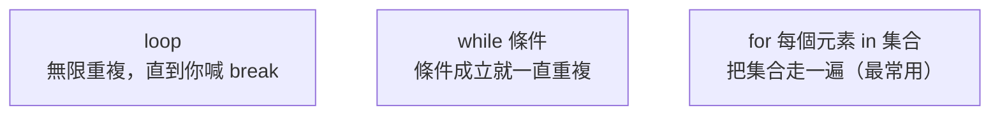

# [rust-1-5] 控制流程：if、loop、while、for

> **本章目標**：學會用條件判斷與迴圈控制程式的走向——讓程式會「做選擇」也會「重複做事」。

## 你會學到

- `if / else if / else` 做條件分支
- Rust 的三種迴圈：`loop`、`while`、`for`
- 為什麼處理「一排資料」時 `for` 最常用、最安全
- `loop` 怎麼搭配 `break` 回傳一個值

## 概念說明

程式不是從頭到尾一條線跑完，它需要：

- **做選擇**：條件成立就走這條路，否則走另一條 → `if`
- **重複做**：同一件事做很多遍 → 迴圈

```
如果 分數 >= 60：
    印出「及格」
否則：
    印出「不及格」

對 清單裡的每一個學生：
    印出他的名字
```

Rust 把這些寫成 `if` 和迴圈。它有三種迴圈，差別在「**重複的條件是什麼**」：



這張圖的重點：`loop` 是「一直跑到你喊停」，`while` 是「條件還成立就繼續」，`for` 是「把一堆東西逐一處理一遍」——日常最常用、也最不容易出錯的是 `for`。

## 程式碼範例

### if / else if / else

```rust
fn main() {
    let score = 72;
    if score >= 90 {
        println!("優等");
    } else if score >= 60 {
        println!("及格");
    } else {
        println!("不及格");
    }
}
```

說明：條件不用加括號（不必寫成 `if (score >= 90)`），但大括號 `{}` 一定要有。條件**必須是 `bool`**——Rust 不像某些語言把「非零」當真，你得明確給它真假值。

### loop：無限迴圈 + break 回傳值

`loop` 會一直重複，直到遇到 `break`。Rust 的特色是 `break` 還能**帶回一個值**：

```rust
fn main() {
    let mut count = 0;
    let result = loop {
        count += 1;
        if count == 5 {
            break count * 10;   // 跳出迴圈，並把 count*10 當成 loop 的值
        }
    };
    println!("result = {}", result);   // 50
}
```

說明：`count += 1` 是 `count = count + 1` 的簡寫。當 `count` 到 5，`break count * 10` 同時做兩件事：跳出迴圈、把 `50` 當作整個 `loop` 的結果（呼應上一章「Rust 什麼都能算出值」）。

### while：條件成立就繼續

```rust
fn main() {
    let mut n = 3;
    while n > 0 {
        println!("倒數 {}", n);
        n -= 1;
    }
    println!("發射！");
}
```

說明：每輪開始前檢查 `n > 0`，成立才跑。適合「重複到某個條件不再成立」。

### for：把一堆東西逐一處理（最常用、最安全）

```rust
fn main() {
    let temps = [25, 26, 24, 23, 27];
    for t in temps {
        println!("氣溫 {}", t);
    }

    // 想跑「固定次數」用 range：1..=5 是 1 到 5（含 5）
    for i in 1..=5 {
        println!("第 {} 次", i);
    }
}
```

說明：`for t in temps` 會把陣列每個元素依序拿出來放進 `t`。`1..=5` 是一個「範圍」，表示 1 到 5（`..=` 含結尾；`1..5` 則不含 5）。

為什麼 `for` 最受推薦？因為用 `while` 配索引手動跑陣列時，很容易寫錯邊界（多跑一格、少跑一格）而越界。`for` 直接走訪元素，**從根本上避免了索引算錯**，更安全也更好讀。

## 小練習

1. 寫一段程式：用 `for i in 1..=10` 印出 1 到 10，但遇到偶數印「i 是偶數」、奇數印「i 是奇數」（搭配 `if`）。
2. 用 `while` 實作「把一個數字不斷除以 2、印出每一步，直到變成 0」。
3. 用 `loop` + `break` 寫一個迴圈，從 1 開始累加（1+2+3+…），加到「總和超過 100」就停下，並讓 `loop` 回傳那個總和、印出來。

## 課外讀物

> 「巢狀太多層的條件/迴圈」是常見的可讀性反模式 → [課外讀物 E-6-6：程式碼異味與反模式](../../../課外讀物/E-6-best-practices/E-6-6-anti-patterns.md)

> 迴圈跑幾遍會影響效能——「一層迴圈 vs 兩層巢狀」差很多 → **dsa 課程 Part 1：複雜度分析（Big-O）**
