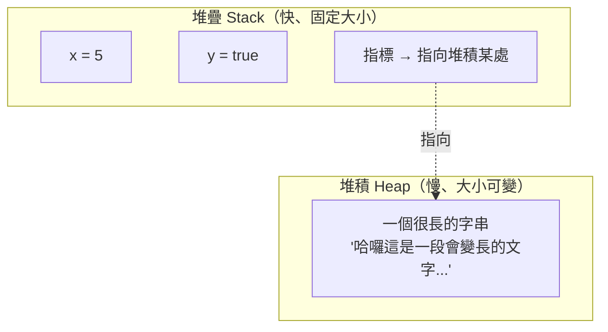
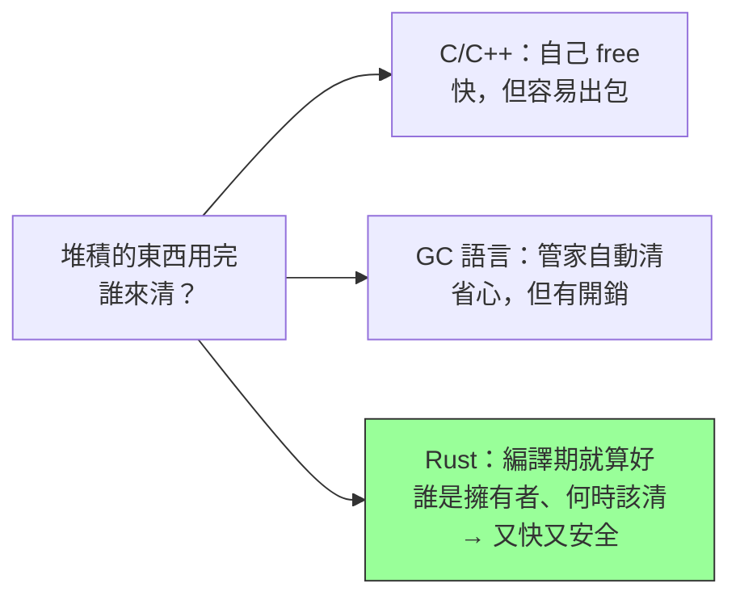

# [rust-2-1] 記憶體的根本問題：堆疊 vs 堆積，與別的語言怎麼處理

> **本章目標**：在學「所有權」之前，先搞懂程式的記憶體分成「堆疊」與「堆積」兩塊，以及為什麼「管理堆積」是個讓所有語言頭痛的問題——這是理解 Rust 為何這樣設計的關鍵背景。

## 你會學到

- 程式執行時記憶體的兩大區域：堆疊（stack）與堆積（heap）
- 為什麼有些資料放堆疊、有些得放堆積
- 「堆積上的東西用完要還」這件事，別的語言怎麼處理
- Rust 打算用什麼方式解決（先建立期待）

## 概念說明

### 兩塊記憶體：堆疊與堆積

程式跑起來時，作業系統給它的記憶體大致分兩塊用途，用一個比喻：

```
堆疊 stack ── 像「一疊餐盤」：又快又整齊，但只放「大小固定、生命短」的東西。
              拿放都在最上面，超快。函式的區域變數放這。

堆積 heap  ── 像「一間大倉庫」：放「大小不定、要活久一點」的東西。
              要先「找一塊空位」放進去，較慢，用完還要記得清掉。
```



這張圖在說：像 `5`、`true` 這種**大小固定**的小東西，直接放堆疊（快）。但像「一段可能變長的字串」這種**大小不固定、可能變大**的資料，得放進堆積（倉庫），而堆疊上只留一個「指標」記住它在倉庫的哪裡。

> 為什麼要這樣分？想深入「堆疊、堆積、記憶體位址」的硬體與作業系統原理 → **cs 課程 Part 3：記憶體階層、Part 5：記憶體管理**

### 真正的難題：堆積上的東西，誰負責清掉？

堆疊很單純——東西用完（函式結束），那疊盤子自動收掉，不用煩惱。

**麻煩的是堆積**。倉庫的空間有限，放進去的東西「用完了」必須清掉、騰出空位，否則倉庫遲早爆滿（記憶體洩漏）。問題是：**「什麼時候才算用完、該由誰來清？」** 這出乎意料地難。歷史上有兩種答案（呼應 [rust-0-1]）：

- **自己清（C/C++）**：你親手 `malloc` 拿、`free` 還。忘了還 → 洩漏；還太早又用 → 災難；還兩次 → 災難。
- **管家清（Java/C#/JS/Python）**：GC 定期掃描「還有沒有人用」，沒人用就清。省心，但要花 CPU、可能造成暫停。



### Rust 的答案：所有權

Rust 的解法既不是「你自己清」也不是「管家執行時清」，而是：**在編譯時，透過「所有權」規則，精確算出每塊堆積記憶體『誰擁有、活到哪一行該被清』，然後編譯器自動在正確的位置插入清理動作。**

結果就是：**執行時沒有 GC 的開銷（快得像 C），又不會忘記清或清錯（安全）。** 代價是你要先學會這套規則——這正是下一章開始的主題。

現在你只要記住一句話：**「所有權，本質上是 Rust 用來決定『堆積記憶體何時該被釋放』的一套編譯期規則。」** 帶著這個認識，後面會非常好懂。

## 程式碼範例

感受一下「放堆疊」與「放堆積」的兩種值。先別管語法細節，重點在註解：

```rust
fn main() {
    // 放堆疊：大小固定的整數
    let x = 5;

    // 放堆積：String 是「可變長」的字串，內容存在堆積，
    // 變數 s 在堆疊上只是一個「指向堆積資料的把手」
    let s = String::from("一段會變長的文字");

    println!("{} {}", x, s);
}   // ← 函式結束。x 直接從堆疊收掉；
    //   s 擁有的那塊「堆積記憶體」，Rust 在這裡自動幫你清掉（不用你寫 free）
```

關鍵在最後那個 `}`：`s` 離開了它的作用範圍，Rust **自動**釋放它在堆積上的資料。你沒寫任何「清理」的程式碼，也沒有 GC 在背後巡邏——這份「自動」是編譯期就決定好的。這背後的規則，下一章正式登場。

> 字串為什麼要放堆積、`String` 和之後的 `&str` 差在哪 → [rust-6-2]（先有個印象就好）

## 小練習

1. 用自己的話解釋：為什麼整數 `5` 可以放堆疊，而「一段可能變長的字串」要放堆積？
2. 比較「C 的手動 free」和「Java 的 GC」各自的優缺點，各寫一句。再想想 Rust 想怎麼兼得兩者的好處。
3. 思考題：上面範例最後的 `}`，Rust 怎麼「知道」該在這裡清掉 `s`？（提示：和 `s` 的「作用範圍」有關——這正是所有權要回答的。）

## 課外讀物

> 想徹底搞懂「堆疊、堆積、記憶體位址、虛擬記憶體」 → **cs 課程 Part 3：硬體構造、Part 5：作業系統（記憶體管理）**

> 想知道「記憶體沒清乾淨」在真實系統造成的效能/可靠性問題 → **sre 課程**（記憶體洩漏是經典的線上事故來源）
