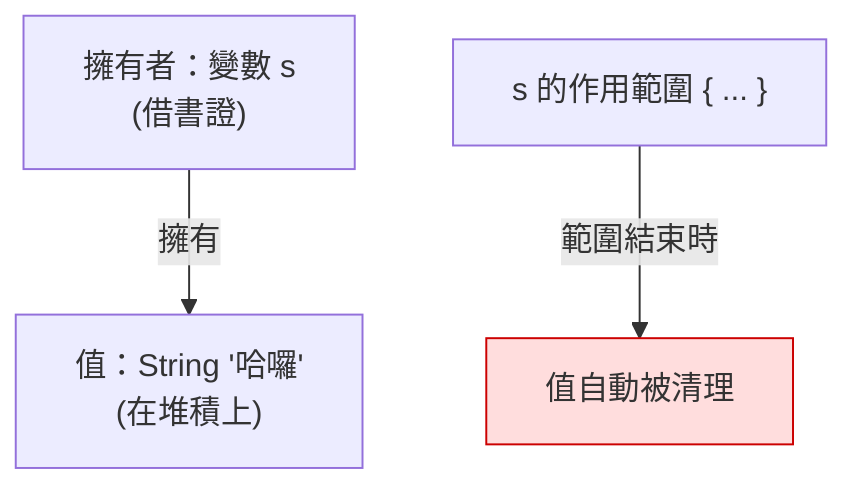

# [rust-2-2] 所有權三原則：每個值都有唯一的「擁有者」

> **本章目標**：正式認識 Rust 的核心——所有權的三條規則。理解「擁有者」「作用範圍」「自動釋放」這組概念，這是整本書的地基。

## 你會學到

- 所有權的三條規則（背下來，後面都靠它）
- 「擁有者」和「作用範圍（scope）」是什麼意思
- 值如何在「擁有者離開範圍」時被自動清理
- 這套規則怎麼取代了 `free` 和 GC

## 概念說明

### 三條規則

Rust 的所有權系統，根基只有三句話。先讀過、有印象，這一章和後面幾章都在把它講透：

```
規則一：每一個值，都有一個「擁有者」（owner）變數。
規則二：同一時間，一個值只能有「一個」擁有者。
規則三：當擁有者離開它的「作用範圍」，這個值就被自動清理掉。
```

用一個比喻：把值想成「一本圖書館的書」，擁有者是「借書證」。

- 一本書同時只能登記在**一張**借書證下（規則一、二）。
- 當這張借書證「失效」（持證人離開），書就自動還回去、被回收（規則三）。



這張圖在說：值由唯一的擁有者 `s` 持有；當 `s` 的作用範圍（那對大括號）結束，值就自動被釋放——不用你寫任何清理程式碼。

### 什麼是「作用範圍（scope）」

作用範圍就是「一個變數**有效**的那段程式碼區間」，通常由一對大括號 `{ }` 框出來。變數從「被宣告」開始有效，到「那對大括號結束」為止失效。

```
{                       // 範圍開始
    let s = ...;        // s 從這裡開始有效
    // ... 用 s ...
}                       // 範圍結束 → s 失效 → 它擁有的值被清理
```

規則三的「離開作用範圍」就是指這個 `}`。Rust 會在這個點，自動呼叫一個叫 `drop` 的清理動作——這就是它取代手動 `free` 與 GC 的方式：**清理的時機，由「擁有者的作用範圍」在編譯期就決定死了。**

## 程式碼範例

### 作用範圍與自動清理

```rust
fn main() {
    {                                   // 內層範圍開始
        let s = String::from("哈囉");    // s 在此誕生，擁有那塊堆積資料
        println!("{}", s);              // 範圍內，正常使用
    }                                   // 範圍結束 → Rust 自動清理 s 的資料

    // println!("{}", s);   // ❌ 這裡 s 已經不存在了，無法使用
}
```

說明：`s` 只在那對內層大括號裡有效。一出大括號，Rust 自動釋放它，之後再用就編譯錯誤。你沒寫 `free`、沒有 GC，但記憶體乾淨俐落地被回收了。

### 「唯一擁有者」初探

規則二（同時只能有一個擁有者）是最反直覺、也最重要的一條。先看一眼它的效果（完整機制是下一章 [rust-2-3] 的「移動」）：

```rust
fn main() {
    let s1 = String::from("哈囉");
    let s2 = s1;            // 擁有權從 s1「移動」給 s2

    // 現在 s2 是唯一擁有者，s1 已經失效
    println!("{}", s2);    // ✅ OK
    // println!("{}", s1); // ❌ s1 不再擁有那個值，不能用
}
```

說明：`let s2 = s1` 並不是「複製一份」，而是把**擁有權交棒**給 `s2`。交棒後 `s1` 就失效了——因為規則二說「一個值只能有一個擁有者」。這個「交棒」就叫**移動（move）**，下一章專門講，它是 Rust 新手第一個會卡住的地方，卡住很正常。

### 為什麼要這麼嚴格？

你可能想：「幹嘛這麼麻煩，讓 s1 和 s2 都能用不好嗎？」關鍵在規則三——**值會在「擁有者離開範圍」時被清理**。如果 s1 和 s2 都算擁有者，那它們各自離開範圍時，會**把同一塊記憶體清理兩次**（經典的 double free bug，在 C++ 裡會當機或更糟）。

Rust 用「唯一擁有者」這條規則，從根本上讓「重複清理」不可能發生——**這是它在編譯期就消滅一整類記憶體 bug 的祕密**。嚴格，是為了安全。

## 小練習

1. 把三條所有權規則用自己的話各寫一遍（不要照抄）。
2. 寫一段程式：在內層 `{ }` 裡宣告一個 `String`、印出來；在大括號外再嘗試印它，觀察編譯器說它「不在範圍內」。
3. 思考題：如果 Rust 允許一個值有兩個擁有者，配合「擁有者離開範圍就清理」這條規則，會發生什麼壞事？（提示：同一塊記憶體被清幾次？）

## 課外讀物

> 「唯一擁有者、誰負責清理」其實是一種職責劃分的體現 → [課外讀物 E-7-2：單一職責原則](../../../課外讀物/E-7-solid/E-7-2-srp.md)

> double free、use-after-free 這類記憶體錯誤為什麼危險 → [課外讀物 E-10：Web Security 基礎](../../../課外讀物/E-10-security/E-10-1-web-security-overview.md)
