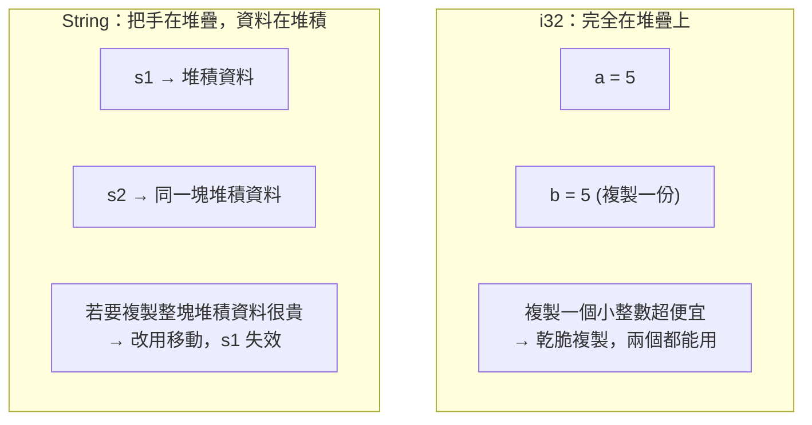

# [rust-2-4] Clone 與 Copy：什麼時候是深拷貝、什麼時候是廉價複製

> **本章目標**：搞懂為什麼整數賦值後原變數還能用、字串卻不行——這是 `Copy` 與 `Move` 的差別；並學會用 `clone()` 在需要時明確深拷貝。

## 你會學到

- 為什麼 `i32` 賦值是「複製」、`String` 賦值是「移動」
- `Copy` 特性：哪些型別會自動廉價複製
- `clone()`：明確要求一份深拷貝，以及它的成本
- 一個判斷直覺：資料在堆疊還是堆積？

## 概念說明

### 同樣是賦值，為什麼結果不同？

看這兩段，行為相反：

```rust
let a = 5;
let b = a;
// a 還能用！                ← 整數是「複製」

let s1 = String::from("hi");
let s2 = s1;
// s1 不能用了              ← String 是「移動」
```

差別的根源是 [rust-2-1] 的堆疊 vs 堆積：



這張圖的重點：**整數這種「完全待在堆疊、大小固定」的小東西，複製一份的成本微乎其微**，所以 Rust 乾脆複製，讓兩個變數都能用，皆大歡喜。而 **`String` 的真正資料在堆積、可能很大**，「自動深拷貝」會偷偷拖慢程式，所以 Rust 選擇移動。

### Copy 特性：會自動廉價複製的型別

Rust 把「可以安全又便宜地按位元複製」的型別，標記為具有 **`Copy`** 特性。有 `Copy` 的型別，賦值與傳入函式時都是**複製**（原變數繼續有效），不會發生移動。

哪些型別是 `Copy`？規則很直覺——**完全放在堆疊、大小固定的簡單型別**：

- 所有整數（`i32`、`u64`…）、浮點數（`f64`…）
- 布林 `bool`、字元 `char`
- 只由 `Copy` 型別組成的 tuple，例如 `(i32, bool)`

而 `String`、`Vec` 這種「擁有堆積資料」的型別**沒有** `Copy`——它們走移動。

### clone：我明確要一份深拷貝

當你確實需要「複製一整份堆積資料、兩個變數各自獨立」，就明確呼叫 `.clone()`：

```
.clone() ── 「我知道這可能有成本，但我就是要完整複製一份。」
```

Rust 的設計哲學是**明確**：昂貴的深拷貝不會偷偷發生，一定是你親手寫了 `.clone()`。所以當你在程式裡看到 `.clone()`，等於看到一個「這裡有複製成本」的標記——這在效能調校時很有用。

## 程式碼範例

### Copy 型別：複製，原變數還在

```rust
fn main() {
    let a = 5;
    let b = a;             // i32 有 Copy → 複製
    println!("{} {}", a, b);   // ✅ 兩個都能用：5 5

    let p = (3, true);     // (i32, bool) 也是 Copy
    let q = p;
    println!("{:?} {:?}", p, q);  // ✅ 都能用
}
```

### String：移動（沒有 Copy）

```rust
fn main() {
    let s1 = String::from("hi");
    let s2 = s1;               // 移動，s1 失效
    println!("{}", s2);
    // println!("{}", s1);     // ❌ 不能用
}
```

### 用 clone 取得獨立的一份

```rust
fn main() {
    let s1 = String::from("hi");
    let s2 = s1.clone();       // 深拷貝：複製整塊堆積資料
    println!("{} {}", s1, s2); // ✅ 兩個各自獨立，都能用
}
```

說明：`clone` 之後 `s1`、`s2` 指向**各自獨立**的堆積資料，互不影響，所以都能用。代價是真的複製了一遍。

> **常見錯誤** — 很多 Rust 新手一遇到「移動後不能用」的編譯錯誤，就反射性到處灑 `.clone()` 把錯誤壓下去。
> 問題是：這會帶來不必要的複製成本，是一種「為了過編譯而犧牲效能」的壞習慣。
> 正確做法：**大多數情況你需要的不是「複製一份」，而是「借來用一下」**——也就是下一章 [rust-2-5] 的「借用 `&`」。`clone` 只在你「真的需要兩份獨立資料」時才用。

## 小練習

1. 寫一段程式驗證：`i32` 賦值後原變數還能用，`String` 賦值後不能用。
2. 把上題的 `String` 例子用 `.clone()` 修好，讓兩個變數都能用，並在註解裡寫下「這行 clone 的成本是什麼」。
3. 判斷題（先猜再驗證）：以下哪些賦值後原變數還能用？`char`、`Vec<i32>`、`(bool, i32)`、`String`。用「在堆疊還堆積、大小固不固定」的直覺判斷。

## 課外讀物

> 「明確優於隱晦、不要偷偷做昂貴的事」是好程式的通則 → [課外讀物 E-6-1：什麼是 Clean Code](../../../課外讀物/E-6-best-practices/E-6-1-what-is-clean-code.md)

> 不必要的複製是常見的效能浪費——但別過早最佳化 → **dsa 課程 Part 1（複雜度）**、[課外讀物 E-11：效能與快取](../../../課外讀物/E-11-performance/E-11-6-backend-profiling.md)
