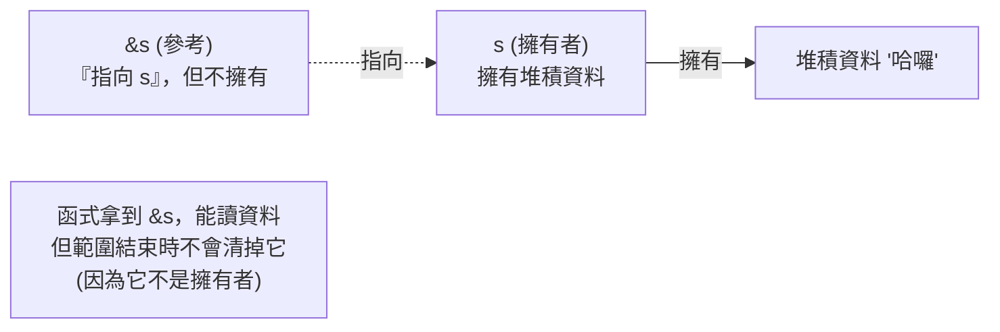

# [rust-2-5] 借用（Borrowing）與參考 `&`：不奪走所有權地「借來用一下」

> **本章目標**：學會 Rust 日常最常用的工具——借用。理解怎麼用 `&` 讓函式「借用」一個值而不奪走擁有權，解決上一章「傳進函式就失去所有權」的痛點。

## 你會學到

- 「借用」是什麼，怎麼用 `&` 建立一個參考（reference）
- 為什麼借用能避免不必要的移動與 clone
- 函式怎麼接收參考參數
- 借用和擁有權的關係（借用不會奪走擁有權）

## 概念說明

### 從「給你」變成「借你」

[rust-2-3] 我們遇到一個痛點：把 `String` 傳進函式，擁有權就移動進去了，回來原變數就不能用。每次都 `.clone()` 又太浪費。

Rust 的解法是**借用**——用一個比喻：

```
移動(move)：把書「送給」對方 → 書是他的了，你沒了。
clone：     去影印一整本「副本」給他 → 兩本書，但印很累。
借用(&)：   把書「借給」對方看一下 → 他看完還你，書始終是你的。 ✅
```

大多數時候你要的就是第三種：**讓別人「用一下」你的值，但擁有權還是你的。** 這就是借用，用 `&` 符號建立一個「參考（reference）」。



這張圖在說：`&s` 是一個「指向 `s` 的參考」，它能讓你存取資料，但**它不擁有資料**。所以當這個參考用完，**不會**觸發清理（清理是擁有者 `s` 的責任）。擁有權自始至終留在 `s`。

## 程式碼範例

### 把參考傳進函式

回到上一章的痛點，這次用借用解決：

```rust
fn main() {
    let s = String::from("哈囉");
    let len = calculate_length(&s);   // 傳「參考」&s，不是 s 本身
    println!("'{}' 的長度是 {}", s, len);  // ✅ s 還在！照樣能用
}

fn calculate_length(text: &String) -> usize {   // 參數型別是 &String
    text.len()
}   // ← text 只是參考，離開範圍時「不會」清掉它指向的資料
```

逐項說明：

- `&s`：建立一個「指向 `s` 的參考」傳進去。
- `text: &String`：函式參數型別前面有 `&`，表示「我收的是一個參考，不是擁有權」。
- 函式結束時，`text` 這個參考消失，但它**指向的資料毫髮無傷**——因為擁有者 `s` 還在 `main` 裡好好的。
- 所以回到 `main`，`s` 照樣能用。問題完美解決，而且沒有任何複製成本。

### 借用是「預設該用」的工具

記住一個心法：**當你只是想「讀」或「用一下」一個值，預設就用借用 `&`，而不是移動或 clone。** 這呼應上一章的「常見錯誤」——新手愛灑 clone，老手用借用。

```rust
fn main() {
    let name = String::from("小美");
    greet(&name);          // 借用
    greet(&name);          // 還能再借！因為從沒失去擁有權
    println!("{} 還在", name);
}

fn greet(who: &String) {
    println!("你好，{}", who);
}
```

說明：因為每次都只是「借」，`name` 的擁有權從沒離開過 `main`，所以你能借第二次、第三次，最後還能自己用。要是用移動，第一次 `greet(name)` 之後 `name` 就沒了。

### 一個重要限制：借來的只能「看」，不能「改」

到目前為止的 `&` 借用都是**唯讀**的——你能讀，但不能改它指向的資料：

```rust
fn main() {
    let s = String::from("哈囉");
    add_world(&s);
}

fn add_world(text: &String) {
    text.push_str(" world");   // ❌ 編譯錯誤！不能透過唯讀借用修改
}
```

想「借來而且能改」，需要另一種借用——**可變借用 `&mut`**，那是下一章 [rust-2-6] 的主題，而且 Rust 對它有嚴格規則（正是那些規則讓 Rust 的並行「無懼」）。

## 小練習

1. 把一個「計算字串長度」的需求，用「借用」實作：寫 `fn length(s: &String) -> usize`，在 `main` 呼叫後確認原字串還能用。
2. 寫一個函式 `print_twice(s: &String)` 印出某字串兩次，在 `main` 連續呼叫它三次，證明借用不會奪走擁有權。
3. 試著在一個 `&String` 參數的函式裡修改字串（例如 `push_str`），觀察編譯器拒絕你，並預習：要能改，需要什麼？

## 課外讀物

> 「借用而非複製」這種「用最小代價拿到要的東西」的思路，也是效能設計的精神 → [課外讀物 E-11：效能與快取](../../../課外讀物/E-11-performance/E-11-6-backend-profiling.md)

> 函式只拿它「需要的最小權限」（唯讀借用）呼應介面隔離與最小權限原則 → [課外讀物 E-7-5：介面隔離原則](../../../課外讀物/E-7-solid/E-7-5-isp.md)
