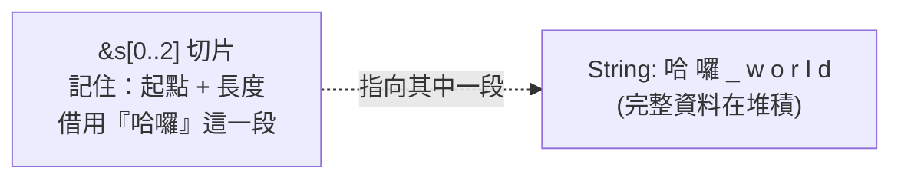

# [rust-2-7] Slice（切片）：安全地借用「一部分」

> **本章目標**：學會切片——一種「借用集合中一段連續範圍」的參考，用來安全地引用字串或陣列的一部分，而不需要複製。

## 你會學到

- 切片（slice）是什麼：借用「一段」而不是整個
- 字串切片 `&str` 與陣列切片
- 為什麼切片比「自己存索引範圍」更安全
- `&str` 和 `String` 的初步關係（[rust-6-2] 會深入）

## 概念說明

### 「我只想借其中一段」

有時你不想借整個集合，只想借「其中一段連續的部分」。例如一句話 `"哈囉 world"`，你想指出「前面那個詞 `哈囉`」。

土法煉鋼的做法是「記住開始和結束的索引」（例如 0 到 5），但這很脆弱——萬一原字串變了、或你索引算錯，這對數字就指向錯的地方，甚至越界。

**切片**是 Rust 的優雅解法：它是一種**參考**（所以也是借用，不奪走擁有權），但指向的是「集合裡的一段連續範圍」，而且這個參考**本身就綁定了那段資料**，不會各自飄走。



這張圖在說：切片不複製資料，它是一個「指向原資料中某一段」的參考，內部記著「從哪裡開始、有多長」。因為它是借用，原資料的擁有權不變。

## 程式碼範例

### 字串切片

```rust
fn main() {
    let s = String::from("哈囉 world");
    let hello = &s[0..2];     // 借用索引 0 到 2（不含 2）這一段
    let world = &s[3..8];     // 借用後面那段
    println!("{} / {}", hello, world);
}
```

說明：`&s[起點..終點]` 建立一個切片，範圍是「起點到終點（不含終點）」。它的型別是 `&str`（字串切片）。注意這只是**借用**——`s` 還是擁有者，切片只是指著它的一部分。

幾個語法糖：

```rust
let s = String::from("哈囉 world");
let a = &s[..2];     // 從頭開始，等同 &s[0..2]
let b = &s[3..];     // 到結尾，等同 &s[3..s.len()]
let c = &s[..];      // 整個字串的切片
```

### 為什麼切片更安全：它和資料「綁在一起」

切片受借用規則保護。看這個會被 Rust 擋下來的危險情境：

```rust
fn main() {
    let mut s = String::from("哈囉 world");
    let word = &s[0..2];      // word 是一個（唯讀）切片，借用了 s
    s.clear();                // ❌ 想清空 s = 需要可變借用，但 word 還在唯讀借用！
    println!("{}", word);
}
```

Rust 編譯錯誤：因為 `word` 還在借用 `s`（唯讀），你不能同時拿可變借用去 `clear()`（呼應 [rust-2-6] 的規則）。

**這正是切片的安全價值**：如果用「土法存索引」，你 `clear()` 之後那對索引就指向不存在的資料、釀成 bug；但切片和原資料綁定，編譯器會在你「想破壞它指向的資料」時擋下來。安全，再一次贏在編譯期。

### 陣列也能切片

切片不只用於字串，陣列也行：

```rust
fn main() {
    let arr = [10, 20, 30, 40, 50];
    let middle = &arr[1..4];     // 借用 [20, 30, 40]
    println!("{:?}", middle);
    println!("中段長度 {}", middle.len());
}
```

說明：`&arr[1..4]` 是一個「陣列切片」，型別是 `&[i32]`。一樣是借用一段、不複製。

### `&str`：你其實早就在用了

還記得 [rust-0-3] 第一支程式裡的 `"Hello, Rust!"` 嗎？那種「直接寫在程式裡的字串字面值」，它的型別就是 `&str`——一個字串切片，借用了「編譯時就嵌進程式裡的那段文字」。

所以函式參數常寫成 `&str` 而非 `&String`，因為 `&str` 更通用（字面值和 `String` 都能轉成它來傳）。這個 `String` 與 `&str` 的恩怨情仇，[rust-6-2] 會專門講清楚。先記住：**看到 `&str` 就想到「一段借來的字串」。**

## 小練習

1. 給定 `let s = String::from("rust is fun")`，用切片分別取出 `"rust"`、`"is"`、`"fun"` 三個詞印出來。
2. 用切片語法糖寫出：整個字串的切片、從第 5 個字元到結尾的切片。
3. 重現本章「`clear()` 被擋下」的例子，讀錯誤訊息，理解「切片正在借用，所以不能同時清空」。

## 課外讀物

> 切片背後「指向連續記憶體的一段」，呼應陣列的記憶體佈局 → **dsa 課程 Part 2：陣列**

> `&str` vs `String` 的完整故事 → [rust-6-2]（本書 Part 6）
