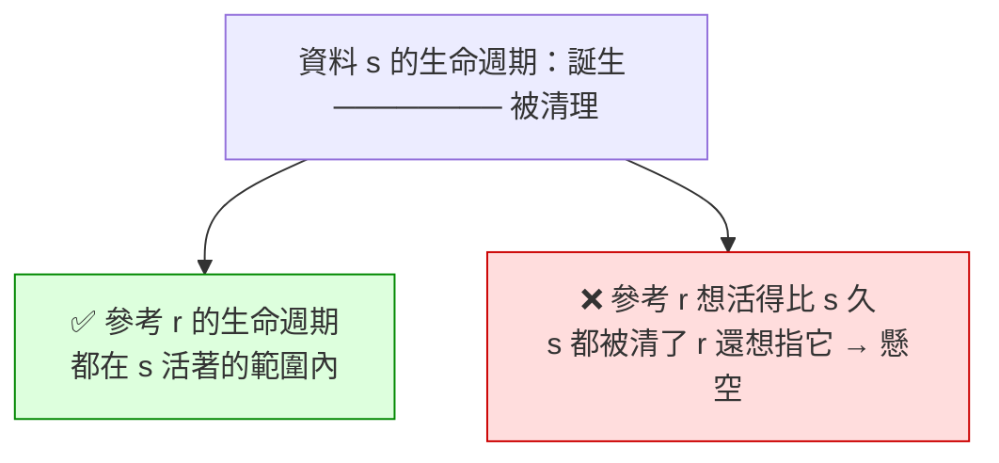

# [rust-2-8] 生命週期初探（Lifetimes）：參考不能活得比它指向的資料久

> **本章目標**：認識「生命週期」這個概念——Rust 怎麼保證「一個參考永遠不會指向已經被清掉的資料」，以及為什麼大多數時候你根本不用為它操心。

## 你會學到

- 「懸空參考（dangling reference）」是什麼災難
- 生命週期的核心概念：參考不能比它指向的資料活得久
- Rust 怎麼在編譯期幫你檢查這件事
- 為什麼日常寫程式很少需要手寫生命週期標註（[rust-5-4] 再深入）

## 概念說明

### 借用規則的第二條：參考必須永遠有效

[rust-2-6] 提過借用規則有兩條，第一條是「多讀或一寫」。這一章講第二條：**參考必須永遠有效——它不能指向一塊「已經被清掉」的資料。**

指向已清掉資料的參考，叫**懸空參考（dangling reference）**。用比喻：

```
你抄下朋友家的地址（參考），打算改天去找他。
但朋友搬走、房子拆了（資料被清掉）。
你拿著舊地址跑去 → 撲空，甚至跑到一個變成工地的危險地方。
```

在 C/C++ 裡，這種「指標指向已釋放記憶體」（use-after-free）是當機與資安漏洞的大宗。Rust 用**生命週期**的概念，在編譯期保證這種事不可能發生。

### 生命週期：資料活著的那段期間

**生命週期就是「一個值從誕生到被清理，這中間它『活著』的那段程式碼區間」**（其實就是 [rust-2-2] 講的作用範圍，從生命週期的角度再看一次）。

Rust 的鐵則是：

```
一個參考的生命週期，不能「超過」它所指向資料的生命週期。
（資料死了，指向它的參考就不准再被用。）
```



這張圖在說：只要參考的「存活區間」被包在資料的「存活區間」之內就安全；一旦參考想活得比資料久，就是懸空參考，Rust 會拒絕編譯。

## 程式碼範例

### Rust 擋下懸空參考

下面這個函式想回傳「一個指向函式內部區域變數的參考」——但那個變數在函式結束時就被清掉了：

```rust
fn dangle() -> &String {        // 想回傳一個參考
    let s = String::from("哈囉");
    &s                          // ❌ 回傳指向 s 的參考……
}                               // 但 s 在這裡就被清掉了！參考會懸空

fn main() {
    let r = dangle();
    println!("{}", r);
}
```

編譯器直接擋下，並提示生命週期問題：

```
error[E0106]: missing lifetime specifier
... this function's return type contains a borrowed value,
    but there is no value for it to be borrowed from
```

白話：「你想回傳一個借來的東西，但它借的那個來源（`s`）函式一結束就沒了。」**這個 bug 在 C 裡會編譯成功、執行時才出事（或被駭客利用）；Rust 在編譯期就攔住。**

正確做法：別回傳參考，直接把擁有權交出去（回傳 `String` 本身）：

```rust
fn no_dangle() -> String {
    let s = String::from("哈囉");
    s                           // ✅ 把擁有權移動出去，沒有懸空問題
}
```

### 好消息：大多數時候你不用寫生命週期

你可能擔心「那我是不是要一直手寫生命週期標註？」——**通常不用**。Rust 有一套「生命週期省略規則」，能自動推斷絕大多數情況。你前面寫的所有借用範例，編譯器都默默幫你推好了生命週期，你根本沒察覺。

只有在「比較複雜、編譯器無法自己推斷」的情況（例如函式回傳的參考，可能來自多個參數中的哪一個講不清楚），你才需要用 `'a` 這種標註親手告訴它。那是 [rust-5-4] 的進階主題。

**現階段的重點不是語法，而是這個觀念**：

> Rust 永遠在背後確認「每個參考都指向還活著的資料」。這就是它沒有 GC，卻能保證不出現懸空指標的原因。

## 小練習

1. 用自己的話解釋「懸空參考」，並說出它在 C/C++ 裡為什麼危險、Rust 怎麼避免。
2. 把本章 `dangle()` 的例子打出來，看編譯器報的生命週期錯誤，再用「回傳 `String` 本身」的方式修好它。
3. 思考題：為什麼「回傳指向函式內部變數的參考」一定會懸空，但「回傳指向『傳進來的參數』的參考」就不一定？（提示：參數的資料是誰擁有的、活多久？）

## 課外讀物

> use-after-free、懸空指標在真實世界造成的資安漏洞 → [課外讀物 E-10：Web Security 基礎](../../../課外讀物/E-10-security/E-10-9-heartbleed.md)（Heartbleed 就是記憶體讀取出包的著名案例）

> 生命週期標註的進階語法（`'a`） → [rust-5-4]（本書 Part 5）

> 變數作用範圍、記憶體何時釋放的底層視角 → **cs 課程 Part 5：作業系統（記憶體管理）**
