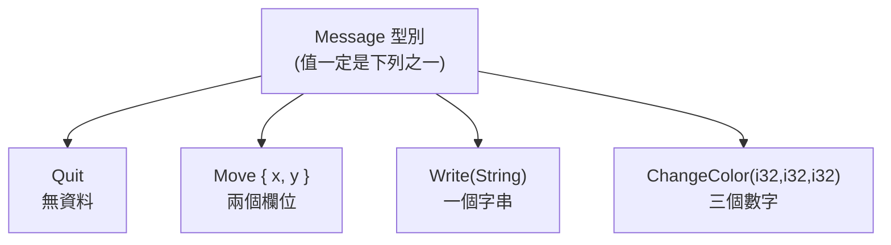

# [rust-3-3] Enum：列舉的真正威力（每個變體還能帶資料）

> **本章目標**：認識 enum——一種表達「這個東西就是這幾種可能之一」的型別。Rust 的 enum 比你想像的強大，每個變體還能攜帶自己的資料。

## 你會學到

- enum 是什麼，適合表達什麼樣的資料
- 為什麼 enum 比「用一堆常數或布林」更安全
- Rust 的殺手鐧：每個 enum 變體可以帶不同型別的資料
- 標準庫的 enum 預告（`Option`、`Result`）

## 概念說明

### 「就是這幾種之一」

很多資料的本質是「**只會是有限幾種可能裡的某一種**」：

```
交通號誌 = 紅燈 或 黃燈 或 綠燈     ← 不可能是第四種
付款方式 = 現金 或 信用卡 或 行動支付
方向     = 上 下 左 右
```

這種「N 選 1」的概念，用 **enum（列舉）** 表達最自然。比喻：enum 像「一個只有固定幾個選項的下拉選單」——值一定是其中之一，不會冒出意料外的東西。

為什麼不用「整數常數」就好（像 `0=紅, 1=黃, 2=綠`）？因為那樣 `status` 的型別是 `u32`，編譯器不會阻止你寫出 `status = 99` 這種無意義的值（[CLAUDE 規範裡的「魔術數字」反模式](../../../課外讀物/E-6-best-practices/E-6-6-anti-patterns.md)）。用 enum，編譯器**保證**值只會是你列出的那幾種，從型別層面杜絕無效狀態。

## 程式碼範例

### 基本 enum

```rust
enum Direction {
    Up,
    Down,
    Left,
    Right,
}

fn main() {
    let dir = Direction::Up;       // 用 型別::變體 建立
    move_player(dir);
}

fn move_player(d: Direction) {
    // 怎麼根據 d 做不同的事？用 match（下一節 rust-3-5 詳講）
}
```

說明：`enum Direction { ... }` 列出所有可能的「變體（variant）」。建立時用 `Direction::Up` 這種 `型別::變體` 寫法。一個 `Direction` 型別的值，**一定**是這四個之一。

### 殺手鐧：變體可以帶資料

這是 Rust 的 enum 遠比其他語言強大的地方——**每個變體可以攜帶自己的資料，而且不同變體可以帶不同型別的資料**：

```rust
enum Message {
    Quit,                          // 不帶資料
    Move { x: i32, y: i32 },       // 帶兩個具名欄位（像迷你 struct）
    Write(String),                 // 帶一個 String
    ChangeColor(i32, i32, i32),    // 帶三個 i32
}

fn main() {
    let m1 = Message::Write(String::from("哈囉"));
    let m2 = Message::Move { x: 10, y: 20 };
    let m3 = Message::ChangeColor(255, 0, 0);
    let m4 = Message::Quit;
    // 怎麼分別處理？一樣用 match（下一節）
}
```

說明：`Message` 的四個變體形狀各異——`Quit` 啥都不帶，`Move` 帶具名欄位，`Write` 帶一個字串，`ChangeColor` 帶三個數字。**用一個型別 `Message` 就能優雅表達「四種結構完全不同的訊息」**。如果用 struct，你得開四個 struct 再想辦法湊在一起；enum 一次搞定。



這張圖在說：`Message` 把「四種不同形狀的可能」收進同一個型別；任何一個 `Message` 值都明確是其中一種，編譯器會逼你處理每一種（下一節 `match` 會看到）。

### 你早就在用的兩個 enum

Rust 標準庫最重要的兩個型別其實都是 enum，它們即將是後面兩節與整個 Part 4 的主角：

- **`Option`**：表達「**有一個值，或什麼都沒有**」——Rust 用它取代危險的 `null`（下一節 [rust-3-4]）。
- **`Result`**：表達「**成功（帶結果），或失敗（帶錯誤）**」——Rust 的錯誤處理核心（[rust-4-1]）。

先有個印象：它們強大、安全的祕密，正是來自「enum 變體能帶資料」這個特性。

## 小練習

1. 定義一個 `enum Coin`，變體有 `Penny`、`Nickel`、`Dime`、`Quarter`。建立一個 `Coin::Dime`。
2. 定義一個 `enum Shape`，讓 `Circle` 帶一個半徑 `f64`、`Rectangle` 帶寬和高兩個 `f64`。建立各一個實例。
3. 思考題：用 enum 表達「紅黃綠燈」，比用整數常數 `0/1/2` 好在哪？（提示：編譯器能不能阻止你給出無效的值？）

## 課外讀物

> 「用型別讓無效狀態無法被表達」是強型別語言的精髓，呼應消滅魔術數字 → [課外讀物 E-6-6：程式碼異味與反模式](../../../課外讀物/E-6-best-practices/E-6-6-anti-patterns.md)

> enum + match 是 Rust 處理「多種情況」的招牌組合 → 下一節從 [rust-3-4] Option 開始實戰
