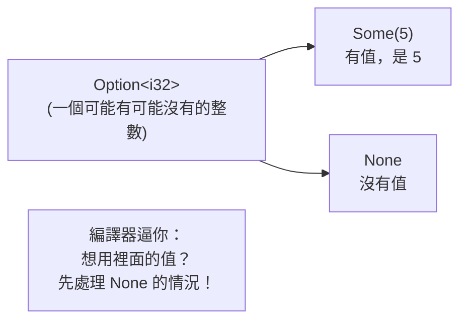

# [rust-3-4] `Option`：Rust 怎麼用型別系統「消滅 null」

> **本章目標**：理解 `null` 為什麼被稱為「十億美元的錯誤」，以及 Rust 如何用 `Option` 這個 enum 從根本上避免它——逼你在編譯期就處理「可能沒有值」的情況。

## 你會學到

- `null` 在其他語言造成的經典 bug
- `Option<T>` 是什麼：`Some(值)` 或 `None`
- 為什麼 Rust「沒有 null」反而更安全
- 怎麼安全地取出 `Option` 裡的值

## 概念說明

### 十億美元的錯誤

在很多語言（Java、C#、JavaScript…），任何物件都可能是 `null`（空）。問題是：你常常**忘記它可能是 null**，直接拿來用，於是程式在執行時砰一聲炸掉——`NullPointerException`、`undefined is not a function`，這類錯誤你大概不陌生。

發明 null 的電腦科學家 Tony Hoare 後來公開道歉，稱它是「**十億美元的錯誤**」，因為它造成的當機與損失難以計數。

問題的核心是：**「這個值可能不存在」這件事，被藏起來了**——型別上看不出來，編譯器也不提醒你，全靠你自己記得檢查。一旦忘記，就出事。

### Rust 的解法：把「可能沒有」寫進型別

Rust **乾脆沒有 null**。取而代之，它用一個 enum 叫 `Option<T>`：

```rust
enum Option<T> {       // T 代表「任意型別」（泛型，rust-5-1 會講）
    Some(T),           // 有一個值，值就裝在這裡
    None,              // 沒有值
}
```

意思是：一個「可能有、可能沒有」的值，型別不是 `T`，而是 `Option<T>`。這樣一來，「可能沒有值」這件事**明明白白寫在型別上**，編譯器看得到，也會**強迫你處理 `None` 的情況**才能拿到裡面的值。



這張圖在說：拿到一個 `Option<i32>`，你不能直接當整數用——必須先「打開看看是 `Some` 還是 `None`」。**忘記處理「沒有值」的情況，在 Rust 裡會編譯失敗，而不是執行時才爆炸。** 這就是 Rust 把「十億美元的錯誤」消滅在編譯期的方法。

## 程式碼範例

### 一個會回傳 Option 的函式

「找東西」這種操作天生「可能找不到」，正是 `Option` 的主場：

```rust
// 在陣列裡找第一個偶數，可能有、可能沒有
fn first_even(numbers: &[i32]) -> Option<i32> {
    for &n in numbers {
        if n % 2 == 0 {
            return Some(n);     // 找到了，包進 Some
        }
    }
    None                        // 整個找完都沒有 → None
}
```

說明：回傳型別是 `Option<i32>`——它**誠實地告訴呼叫者「我可能給你一個整數，也可能兩手空空」**。找到就回傳 `Some(n)`，找不到回傳 `None`。

### 安全地取出值

拿到 `Option` 後，怎麼用裡面的值？最完整的方式是用 `match`（下一節 [rust-3-5] 主角，這裡先嚐一口）：

```rust
fn main() {
    let nums = [1, 3, 5, 8, 9];
    match first_even(&nums) {
        Some(n) => println!("找到偶數：{}", n),
        None => println!("沒有偶數"),
    }
}
```

說明：`match` 強迫你**同時寫出 `Some` 和 `None` 兩種情況**——少寫一種，編譯器不讓你過。這就是「逼你處理沒有值的情況」的具體樣子。

### 幾個方便的捷徑

每次都寫 `match` 有時太囉嗦，`Option` 提供一些常用方法：

```rust
fn main() {
    let nums = [1, 3, 5, 8];

    // unwrap_or：有值就用，None 就用我給的預設值
    let x = first_even(&nums).unwrap_or(0);
    println!("{}", x);    // 8（有找到）

    let empty: [i32; 0] = [];
    let y = first_even(&empty).unwrap_or(-1);
    println!("{}", y);    // -1（沒找到，用預設）

    // is_some / is_none：只想知道有沒有值
    if first_even(&nums).is_some() {
        println!("有偶數");
    }
}
```

> **常見錯誤** — `Option` 還有一個方法叫 `.unwrap()`，會「硬取出值，如果是 `None` 就讓程式 panic 當掉」。
> 問題是：在正式程式裡到處 `.unwrap()` 等於把「可能沒值」的炸彈又裝回去了——一遇到 `None` 就當機。
> 正確做法：正式程式優先用 `match`、`unwrap_or`、或下一章的 `?` 來**好好處理** `None`。`.unwrap()` 只適合「你 100% 確定有值」的場合或快速實驗。

## 小練習

1. 寫一個函式 `fn find_first_space(s: &str) -> Option<usize>`，回傳第一個空白字元的位置；沒有空白就回傳 `None`。（提示：可搭配 `chars().enumerate()`，或先用迴圈練習概念。）
2. 用 `match` 處理上題的回傳值，分別印出「空白在第 N 位」或「沒有空白」。
3. 把上題改用 `unwrap_or` 給一個預設值（例如 `0`），比較兩種寫法。想想各自適合什麼情境。

## 課外讀物

> 「把可能不存在的狀態寫進型別、讓編譯器逼你處理」是強型別的核心價值 → [課外讀物 E-6-4：TypeScript 最佳實踐](../../../課外讀物/E-6-best-practices/E-6-4-typescript-best-practices.md)（TS 的 `strictNullChecks`、`T | undefined` 是類似精神）

> 下一節用 `match` 把 `Option`、`enum` 處理得淋漓盡致 → [rust-3-5]
