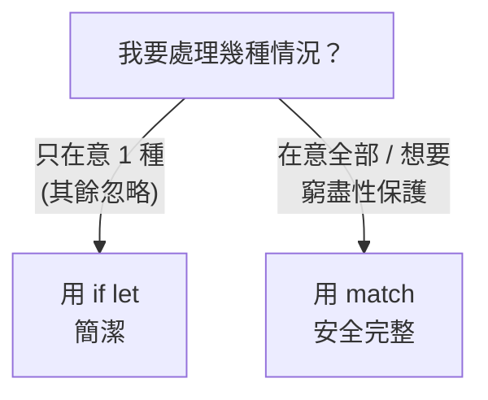

# [rust-3-6] `if let` / `while let`：更簡潔的模式比對

> **本章目標**：學會 `if let` 與 `while let`——當你只在意「一種」情況時，它們比寫完整的 `match` 更簡潔好讀。

## 你會學到

- `if let`：只處理一種模式時的簡寫
- `if let ... else` 的用法
- `while let`：條件成立就一直比對下去
- 什麼時候該用 `match`、什麼時候用 `if let`

## 概念說明

### 只關心一種情況時，match 有點囉嗦

`match`（[rust-3-5]）很強，但有時你只在意「其中一種情況」，其餘的根本不想管。這時寫完整 `match` 顯得囉嗦：

```rust
// 只想在「有值」時做事，但 match 逼我也寫 None 那行
match some_value {
    Some(x) => println!("有：{}", x),
    None => {}                          // 空的，純粹為了讓 match 窮盡
}
```

那行空的 `None => {}` 沒做事，卻不得不寫。`if let` 就是來消除這種噪音的——它的意思是：「**如果**這個值符合某個模式，就做這件事，否則跳過。」

```
if let 某模式 = 某值 {
    符合就做這個
}
```

可以把它讀成「`match` 的單臂版」：只寫你在意的那一臂，其餘自動忽略。

## 程式碼範例

### if let：只處理 Some

```rust
fn main() {
    let config: Option<i32> = Some(42);

    if let Some(value) = config {
        println!("設定值是 {}", value);    // 只在有值時做事
    }
    // 如果 config 是 None，這段就單純跳過，不用寫 None 分支
}
```

說明：`if let Some(value) = config` 的意思是「如果 `config` 長得像 `Some(value)`（也就是有值），就把值綁到 `value` 並執行區塊」。比起完整 `match`，少了那行多餘的 `None`。

### if let ... else：兩種情況也行

如果「不符合」時你也想做點事，加上 `else`：

```rust
fn main() {
    let config: Option<i32> = None;

    if let Some(value) = config {
        println!("設定值是 {}", value);
    } else {
        println!("沒有設定，使用預設");      // None 時走這裡
    }
}
```

這基本上等同一個只有兩臂的 `match`，但很多人覺得 `if let / else` 在這種「有/無」的情境下更直覺。

### while let：只要還符合就繼續

`while let` 是「迴圈版」——只要值還符合某模式，就一直跑下去。經典用途是「不斷從一個集合取出元素，直到空了」：

```rust
fn main() {
    let mut stack = vec![1, 2, 3];        // 一個堆疊（Vec，rust-6-1 詳講）

    // pop() 取出最後一個，回傳 Option：還有就是 Some，空了就是 None
    while let Some(top) = stack.pop() {
        println!("取出 {}", top);
    }
    // 印出 3, 2, 1，然後 stack 空了、pop() 回傳 None，迴圈自然結束
}
```

說明：`stack.pop()` 每次回傳一個 `Option`——還有元素時是 `Some(值)`、空了是 `None`。`while let Some(top) = stack.pop()` 的意思是「只要還能取出 `Some`，就繼續迴圈」。一旦 `pop()` 回傳 `None`（空了），條件不符，迴圈結束。比起用 `match` 加 `break` 手動處理，這寫法乾淨多了。

### 怎麼選：match vs if let

一個簡單的判準：



這張圖的重點：**`if let` 換來簡潔，但放棄了 `match` 的「窮盡性檢查」**。所以——處理 enum 的「所有」變體、想要編譯器幫你把關時，用 `match`；只想「拎出一種情況」做事時，用 `if let`。兩者互補，按情境選。

## 小練習

1. 給一個 `Option<String>`，用 `if let` 在「有值」時印出它，沒值時什麼都不做。
2. 把上題改成 `if let ... else`，沒值時印出「（空）」。
3. 用 `while let` 把一個 `vec![10, 20, 30]` 的元素一個個 `pop()` 出來印掉，觀察印出的順序（先進的後出，呼應堆疊的後進先出）。

## 課外讀物

> `while let` + `pop()` 體現的是「堆疊（後進先出）」的行為 → **dsa 課程 Part 2：堆疊（Stack）**

> 「簡潔 vs 完整保護」的取捨，是寫程式常見的判斷 → [課外讀物 E-6-1：什麼是 Clean Code](../../../課外讀物/E-6-best-practices/E-6-1-what-is-clean-code.md)
