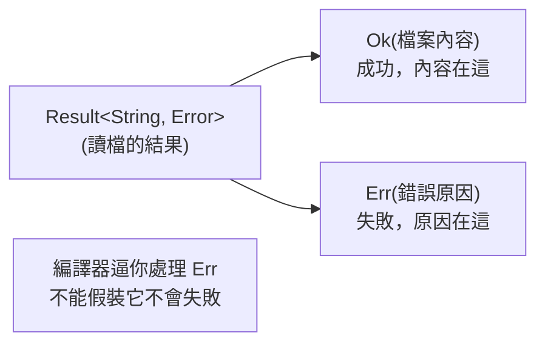

# [rust-4-1] 兩種錯誤：可恢復的（`Result`）vs 不可恢復的（`panic!`）

> **本章目標**：理解 Rust 把錯誤分成兩類的設計哲學，並認識 `Result` 這個 enum——Rust 不用「例外（exception）」，而是用型別把「可能失敗」攤在陽光下。

## 你會學到

- Rust 怎麼把錯誤分成「可恢復」與「不可恢復」兩類
- `panic!` 是什麼，什麼時候會發生
- `Result<T, E>` 是什麼：`Ok(成功值)` 或 `Err(錯誤)`
- 為什麼「沒有例外」反而讓錯誤更難被忽略

## 概念說明

### 兩種錯誤，兩種態度

現實中的錯誤其實有兩種很不同的性質：

```
可恢復的錯誤：「檔案不存在」「網路逾時」「使用者輸入了非數字」
            → 這些是「預期之內、可以好好處理」的狀況，程式該優雅應對。

不可恢復的錯誤：「陣列索引越界」「程式邏輯出現絕不該發生的狀態」
            → 這代表程式有 bug，繼續跑下去只會更糟，該立刻停下。
```

很多語言用同一套「例外（exception）」機制處理兩者，結果常常分不清。Rust 刻意把它們分開：

- **不可恢復** → `panic!`：直接讓程式中止（呼應你在 [rust-1-3] 看過的陣列越界 panic）。
- **可恢復** → `Result`：用型別把「可能成功、可能失敗」表達出來，逼你處理。

### Rust 沒有 exception，改用 Result

在 Java/JavaScript，一個函式可能「突然丟出例外」，而你從型別上**看不出來**它會不會丟——很容易忘記 try/catch，結果例外往上竄、程式炸掉。

Rust 的做法和 [rust-3-4] 的 `Option` 一脈相承：**把「可能失敗」寫進回傳型別**。會失敗的函式回傳 `Result<T, E>`：

```rust
enum Result<T, E> {
    Ok(T),       // 成功，帶著成功的結果（型別 T）
    Err(E),      // 失敗，帶著錯誤資訊（型別 E）
}
```



這張圖在說：一個會失敗的操作（像讀檔）回傳 `Result`——成功是 `Ok(結果)`，失敗是 `Err(原因)`。因為它是個 enum，**你必須像處理 `Option` 一樣把兩種情況都面對**，無法「假裝它不會失敗」。錯誤再也不會被默默忽略。

## 程式碼範例

### panic!：不可恢復，直接中止

```rust
fn main() {
    let nums = [1, 2, 3];
    println!("{}", nums[10]);    // 索引越界 → panic！程式中止
}
```

執行時：

```
thread 'main' panicked at 'index out of bounds: the len is 3 but the index is 10'
```

`panic!` 也可以你自己觸發，用在「程式進入了絕不該發生的狀態」時：

```rust
fn main() {
    let age = -5;
    if age < 0 {
        panic!("年齡不可能是負的，這是個 bug：{}", age);
    }
}
```

重點：`panic!` 是「**這裡出大事、不該繼續**」的訊號，不是用來處理「預期內的失敗」的。使用者打錯字不該讓程式 panic——那是 `Result` 的工作。

### Result：可恢復，好好處理

標準庫裡會失敗的操作都回傳 `Result`。例如把字串轉成數字（使用者可能亂打）：

```rust
fn main() {
    let input = "42";
    let parsed: Result<i32, _> = input.parse::<i32>();

    match parsed {
        Ok(n) => println!("轉成功，數字是 {}", n),
        Err(e) => println!("轉失敗：{}", e),
    }
}
```

說明：`input.parse::<i32>()` 試著把字串轉成 `i32`，回傳一個 `Result`。用 `match` 處理兩種結果——`Ok(n)` 拿到數字，`Err(e)` 拿到錯誤。如果 `input` 是 `"abc"`，就會走 `Err` 那條，程式優雅地告訴你「轉失敗」，而不是當掉。

### 為什麼這個設計好？

因為**「會失敗」這件事藏不住了**。一個回傳 `Result` 的函式，你**沒辦法**直接把它當成功值用——編譯器會擋你，逼你先處理 `Err`。對比 Java 那種「忘記 catch 就炸」，Rust 讓「忽略錯誤」變成一件你得刻意為之的事。

> 這呼應一個重要原則：錯誤要被明確處理、不能默默吞掉 → [課外讀物 E-6-8：後端 Clean Code（錯誤處理）](../../../課外讀物/E-6-best-practices/E-6-8-backend-clean-code.md)

## 小練習

1. 寫一段程式，用 `"abc".parse::<i32>()` 故意製造一個 `Err`，用 `match` 印出錯誤訊息。
2. 寫一個函式 `fn safe_divide(a: i32, b: i32) -> Result<i32, String>`：`b` 不為 0 回傳 `Ok(a / b)`，為 0 回傳 `Err(String::from("除數不能為零"))`。在 `main` 用 `match` 測試兩種情況。
3. 思考題：「使用者在表單輸入了非數字」應該用 `panic!` 還是 `Result`？「程式算出一個負的陣列長度（理論上不可能）」呢？說說你的判斷。

## 課外讀物

> 「錯誤訊息要對人有意義、不要吃掉錯誤」 → [課外讀物 E-6-8：後端 Clean Code（錯誤處理）](../../../課外讀物/E-6-best-practices/E-6-8-backend-clean-code.md)

> `Result` 和 [rust-3-4] 的 `Option` 是同一種思路（用 enum 把特殊情況寫進型別）→ 複習 [rust-3-4]、[rust-3-5]

> 下一節：用 `?` 運算子讓「傳遞錯誤」變得超優雅 → [rust-4-2]
