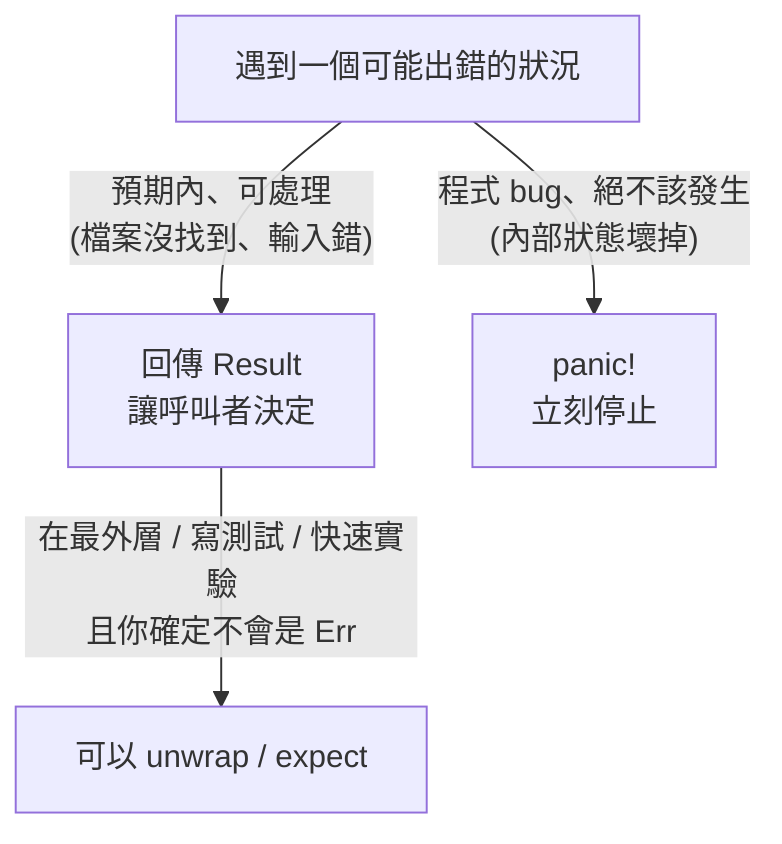

# [rust-4-3] 錯誤處理的好習慣：有意義的錯誤、別吞掉錯誤

> **本章目標**：把前兩章的 `Result`、`?` 用得更好——學會幾個錯誤處理的好習慣，並認識讓 Rust 錯誤處理更省力的常用 crate。

## 你會學到

- 好的錯誤訊息長什麼樣
- 為什麼「吞掉錯誤」是禁忌
- `panic!` / `Result` / `unwrap` 各自的適用場合（總整理）
- 兩個讓錯誤處理更舒服的 crate：`anyhow`、`thiserror`（概念）

## 概念說明

### 好習慣一：錯誤訊息要對「人」有意義

錯誤訊息是寫給「未來在半夜被叫起來查問題的人」（可能就是你自己）看的。它應該說清楚「**什麼東西、為什麼失敗**」：

```
壞：   "error"
壞：   "操作失敗"
好：   "找不到 ID 為 42 的使用者"
好：   "無法連線到資料庫 db.example.com:5432：連線逾時"
```

好訊息包含**具體的脈絡**（哪個 ID、哪台主機、什麼原因），讓人一看就知道從哪查起。這個原則跨所有語言通用。

> 錯誤訊息與一致的錯誤格式設計 → [課外讀物 E-6-8：後端 Clean Code（錯誤處理）](../../../課外讀物/E-6-best-practices/E-6-8-backend-clean-code.md)

### 好習慣二：絕對不要「吞掉」錯誤

「吞掉錯誤」是指**收到錯誤卻假裝沒事、什麼都不做**。在 Rust 你比較難不小心吞掉（型別逼你面對），但還是有方式做這種壞事，要避免：

```rust
// 壞：用 let _ = 把錯誤丟掉，假裝沒發生
let _ = risky_operation();      // 出錯了也完全不知道，問題被藏起來

// 壞：到處用 .unwrap()，一出錯就讓整個程式 panic
let data = risky_operation().unwrap();
```

吞掉錯誤的後果是：**問題悄悄發生、資料可能默默壞掉，而你毫不知情**，直到很久以後才在某個莫名其妙的地方爆出來、超難追查。正確的態度是：**至少記錄下來，或往上傳給能處理的人。**

### 好習慣三：選對工具——panic / Result / unwrap 總整理

把前兩章的東西整理成一張決策表：



| 工具 | 適用場合 |
|------|---------|
| **`Result` + `?`** | 絕大多數「可恢復」的錯誤，正式程式的主力 |
| **`panic!`** | 程式進入「絕不該發生」的狀態（代表 bug） |
| **`.unwrap()`** | 快速實驗、寫測試、或你 100% 確定不會失敗時 |
| **`.expect("說明")`** | 同 unwrap，但附一句說明，panic 時更好查 |

一個實用建議：在「正式、會上線」的程式碼裡，盡量用 `Result` + `?`；`.unwrap()` 留給測試和原型。如果非得 unwrap，改用 `.expect("為什麼這裡確定有值")`，至少留個線索。

## 程式碼範例

### 用 expect 留下線索

```rust
fn main() {
    // 比起 .unwrap()，.expect 在 panic 時會印出你寫的說明
    let config = load_config()
        .expect("啟動時必須能讀到設定檔 config.toml");
}
```

說明：如果 `load_config()` 失敗，程式會 panic 並印出「啟動時必須能讀到設定檔 config.toml」——比起 unwrap 只丟一句通用訊息，這讓人立刻知道是設定檔的問題。

### 讓錯誤處理更省力的 crate（概念認識）

[rust-4-2] 你看到要手動 `.map_err(...)` 轉換錯誤型別，有點煩。實務上社群有兩個超常用的 crate 來解決：

- **`anyhow`**：適合**應用程式**。它提供一個「萬用錯誤型別」`anyhow::Error`，讓你不用為每種錯誤定義型別，`?` 直接暢通無阻，還能輕鬆附加脈絡（`.context("讀設定檔時")`）。
- **`thiserror`**：適合**函式庫**。它幫你用很少的程式碼，定義「自訂、結構化的錯誤型別」，讓用你函式庫的人能精確地比對錯誤種類。

你現在只要知道「**有這兩個好東西**」即可，[rust-7-2] 學會加 crate 後就能用上它們。一句話記住差別：

```
寫「應用程式」→ 通常用 anyhow（省事，錯誤能往上傳就好）
寫「函式庫」  → 通常用 thiserror（給使用者清楚的錯誤型別）
```

## 小練習

1. 把一段用 `.unwrap()` 的程式，改成用 `.expect("...")` 並寫上有意義的說明。
2. 設計三條「好的錯誤訊息」，分別針對：找不到使用者、檔案讀取失敗、密碼長度不足。確認每條都包含「具體脈絡」。
3. 思考題：你在寫一個「給別人用的函式庫」還是「自己的應用程式」，會影響你選 `anyhow` 還是 `thiserror`？為什麼？

## 課外讀物

> 錯誤訊息設計、一致的錯誤格式、別吞錯誤 → [課外讀物 E-6-8：後端 Clean Code（錯誤處理）](../../../課外讀物/E-6-best-practices/E-6-8-backend-clean-code.md)

> 良好的錯誤處理對線上系統的可靠性至關重要 → **sre 課程**（錯誤可觀測、可追蹤是事故處理的基礎）

> 學會加 crate 後就能用 `anyhow` / `thiserror` → [rust-7-2]（本書 Part 7）
