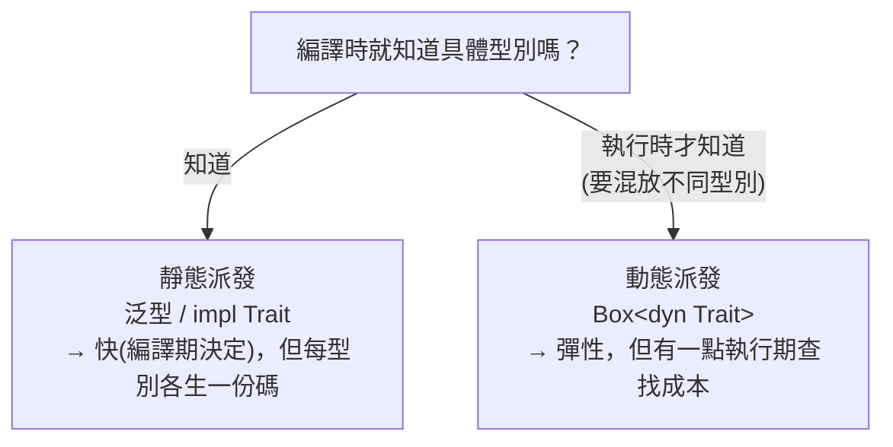

# [rust-5-3] 特徵作為參數與回傳值：寫出彈性的函式

> **本章目標**：學會用 trait 當函式的參數型別與回傳型別，寫出「接受／產出任何具備某能力的型別」的彈性函式；並認識「靜態派發 vs 動態派發」的差別。

## 你會學到

- `impl Trait` 當參數：更簡潔的「接受任何具某能力的型別」
- `impl Trait` 當回傳值：回傳「某種會做某事的東西」
- 為什麼有時需要 `Box<dyn Trait>`（動態派發）
- 靜態派發與動態派發的取捨（直覺版）

## 概念說明

延續 [rust-5-2]，trait 不只用在「為型別加能力」，更常用在**函式的參數與回傳值**——讓函式變得彈性：對輸入只要求「具備某能力」，而不綁死「某個具體型別」。

這呼應一個重要的設計原則：**依賴抽象（能力），而非依賴具體**。函式說「給我任何會叫的動物」，而不是「只收狗」——這樣未來多了新動物也不用改函式。

> 這正是依賴反轉原則的精神 → [課外讀物 E-7-6：依賴反轉原則](../../../課外讀物/E-7-solid/E-7-6-dip.md)

## 程式碼範例

沿用 [rust-5-2] 的 `Animal` trait（有 `sound` 方法）。

### `impl Trait` 當參數：簡潔寫法

[rust-5-2] 我們用 `<T: Animal>` 寫泛型參數。有個更簡潔的等價寫法 `impl Trait`：

```rust
// 這兩種寫法意思幾乎一樣
fn describe_a<T: Animal>(animal: T) {       // 泛型寫法
    println!("{}", animal.sound());
}

fn describe_b(animal: impl Animal) {        // impl Trait 寫法（更短）
    println!("{}", animal.sound());
}
```

說明：`animal: impl Animal` 讀作「`animal` 是某個有實作 `Animal` 的型別」。對單一參數來說，它比 `<T: Animal>` 更好讀。兩者背後其實一樣（都是泛型），效果相同。

### `impl Trait` 當回傳值：回傳「某種會做某事的東西」

你也可以用 `impl Trait` 說「我回傳某個實作了某 trait 的型別，但呼叫者不用知道具體是哪個」：

```rust
fn make_dog() -> impl Animal {
    Dog                          // 回傳一個 Dog，但對外只承諾「它是 Animal」
}

fn main() {
    let animal = make_dog();
    println!("{}", animal.sound());   // 汪汪
}
```

說明：`-> impl Animal` 表示「我回傳某個 `Animal`」。這在回傳「複雜或無法寫出名字的型別」（例如閉包、迭代器，[rust-6-4]、[rust-6-5] 會遇到）時特別有用。

### 限制：`impl Trait` 回傳值只能是「單一種」型別

`impl Trait` 有個限制：一個函式用它當回傳值時，**所有回傳路徑必須回傳同一個具體型別**。下面這個想「有時回狗、有時回貓」就不行：

```rust
fn make_animal(is_dog: bool) -> impl Animal {
    if is_dog {
        Dog       // ❌ 一邊回 Dog
    } else {
        Cat       // ❌ 另一邊回 Cat —— 兩個不同型別，編譯失敗
    }
}
```

為什麼？回憶 [rust-5-1]：泛型靠「編譯期單態化」，需要在編譯時就確定「具體是哪個型別」。但這裡要到執行時（看 `is_dog`）才知道，編譯器辦不到。解法是下面的動態派發。

### `Box<dyn Trait>`：執行時才決定型別（動態派發）

當你真的需要「同一個地方可能是狗、可能是貓，執行時才知道」，用 `Box<dyn Trait>`：

```rust
fn make_animal(is_dog: bool) -> Box<dyn Animal> {
    if is_dog {
        Box::new(Dog)       // ✅
    } else {
        Box::new(Cat)       // ✅ 兩種都行了
    }
}

fn main() {
    let a = make_animal(true);
    println!("{}", a.sound());
}
```

說明：`Box<dyn Animal>` 表示「一個放在堆積上、實作了 `Animal` 的東西，具體型別執行時才定」。`dyn` 代表**動態派發（dynamic dispatch）**——呼叫 `sound()` 時，程式在執行時才查「現在這個到底是狗還是貓、該叫哪個版本」。

> `Box` 是「智慧指標」，把資料放堆積上，[rust-8-1] 會專門講。這裡先照用。

### 兩種派發的取捨



這張圖的重點：**能在編譯期定下型別就用泛型/`impl Trait`（更快）；非得執行時才決定、或要把不同型別混在一起（例如一個 `Vec` 裝各種動物）才用 `Box<dyn Trait>`**。日常多數情況用前者；後者在你需要那份彈性時才登場。

## 小練習

1. 用 [rust-5-2] 的 `Shape` trait，寫一個函式 `fn total_area(shapes: ...)`，先用 `impl` 參數版接受單一形狀印出面積。
2. 寫一個函式 `fn random_shape(big: bool) -> Box<dyn Shape>`，`big` 為真回傳大圓、否則回傳小矩形。在 `main` 呼叫並印出面積。
3. 思考題：什麼情況你「必須」用 `Box<dyn Trait>` 而不能用 `impl Trait`？（提示：和「一個容器要裝不同具體型別」有關。）

## 課外讀物

> 「依賴能力（trait）而非具體型別」是依賴反轉原則 → [課外讀物 E-7-6：依賴反轉原則](../../../課外讀物/E-7-solid/E-7-6-dip.md)

> 靜態 vs 動態派發的「執行期成本」差異，呼應效能意識 → **dsa 課程 Part 1（複雜度）**、[rust-8-1]（Box）
