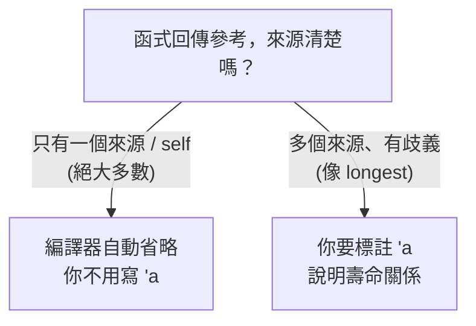

# [rust-5-4] 生命週期進階：標註語法與「省略規則」為什麼大多時候不用寫

> **本章目標**：把 [rust-2-8] 的生命週期概念補完——學會 `'a` 標註語法、知道什麼時候才需要寫它，以及為什麼平常你幾乎不用寫。

## 你會學到

- 複習：生命週期在防什麼（懸空參考）
- 什麼情況編譯器無法自己推斷、需要你標註
- `'a` 生命週期標註的語法與意義
- 「生命週期省略規則」為什麼讓你平常不用寫

## 概念說明

### 先複習：生命週期防的是懸空參考

[rust-2-8] 講過：生命週期是 Rust 確保「**參考永遠指向還活著的資料**」的機制，防止懸空參考。多數時候編譯器自動推斷，你沒感覺。這一章補上「**少數需要你親手標註**」的情況。

### 什麼時候編譯器會卡住？

問題出在「函式回傳一個參考，但這個參考可能來自多個參數中的哪一個，講不清楚」。看這個「回傳較長字串」的函式：

```rust
fn longest(a: &str, b: &str) -> &str {       // ❌ 編譯器困惑
    if a.len() > b.len() { a } else { b }
}
```

編譯器報錯，因為它在想：**「你回傳的這個參考，到底是借 `a` 還是借 `b`？這關係到它能活多久，但我看不出來。」**

回憶生命週期的鐵則：回傳的參考不能活得比它指向的資料久。但這裡回傳值「可能是 a、可能是 b」，編譯器無法確定「它的壽命該跟誰算」，於是要求**你來標註清楚**。

### `'a`：給生命週期取個名字

解法是用**生命週期標註** `'a`（讀作「tick a」），它像給「壽命」貼一個標籤，讓你能表達「這幾個參考的壽命關係」：

```rust
fn longest<'a>(a: &'a str, b: &'a str) -> &'a str {
    if a.len() > b.len() { a } else { b }
}
```

逐項解讀：

- `<'a>`：宣告一個生命週期參數 `'a`（就像 `<T>` 宣告型別參數）。
- `a: &'a str`、`b: &'a str`：兩個參數的參考都標上 `'a`。
- `-> &'a str`：回傳的參考也是 `'a`。

合起來的意思是：「**回傳的參考，其壽命和 `a`、`b` 之中較短的那個一致**。」這等於告訴編譯器「回傳值絕不會比傳進來的資料活得久」，於是它能放心地檢查安全性。

> 重點：生命週期標註**不改變任何東西實際活多久**，它只是「描述彼此的壽命關係」，讓編譯器能驗證安全。你是在「說明事實」，不是「下命令」。

## 程式碼範例

### 標註後正常運作，且仍擋下危險用法

```rust
fn longest<'a>(a: &'a str, b: &'a str) -> &'a str {
    if a.len() > b.len() { a } else { b }
}

fn main() {
    let s1 = String::from("長長的字串");
    let s2 = String::from("短");
    let result = longest(&s1, &s2);
    println!("較長的是：{}", result);     // ✅ s1、s2 都還活著，安全
}
```

而如果你試圖讓回傳的參考活得比來源久，編譯器照樣擋你：

```rust
fn main() {
    let result;
    {
        let s2 = String::from("短");
        result = longest("長長的", &s2);   // result 借了可能是 s2 的東西
    }   // s2 在這裡死了
    // println!("{}", result);   // ❌ result 可能指向已死的 s2 → 編譯失敗
}
```

說明：有了 `'a` 標註，編譯器知道 `result` 的壽命跟 `s2`（較短者）綁定，所以當 `s2` 在內層大括號結束後死亡，`result` 也不准再用。**生命週期標註讓編譯器能精準地把這種懸空風險擋在編譯期。**

### 為什麼平常不用寫？省略規則

你前面寫了那麼多帶參考的函式（[rust-2-5] 的 `calculate_length(&String)` 等），都沒寫 `'a`，卻能編譯。這是因為 Rust 有一套**生命週期省略規則（lifetime elision）**——對常見、明確的情況，編譯器自動幫你填好生命週期：

- 規則大意：如果只有一個參考參數，回傳的參考就跟它走（沒有歧義）；方法裡有 `&self` 時，回傳參考通常跟 `self` 走。

所以像 `fn first_word(s: &str) -> &str` 這種「只有一個來源」的，編譯器一看就懂「回傳值借的是 `s`」，不用你標註。**只有像 `longest` 那種「多個來源、講不清」的，才需要你出手。**



這張圖的重點：**標註生命週期不是日常負擔**——它只在少數「有歧義」的場合才需要。理解「它在防懸空參考」這個本質，比硬背語法更重要。

## 小練習

1. 把 `longest` 函式打出來（含 `'a` 標註），用兩個 `String` 的參考測試。
2. 試著移除 `'a` 標註，看編譯器的 `missing lifetime specifier` 錯誤，理解它為什麼困惑。
3. 寫一個 `fn first_word(s: &str) -> &str`，回傳第一個空白前的切片。觀察：這個**不用**寫 `'a`（因為只有一個來源），印證省略規則。

## 課外讀物

> 生命週期的入門概念與「為什麼要有它」 → 複習 [rust-2-8]

> 懸空參考、use-after-free 的資安後果 → [課外讀物 E-10-9：Heartbleed（記憶體讀取漏洞）](../../../課外讀物/E-10-security/E-10-9-heartbleed.md)
