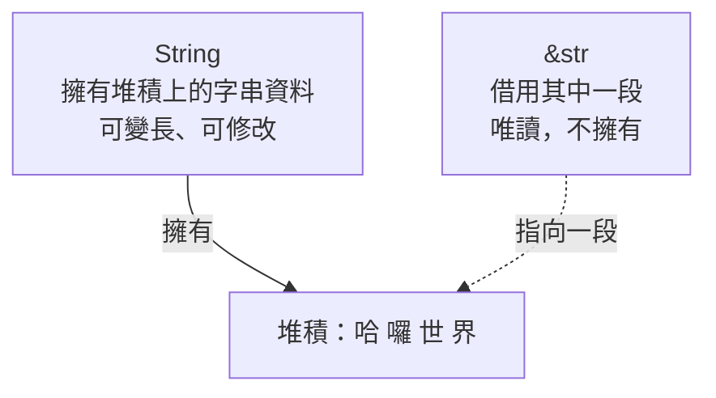
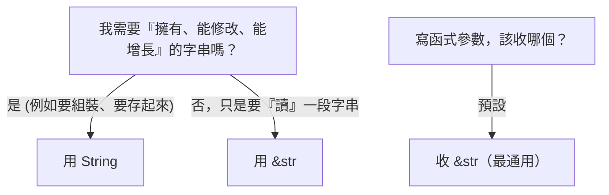

# [rust-6-2] `String` vs `&str`：Rust 字串的兩面，與最常見的初學困惑

> **本章目標**：徹底搞懂 Rust 新手最常卡的一關——為什麼字串有 `String` 和 `&str` 兩種，它們差在哪、各自何時用。

## 你會學到

- 為什麼 Rust 的字串「分兩種」
- `String`：擁有的、可變長的字串
- `&str`：借用的、唯讀的字串切片
- 兩者怎麼互相轉換，函式參數該收哪個

## 概念說明

### 為什麼有兩種字串？

幾乎每個 Rust 新手都困惑過：「字串就字串，幹嘛分 `String` 和 `&str` 兩種？」答案其實你已經有基礎了——它對應 **Part 2 的「擁有 vs 借用」**：

```
String  ──「擁有」一段字串資料（在堆積上），可以增長、修改。
            像「你自己的筆記本」，能寫能改，是你的。

&str    ──「借用」一段已存在的字串（的一部分），唯讀、不擁有。
            像「借看別人筆記本的某一頁」，只能看，不是你的。
```



這張圖在說：`String` 是「字串資料的擁有者」；`&str` 是「指向某段字串的借用」（呼應 [rust-2-7] 的切片，`&str` 就是「字串切片」）。理解了「擁有 vs 借用」，這兩種字串就不再神祕。

### 你早就都用過了

- `String::from("哈囉")`、`.to_string()` 產生的是 **`String`**（擁有）。
- 程式裡直接寫的 `"哈囉"` 字面值，型別是 **`&str`**（它借用「編譯時嵌進程式的那段唯讀文字」）。
- [rust-2-7] 用 `&s[0..2]` 切出來的，也是 **`&str`**。

## 程式碼範例

### String：可以改、可以長

```rust
fn main() {
    let mut s = String::from("哈囉");   // 擁有的字串
    s.push_str("，世界");               // 可以加東西（要 mut）
    s.push('!');                        // 加一個字元
    println!("{}", s);                  // 哈囉，世界!
    println!("長度（位元組）{}", s.len());
}
```

說明：`String` 因為「擁有」資料，能增長、修改。`push_str` 接字串、`push` 接單一字元。

### &str：唯讀，但更通用

```rust
fn main() {
    let literal = "我是字面值";          // 型別是 &str
    let owned = String::from("我是 String");
    let slice = &owned[0..3];            // 從 String 切出 &str

    print_str(literal);                  // ✅
    print_str(&owned);                   // ✅ String 可自動轉成 &str
    print_str(slice);                    // ✅
}

fn print_str(s: &str) {                  // 參數收 &str（最通用）
    println!("{}", s);
}
```

說明：注意 `print_str(&owned)`——一個 `String` 可以自動轉成 `&str` 傳進去（這叫 deref coercion，先不用記名字）。所以**函式參數收 `&str` 比收 `&String` 更好**：因為 `&str` 連字面值、切片、`String` 全都能接，最通用。

### 黃金法則

兩條實用的判斷準則，記住就不太會卡：



濃縮成兩句話：

- **要持有 / 修改 / 回傳一個新字串 → 用 `String`。**
- **只是要讀一段字串（尤其函式參數）→ 用 `&str`。**

### 互相轉換

```rust
fn main() {
    let owned: String = "字面值".to_string();   // &str → String
    let owned2: String = String::from("另一種"); // &str → String
    let borrowed: &str = &owned;                 // String → &str

    println!("{} {} {}", owned, owned2, borrowed);
}
```

說明：`&str` 轉 `String` 用 `.to_string()` 或 `String::from()`（會配置堆積、複製內容）；`String` 轉 `&str` 用 `&`（只是借用，零成本）。

## 小練習

1. 建一個 `String`，用 `push_str` 和 `push` 把它組成 `"Rust 很有趣!"` 並印出。
2. 寫一個函式 `fn shout(s: &str) -> String`，回傳「`s` 加上三個驚嘆號」的新字串。注意參數收 `&str`、回傳 `String`，想想為什麼這樣設計合理。
3. 把一個字面值、一個 `String`、一個切片都傳給練習 2 的函式（記得 `String` 要傳 `&`），確認都能用。

## 課外讀物

> `&str` 就是字串切片，本質是「借用一段連續資料」 → 複習 [rust-2-7]；擁有 vs 借用 → [rust-2-5]

> 函式參數「收最通用的型別」呼應介面設計的彈性 → [課外讀物 E-7-5：介面隔離原則](../../../課外讀物/E-7-solid/E-7-5-isp.md)
