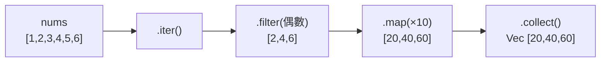

# [rust-6-4] 迭代器（Iterator）：`map` / `filter` / `collect` 的函式式威力

> **本章目標**：學會用迭代器以「描述你想要什麼」的方式處理集合，取代手寫迴圈——程式更短、更好讀，而且 Rust 讓它「零成本」。

## 你會學到

- 迭代器是什麼：一個「逐一吐出元素」的東西
- `map`、`filter` 等「轉換器」怎麼串起來
- 「惰性」與 `collect`：何時真正執行
- 為什麼迭代器和手寫迴圈一樣快（零成本抽象）

## 概念說明

### 從「怎麼做」到「想要什麼」

假設你想「把一串數字裡的偶數挑出來、各乘以 10」。用手寫迴圈（命令式）是這樣：

```rust
let nums = vec![1, 2, 3, 4, 5, 6];
let mut result = Vec::new();
for n in &nums {
    if n % 2 == 0 {
        result.push(n * 10);
    }
}
```

這寫法「一步步指揮電腦怎麼做」。**迭代器**讓你改用「**描述你想要什麼**」的風格（函式式）：

```
把 nums  →  篩選出偶數  →  每個乘以 10  →  收集成一個新向量
```

讀起來就像一句話，意圖一目了然。這種「資料像水流一樣，流過一連串處理站」的風格，學會後會上癮。

## 程式碼範例

### map、filter、collect 串接

```rust
fn main() {
    let nums = vec![1, 2, 3, 4, 5, 6];

    let result: Vec<i32> = nums
        .iter()                      // 1. 變成迭代器（逐一吐出元素的參考）
        .filter(|n| *n % 2 == 0)     // 2. 只留下偶數
        .map(|n| n * 10)             // 3. 每個乘以 10
        .collect();                  // 4. 收集成一個 Vec

    println!("{:?}", result);        // [20, 40, 60]
}
```

逐步說明：

- `.iter()`：把向量變成**迭代器**——一個能「逐一吐出元素」的東西。
- `.filter(|n| ...)`：保留「條件為真」的元素。`|n| *n % 2 == 0` 是一個**閉包**（小函式，下一節 [rust-6-5] 詳講），對每個元素判斷是否為偶數。
- `.map(|n| n * 10)`：把每個元素**轉換**成新的值（這裡乘以 10）。
- `.collect()`：把處理完的結果**收集**成一個集合（這裡是 `Vec<i32>`，由左邊的型別標註決定）。

`filter`、`map` 這類方法叫「**迭代器配接器（adapter）**」——它們接收一個迭代器、回傳一個新的迭代器，所以能像積木一樣**串接**。



這張圖在說：資料像水流一樣，依序流過 `filter`、`map` 各個處理站，最後被 `collect` 接住成為新集合。

### 惰性：不 collect 就不真正執行

迭代器是**惰性（lazy）** 的——`filter`、`map` 本身**不會馬上跑**，它們只是「記下要做什麼」。**直到你呼叫一個「消費者」（像 `collect`、`sum`、`for`）才真正開始一個個處理。**

```rust
fn main() {
    let nums = vec![1, 2, 3, 4, 5];

    // 只有配接器，沒有消費者 → 什麼都還沒發生
    let lazy = nums.iter().map(|n| n * 2);

    // collect / sum 等才會真正觸發計算
    let total: i32 = nums.iter().sum();          // 15
    let doubled: Vec<i32> = lazy.collect();      // [2,4,6,8,10]
    println!("{} {:?}", total, doubled);
}
```

說明：`sum()` 把所有元素加起來、`collect()` 收集成集合——這些「消費者」才真正驅動迭代器跑完。惰性的好處是高效：不會產生用不到的中間結果。

### 常用的迭代器方法

```rust
fn main() {
    let nums = vec![3, 1, 4, 1, 5, 9];

    let sum: i32 = nums.iter().sum();                       // 總和 23
    let max = nums.iter().max();                            // 最大 Some(9)
    let count = nums.iter().filter(|n| **n > 3).count();    // 大於3的個數
    let any_big = nums.iter().any(|n| *n > 8);              // 有沒有 >8 的 true

    println!("{} {:?} {} {}", sum, max, count, any_big);
}
```

說明：`sum`、`max`、`count`、`any`、`all`、`find`… 迭代器提供大量現成方法，多數需求都有對應的，不用自己寫迴圈。

### 零成本：和手寫迴圈一樣快

你可能擔心「串這麼多層，會不會很慢？」**不會**。和泛型一樣（[rust-5-1]），Rust 在編譯時把這串迭代器**優化成等同於一個手寫迴圈**的機器碼。所以你享受了「好讀的函式式風格」，卻**沒有付出任何執行期代價**——這又是「零成本抽象」。**好讀和高效，在 Rust 不衝突。**

## 小練習

1. 給 `vec![1, 2, 3, 4, 5, 6, 7, 8]`，用迭代器鏈：篩出大於 3 的、各加 100、收集成新向量印出。
2. 用 `.iter().sum()` 和 `.iter().max()` 算一個數字向量的總和與最大值。
3. 用 `.filter().count()` 算一句話裡「長度大於 3 的詞」有幾個（提示：`text.split_whitespace()` 配 `word.len()`）。

## 課外讀物

> 迭代器是「函式式程式設計」風格的體現 → **cs 課程 Part 8：程式設計典範（函式式）**

> 「零成本抽象——好讀又高效」呼應「先求對與清楚，效能交給編譯器」 → [課外讀物 E-11-6：後端效能分析](../../../課外讀物/E-11-performance/E-11-6-backend-profiling.md)

> 下一節：迭代器裡那個 `|n| ...` 到底是什麼——閉包 → [rust-6-5]
