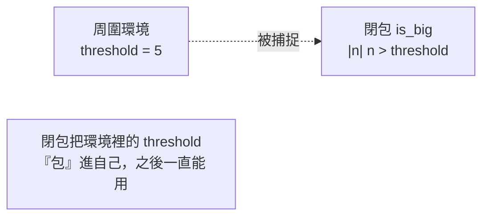

# [rust-6-5] 閉包（Closures）：能捕捉環境的匿名函式

> **本章目標**：搞懂上一節迭代器裡那個 `|n| ...` 是什麼——閉包。理解它和一般函式的差別，尤其是它能「記住」周圍環境變數的能力。

## 你會學到

- 閉包是什麼：沒有名字、可以隨手寫的小函式
- 閉包的語法 `|參數| 主體`
- 閉包的招牌能力：捕捉（記住）周圍的變數
- 閉包常見的用途（搭配迭代器等）

## 概念說明

### 隨手寫的小函式

[rust-6-4] 你寫過 `.filter(|n| *n % 2 == 0)`，那個 `|n| *n % 2 == 0` 就是**閉包**——一個**沒有名字、可以就地寫出來的小函式**。

為什麼需要它？因為像 `filter`、`map` 這種方法需要你「給它一小段邏輯」。為這種一次性的小邏輯特地用 `fn` 定義一個具名函式太隆重了，閉包讓你「**在用的地方隨手寫一段**」。

比喻：

```
具名函式 fn：像「正式登記、掛牌營業的店」——要取名、要宣告，正式。
閉包：     像「臨時擺的小攤」——就地架起來用一下，不用取名。
```

語法對照：

```rust
fn add_one(x: i32) -> i32 { x + 1 }     // 具名函式
let add_one = |x: i32| x + 1;            // 等價的閉包：|參數| 主體
```

閉包用一對直立線 `| |` 包住參數，後面接主體。型別通常可以省略（編譯器會推斷），所以常看到 `|x| x + 1` 這種精簡寫法。

## 程式碼範例

### 基本閉包

```rust
fn main() {
    let double = |x| x * 2;          // 一個閉包，存進變數
    println!("{}", double(5));       // 10，像呼叫函式一樣用

    // 多行主體用大括號
    let describe = |n: i32| {
        if n > 0 { "正" } else { "非正" }
    };
    println!("{}", describe(-3));     // 非正
}
```

說明：閉包可以像值一樣存進變數、再用 `變數(參數)` 呼叫。主體一行可省大括號，多行就用 `{ }`。

### 招牌能力：捕捉環境變數

這是閉包和一般函式**最大的不同**：閉包能「**記住」它被定義時周圍的變數**，即使那些變數沒有當成參數傳進來。

```rust
fn main() {
    let threshold = 5;                       // 周圍的變數

    let is_big = |n: i32| n > threshold;     // 閉包「捕捉」了 threshold

    println!("{}", is_big(8));   // true（8 > 5）
    println!("{}", is_big(3));   // false
}
```

說明：`is_big` 用到了 `threshold`，但 `threshold` 不是它的參數——閉包**從周圍環境「捕捉」了它**。一般的 `fn` 函式做不到這件事（`fn` 只能用自己的參數和全域的東西）。這個「捕捉環境」的能力，正是「閉包（closure）」名字的由來，也是它強大的關鍵。



這張圖在說：閉包像把周圍環境的變數「打包」進自己，所以離開那一行之後，它依然記得 `threshold` 是 5。

### 搭配迭代器：閉包最常見的舞台

回到 [rust-6-4]，現在你懂那些 `|...|` 了。閉包能捕捉環境，讓迭代器處理更靈活：

```rust
fn main() {
    let nums = vec![1, 2, 3, 4, 5, 6];
    let limit = 3;                            // 環境變數

    // 閉包捕捉了 limit，filter 用它來篩選
    let big: Vec<i32> = nums.iter()
        .filter(|n| **n > limit)             // 用到外面的 limit
        .cloned()
        .collect();

    println!("{:?}", big);                   // [4, 5, 6]
}
```

說明：`filter` 裡的閉包捕捉了外部的 `limit`，所以篩選條件能「跟著外面的變數走」。如果用具名函式就做不到這種就地、靈活的串接——這就是為什麼迭代器幾乎總是搭配閉包。（`**n`、`.cloned()` 是處理參考層級的細節，現階段照著用即可。）

### 閉包與所有權（簡單認識）

閉包捕捉變數時，也遵守 Part 2 的所有權規則——它可能「借用」環境變數（預設），有時也會「取得擁有權」（用 `move` 關鍵字，常見於把閉包丟到另一個執行緒時，[rust-8-3] 會遇到）。現在只要知道「**閉包捕捉變數這件事也受所有權規則管轄**」即可，細節之後自然會碰到。

## 小練習

1. 寫一個閉包 `square`，回傳參數的平方，用它印出 `square(6)`。
2. 寫一個閉包，捕捉外部變數 `tax_rate = 0.05`，接收一個價格、回傳「含稅價」。改變 `tax_rate` 前先定義閉包，體會「捕捉」。
3. 用迭代器 + 閉包：給一個名字向量 `vec!["Amy", "Bob", "Cathy"]`，篩出「長度大於 3」的名字收集成新向量（提示：閉包裡用 `name.len() > 3`）。

## 課外讀物

> 閉包是函式式程式設計的核心概念之一 → **cs 課程 Part 8：程式設計典範（函式式）**

> 把閉包丟到別的執行緒、`move` 捕捉所有權 → [rust-8-3]（本書 Part 8 並行）

> 本 Part 完成！下一步學怎麼把程式碼組織成模組、用別人的套件 → [rust-7-1]
