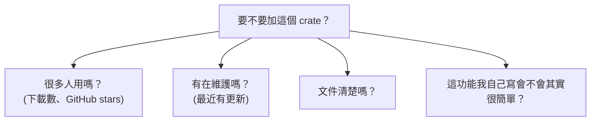

# [rust-7-2] Crate 與 crates.io：怎麼找、加、用別人的套件

> **本章目標**：學會善用 Rust 的套件生態系——從 crates.io 找到合適的 crate，加進專案並使用，站在巨人的肩膀上而不重造輪子。

## 你會學到

- 複習：crate 是什麼、crates.io 是什麼
- 怎麼挑選一個值得信任的 crate
- 用 `cargo add` 加套件、在 `Cargo.toml` 管理
- 版本號的意義（語意化版本）

## 概念說明

### 不要重造輪子

[rust-0-4] 介紹過：crate 是 Rust 的套件，大家把 crate 發布到 **crates.io**，你用 cargo 一行就能下載來用。這一章講「怎麼聰明地用這個生態系」。

核心心法：**別人已經寫好、測好、很多人用的東西，就別自己從頭刻**。要解析 JSON、發 HTTP 請求、產生亂數、處理日期——這些都有成熟的 crate。把時間花在「你的應用獨特的部分」，而不是重造已經很完善的輪子。

> 「重造輪子」與「依賴外部套件」的取捨，和 npm 生態系是同樣的課題 → [課外讀物 E-2：npm 與套件生態](../../../課外讀物/E-2-npm/E-2-1-npm-intro.md)

### 但也別亂加：每個依賴都有成本

加 crate 很爽，但每個依賴都帶來成本：增加編譯時間、擴大「攻擊面」（[資安考量](../../../課外讀物/E-10-security/E-10-1-web-security-overview.md)）、未來要跟著它更新。所以加之前稍微評估：



這張圖在說：挑 crate 時看「使用量、維護狀態、文件、必要性」。一個下載數百萬、持續維護、文件齊全的 crate，通常比你自己刻的可靠。但如果只是「加一個重量級依賴來省三行程式碼」，可能不值得。

## 程式碼範例

### 用 cargo add 加套件

假設要產生亂數，用知名的 `rand` crate：

```bash
cargo add rand
```

這會在 `Cargo.toml` 自動加上：

```toml
[dependencies]
rand = "0.8"
```

然後就能用了：

```rust
use rand::Rng;                       // 引入 rand 提供的能力

fn main() {
    let mut rng = rand::thread_rng();
    let n: i32 = rng.gen_range(1..=6);   // 擲骰子：1 到 6
    println!("你擲出了 {}", n);
}
```

說明：`cargo add rand` 下載並登記依賴，`use rand::Rng` 把它的能力引進來（呼應 [rust-7-1] 的 `use`），接著照它的文件用。`cargo run` 時 cargo 自動處理下載與編譯。

### 讀懂版本號：語意化版本

`Cargo.toml` 裡的 `rand = "0.8"`，這個版本號是有規矩的——**語意化版本（Semantic Versioning）**，格式 `主版本.次版本.修訂版`（例如 `1.4.2`）：

```
主版本 (1)：有「破壞性變更」時 +1（升級可能讓你的程式壞掉，要小心）
次版本 (4)：新增功能、但向後相容時 +1（升級通常安全）
修訂版 (2)：只修 bug 時 +1（升級最安全）
```

`rand = "0.8"` 大致意思是「用 0.8.x 系列的最新版，但不要跳到會破壞相容的版本」。cargo 會幫你在安全範圍內取得更新。

### Cargo.lock：鎖定確切版本

你會發現專案裡有個 `Cargo.lock` 檔。它記錄「這次實際用了每個 crate 的**哪個確切版本**」，確保你和隊友、以及伺服器上跑的是**完全一樣**的版本，避免「我這邊好好的，你那邊卻壞了」。

- **應用程式**：`Cargo.lock` 該進 Git（鎖死版本，確保重現）。
- **函式庫**：通常不進 Git。

> 這和 npm 的 `package-lock.json` 是同樣的概念 → [課外讀物 E-2：npm 與套件生態](../../../課外讀物/E-2-npm/E-2-2-dependencies-vs-devdependencies.md)

### 回收前面的伏筆：anyhow / thiserror

還記得 [rust-4-3] 提的錯誤處理 crate 嗎？現在你會加了：

```bash
cargo add anyhow        # 應用程式的錯誤處理
```

之後就能用 `anyhow::Result` 讓 `?` 更順手。生態系裡有大量這種「讓你少寫樣板」的好 crate，多逛 crates.io 會發現很多寶。

## 小練習

1. 用 `cargo add rand`，寫一支「擲兩顆骰子、印出點數和」的程式。
2. 到 [crates.io](https://crates.io) 搜尋一個你好奇的功能（如 `json`、`http`、`date`），找出下載數最高的那個，看看它的文件首頁。
3. 打開你專案的 `Cargo.toml` 和 `Cargo.lock`，找出 `rand` 被鎖定的「確切版本」，對照 `Cargo.toml` 寫的範圍，理解兩者差別。

## 課外讀物

> 套件生態、語意化版本、lock 檔的完整觀念 → [課外讀物 E-2：npm 與套件生態](../../../課外讀物/E-2-npm/E-2-1-npm-intro.md)

> 第三方依賴會擴大攻擊面，供應鏈安全很重要 → [課外讀物 E-10：Web Security 基礎](../../../課外讀物/E-10-security/E-10-1-web-security-overview.md)

> 下一節：怎麼為你的程式碼寫測試，確保它真的正確 → [rust-7-3]
