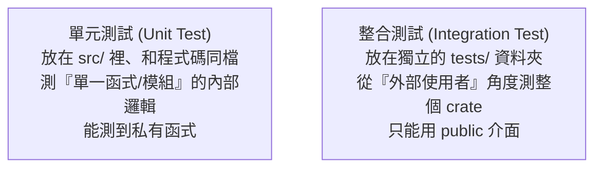

# [rust-7-3] 寫測試：`#[test]`、`cargo test`、單元 vs 整合測試

> **本章目標**：學會為 Rust 程式碼寫自動化測試——Rust 把測試做成語言內建功能，寫起來毫無負擔，讓你能放心地修改程式。

## 你會學到

- 為什麼要寫測試
- 用 `#[test]` 寫測試函式、用 `cargo test` 執行
- `assert!`、`assert_eq!` 斷言巨集
- 單元測試與整合測試的差別

## 概念說明

### 測試是「會自動幫你檢查」的安全網

每次改完程式，你怎麼知道「沒把原本好的東西改壞」？手動一個個試很累、又容易漏。**自動化測試**就是「寫一段程式，去檢查另一段程式的行為對不對」，之後一個指令就能全部重跑一遍。

比喻：測試像「房子的煙霧偵測器」——你裝好之後，它持續默默守著，一有問題（你改壞了某處）就立刻警報，讓你在「出大事之前」就發現。

Rust 對測試特別友善——**它是語言內建的**，不用額外裝框架，把測試和程式碼放在一起即可。這讓「寫測試」的門檻低到沒有藉口不寫。

> 測試的種類、為什麼測試讓你「敢改程式」、測試金字塔 → [課外讀物 E-9：測試](../../../課外讀物/E-9-testing/E-9-1-why-test.md)

## 程式碼範例

### 第一個測試

假設我們有個 `add` 函式要測。在同一個檔案裡這樣寫：

```rust
fn add(a: i32, b: i32) -> i32 {
    a + b
}

#[cfg(test)]                     // 這個區塊只在「測試時」才編譯
mod tests {
    use super::*;                // 把外層的東西（add）引進來

    #[test]                      // 標記：這是一個測試函式
    fn test_add() {
        assert_eq!(add(2, 3), 5);       // 斷言：add(2,3) 應該等於 5
        assert_eq!(add(-1, 1), 0);
    }
}
```

執行測試：

```bash
cargo test
```

你會看到類似：

```
running 1 test
test tests::test_add ... ok

test result: ok. 1 passed; 0 failed
```

逐項說明：

- `#[cfg(test)]`：標記「下面這個模組只在跑測試時才編譯」——所以測試程式碼不會被包進你正式發布的執行檔，零負擔。
- `mod tests { ... }`：習慣把測試放在一個叫 `tests` 的模組裡（呼應 [rust-7-1] 模組）。
- `use super::*;`：把「上一層模組」（也就是 `add` 所在的地方）的東西全引進來，這樣測試裡才能呼叫 `add`。
- `#[test]`：標記一個函式是「測試」。`cargo test` 會自動找出所有 `#[test]` 函式並執行。
- `assert_eq!(實際, 預期)`：**斷言**兩者相等，不相等就讓測試失敗。

### 常用斷言巨集

```rust
#[test]
fn test_various() {
    assert!(2 + 2 == 4);                  // 斷言「條件為真」
    assert_eq!(add(2, 2), 4);             // 斷言「兩者相等」
    assert_ne!(add(2, 2), 5);             // 斷言「兩者不相等」
}
```

說明：`assert!`（條件為真）、`assert_eq!`（相等）、`assert_ne!`（不相等）是三個最常用的斷言。`assert_eq!` 失敗時會貼心地印出「實際值是多少、預期是多少」，方便你查。

### 測試「應該失敗 / 該 panic」的情況

有時你想確認「某個錯誤輸入確實會 panic」：

```rust
fn divide(a: i32, b: i32) -> i32 {
    if b == 0 { panic!("除數不能為零"); }
    a / b
}

#[cfg(test)]
mod tests {
    use super::*;

    #[test]
    #[should_panic(expected = "除數不能為零")]   // 預期這個測試會 panic
    fn test_divide_by_zero() {
        divide(10, 0);
    }
}
```

說明：`#[should_panic]` 表示「這個測試**應該**要 panic 才算通過」——用來驗證你的錯誤處理確實有作用。

### 單元測試 vs 整合測試



這張圖的重點：

- **單元測試**：像上面的例子，和被測的程式碼放在同一個檔案的 `#[cfg(test)]` 模組裡，測「小單位」的邏輯，能存取私有項目。
- **整合測試**：放在專案根目錄的 `tests/` 資料夾，每個檔案是獨立的測試，**只能用公開（`pub`）的 API**——模擬「別人怎麼使用你的 crate」。

兩者互補：單元測試確保「每個零件對」，整合測試確保「組起來也對」。

## 小練習

1. 為 [rust-1-4] 寫過的 `square` 函式寫一個測試，用 `assert_eq!` 驗證 `square(4) == 16`，跑 `cargo test`。
2. 為 [rust-4-1] 的 `safe_divide`（回傳 `Result`）寫測試：驗證 `safe_divide(10, 2)` 是 `Ok(5)`、`safe_divide(1, 0)` 是 `Err(...)`。
3. 故意把 `add` 改錯（例如改成 `a - b`），跑 `cargo test`，看測試「抓到你改壞了」——體會測試當安全網的價值。

## 課外讀物

> 為什麼要測試、測試金字塔、單元/整合/端對端 → [課外讀物 E-9：測試](../../../課外讀物/E-9-testing/E-9-1-why-test.md)

> 測試讓你「敢重構、敢改程式」，是工程紀律的核心 → [課外讀物 E-9-5：測試驅動開發 TDD](../../../課外讀物/E-9-testing/E-9-5-tdd.md)

> 下一節：用文件註解讓你的程式碼自我說明 → [rust-7-4]
