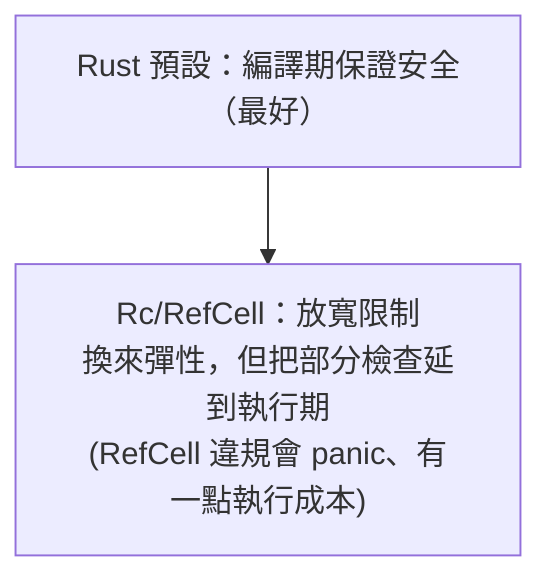

# [rust-8-2] `Rc` 與 `RefCell`：共享所有權與「內部可變性」

> **本章目標**：認識兩個進階智慧指標——`Rc`（讓一份資料被多個擁有者共享）與 `RefCell`（在唯讀的外表下安全地修改內部），以及它們解決的問題。

## 你會學到

- 「唯一擁有者」規則有時太嚴格的情境
- `Rc`：讓一份資料被多人共享（引用計數）
- `RefCell`：「內部可變性」——繞過編譯期借用檢查到執行期
- 這兩者的代價與適用時機

## 概念說明

### 當「唯一擁有者」不夠用

[rust-2-2] 的規則說「一個值只有一個擁有者」。這對單純的情況很好，但有些資料結構天生需要「**多個地方共享同一份資料**」。

例如一個圖：多個節點都「指向」同一個共用節點。這時「唯一擁有者」就卡住了——到底誰擁有那個共用節點？

`Rc`（Reference Counted，引用計數）就是來解這個的。比喻：

```
一般擁有權：一把鑰匙、一個主人。主人走了，房子拆掉。
Rc：       同一個房子發很多把鑰匙給多人。Rc 在旁邊「數還有幾把鑰匙」，
           數到「最後一把也還回來了（沒人用了）」，才拆房子。
```

`Rc` 內部維護一個**計數器**：每多一個共享者 +1，每少一個 -1，歸零時才清理資料。這樣多人能安全共享，又不會有人提早把資料清掉。

> 引用計數其實是一種「迷你 GC」的概念 → **cs 課程 Part 5**（記憶體管理）

## 程式碼範例

### Rc：共享所有權

```rust
use std::rc::Rc;

fn main() {
    let shared = Rc::new(String::from("共用資料"));
    println!("計數：{}", Rc::strong_count(&shared));   // 1

    let a = Rc::clone(&shared);     // 多一個共享者（不是深拷貝！只是計數+1）
    println!("計數：{}", Rc::strong_count(&shared));   // 2

    {
        let b = Rc::clone(&shared);
        println!("計數：{}", Rc::strong_count(&shared));   // 3
    }   // b 離開範圍，計數 -1

    println!("計數：{}", Rc::strong_count(&shared));   // 2
    println!("{} {}", a, shared);
}
```

說明：

- `Rc::new(...)` 建立一個引用計數的共享值。
- `Rc::clone(&shared)`——**注意，這不是深拷貝！** 它只是「多發一把鑰匙」，把計數 +1，大家共享同一份底層資料（很便宜）。
- `Rc::strong_count(&x)` 看現在有幾個共享者。
- 每當一個 `Rc` 離開範圍，計數自動 -1；歸零時底層資料才被清理。

⚠️ 注意：`Rc` **只能用在單執行緒**。多執行緒要用它的線程安全版本 `Arc`（下一節 [rust-8-4]）。

### RefCell：內部可變性

第二個問題：`Rc` 共享的資料是**唯讀**的（多人共享，總不能讓誰隨便改吧）。但有時你就是需要「共享、又能改」。

這就要搭配 **`RefCell`**——它提供「**內部可變性（interior mutability）**」：讓你在「外表看起來不可變」的情況下，安全地修改內部資料。它的訣竅是把 [rust-2-6] 的借用檢查**從編譯期改到執行期**：

```rust
use std::cell::RefCell;

fn main() {
    let data = RefCell::new(5);       // 注意 data 本身不是 mut！

    *data.borrow_mut() += 10;         // 借一個「可變借用」來改
    println!("{}", data.borrow());    // 15（借一個唯讀借用來看）
}
```

說明：

- `RefCell::new(5)`——即使 `data` 不是 `mut`，我們仍能改它內部的值。
- `.borrow_mut()` 拿一個可變借用、`.borrow()` 拿唯讀借用。
- **借用規則（多讀或一寫）仍然存在，只是改在「執行期」檢查**——如果你違反（例如同時拿兩個可變借用），不是編譯失敗，而是**執行時 panic**。這是它和一般借用最大的差別。

### 經典組合：`Rc<RefCell<T>>`

把兩者組起來——`Rc` 給「多人共享」、`RefCell` 給「能改」——就得到「**多個擁有者，且都能修改的共享資料**」：

```rust
use std::rc::Rc;
use std::cell::RefCell;

fn main() {
    let shared = Rc::new(RefCell::new(vec![1, 2, 3]));

    let clone_a = Rc::clone(&shared);
    clone_a.borrow_mut().push(4);     // 透過 a 修改

    shared.borrow_mut().push(5);      // 透過原本的修改

    println!("{:?}", shared.borrow());   // [1, 2, 3, 4, 5]
}
```

說明：`Rc<RefCell<T>>` 是 Rust 裡實作「共享且可變」資料結構（如某些圖、樹）的常見模式。但它有代價——下面說。

### 代價與心法



這張圖的重點：`Rc`/`RefCell` 是「**逃生出口**」——當所有權/借用的預設規則太死、擋住你合理的需求時才用。它們換來彈性，但代價是「部分安全檢查從編譯期挪到執行期」（`RefCell` 借用違規會在執行時 panic，而非編譯時被擋）。所以心法是：**優先用單純的所有權與借用；只在「真的需要共享所有權」時才搬出 `Rc`/`RefCell`。**

## 小練習

1. 用 `Rc` 共享一個 `String`，clone 出三個共享者，用 `Rc::strong_count` 觀察計數變化，再讓其中一個離開範圍看計數下降。
2. 用 `RefCell<i32>` 包一個計數器，多次 `borrow_mut()` 把它加到 10，印出結果（注意 `RefCell` 本身不用 `mut`）。
3. 思考題：`RefCell` 把借用檢查放到執行期，違規時會 panic。比起編譯期就擋下，這「好」還是「不好」？什麼情況下值得這個取捨？

## 課外讀物

> 引用計數作為記憶體管理策略（對比 GC、所有權）→ **cs 課程 Part 5：作業系統（記憶體管理）**

> 下一節：Rust 最自豪的「無懼並行」——多執行緒 → [rust-8-3]
