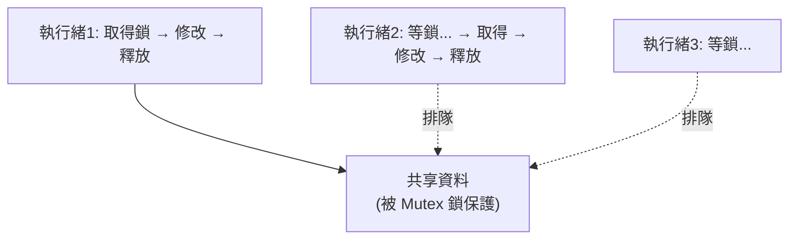

# [rust-8-4] 執行緒間共享資料：`Arc` 與 `Mutex`

> **本章目標**：學會讓多個執行緒安全地共享並修改同一份資料——用 `Arc`（線程安全的共享所有權）搭配 `Mutex`（互斥鎖），這是 Rust 並行程式的核心組合。

## 你會學到

- 為什麼多執行緒共享資料需要特別的工具
- `Arc`：線程安全版的 `Rc`
- `Mutex`：互斥鎖，確保「一次只有一個執行緒能改」
- 經典組合 `Arc<Mutex<T>>`

## 概念說明

### 兩個問題，兩個工具

[rust-8-3] 末尾的問題：多個執行緒要共享同一份「可修改」的資料。這需要解決兩件事：

**問題一：所有權怎麼給多個執行緒？**
[rust-8-2] 的 `Rc` 能共享所有權，但它**不是線程安全的**（它的計數器在多執行緒下會算錯）。線程安全版叫 **`Arc`**（Atomically Reference Counted，原子引用計數）。用法和 `Rc`幾乎一樣，但能安全地跨執行緒。

**問題二：怎麼防止多個執行緒「同時修改」造成資料競爭？**
用 **`Mutex`**（mutual exclusion，互斥鎖）。比喻：

```
Mutex 像「廁所的門鎖」：
    一次只有一個人能進去（持有鎖）。
    其他人要用，得在外面等，直到裡面的人出來（釋放鎖）。
→ 保證「同一時間只有一個執行緒能存取裡面的資料」，杜絕資料競爭。
```



這張圖在說：`Mutex` 讓執行緒「排隊」存取資料——一次一個，輪流來。雖然這會犧牲一點「同時性」，但換來安全。

> 互斥鎖、死結的更完整背景 → **cs 課程 Part 5：並行的麻煩（互斥鎖）**

## 程式碼範例

### Arc + Mutex：經典組合

讓 10 個執行緒一起把同一個計數器加 1：

```rust
use std::sync::{Arc, Mutex};
use std::thread;

fn main() {
    // Arc 讓多執行緒共享所有權；Mutex 保護裡面的計數器
    let counter = Arc::new(Mutex::new(0));
    let mut handles = vec![];

    for _ in 0..10 {
        let counter = Arc::clone(&counter);    // 每個執行緒一份共享所有權
        let handle = thread::spawn(move || {
            let mut num = counter.lock().unwrap();   // 取得鎖（其他人要等）
            *num += 1;                                // 安全地修改
        });   // ← 鎖在這裡（num 離開範圍）自動釋放
        handles.push(handle);
    }

    for handle in handles {
        handle.join().unwrap();     // 等所有執行緒跑完
    }

    println!("最終計數：{}", *counter.lock().unwrap());   // 一定是 10
}
```

逐項說明：

- `Arc::new(Mutex::new(0))`：`Mutex` 把計數器包起來（保護它），`Arc` 讓這份「被保護的計數器」能被多執行緒共享。
- `Arc::clone(&counter)`：每個執行緒拿一份共享所有權（計數 +1，不是深拷貝），然後用 `move` 移進閉包（呼應 [rust-8-3]）。
- `counter.lock().unwrap()`：**取得鎖**。如果別的執行緒正持有鎖，這裡會等到它釋放。取得後回傳一個可變借用 `num`。
- `*num += 1`：在鎖的保護下安全地改。
- **鎖什麼時候釋放？** 當 `num` 離開範圍（閉包結束），鎖**自動釋放**——又是所有權機制在幫忙，不像有些語言要手動 unlock、忘了就死結。
- 最終結果**一定是 10**，不會因為資料競爭而出錯——這在沒有鎖的並行程式裡是不保證的。

### 為什麼非得 Arc + Mutex 一起用？

```
只有 Arc：能共享，但大家只能讀，不能安全地改（資料競爭）。
只有 Mutex：能安全地改，但沒辦法讓多執行緒「共享」這個 Mutex 的所有權。
Arc<Mutex<T>>：共享所有權(Arc) + 安全修改(Mutex) → 兩個問題都解決。
```

而且——如果你忘了用 `Mutex`、試圖讓多執行緒直接改共享資料，**Rust 會編譯失敗**（它知道那不安全）。所以這個組合不只是慣例，很多時候是編譯器逼你寫對。再一次：**無懼並行**。

### 提一下死結

`Mutex` 雖好，但用不好會有**死結（deadlock）**——例如執行緒 A 等 B 持有的鎖、B 又等 A 持有的鎖，兩邊永遠卡住。Rust 的型別系統**擋得了資料競爭，但擋不了死結**（這是邏輯問題）。所以用多個鎖時要小心。死結的成因與避免，是並行程式設計的經典課題。

> 死結的成因與避免策略 → **cs 課程 Part 5：並行的麻煩（死結）**

## 小練習

1. 把本章的計數器例子打出來跑，確認結果一定是 10。試著把執行緒數改成 100，結果應該是 100。
2. 用 `Arc<Mutex<Vec<i32>>>` 讓三個執行緒各自往同一個向量 `push` 一個數字，最後印出向量（順序可能不定，但會有三個元素）。
3. 思考題：如果把上面例子的 `Mutex` 拿掉、讓執行緒直接改共享的數字，Rust 會發生什麼事？（提示：能編譯嗎？）

## 課外讀物

> 互斥鎖、死結、競爭條件的完整原理 → **cs 課程 Part 5：作業系統（並行）**

> 高並發系統的設計與可靠性 → **sre 課程**、**快取課程 Part 6（並發下的一致性）**

> 下一節：另一種並行模型——非同步 async/await → [rust-8-5]
