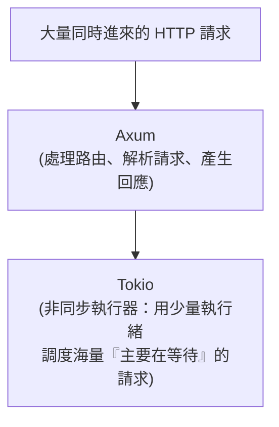

# [rust-9-1] Rust 做 Web 後端的全景：框架選擇與 Tokio

> **本章目標**：在動手寫第一個 Web 服務前，先建立全景——Rust 做後端的生態長怎樣、為什麼選 Axum、以及背後的非同步引擎 Tokio 在做什麼。

## 你會學到

- 為什麼用 Rust 寫 Web 後端（優勢與取捨）
- Rust 後端生態：Axum、Actix、其他
- 為什麼這門課選 Axum
- Tokio：驅動一切的非同步執行器（呼應 [rust-8-5]）

## 概念說明

### 為什麼用 Rust 寫後端？

你在 basic 用 TypeScript、可能聽過 C# 做後端，那為什麼有人用 Rust？

```
優勢：極快、極省資源（沒有 GC 暫停）、編譯期擋掉一大票 bug（含並行）、
      二進位檔小、部署簡單（一個執行檔丟上去就跑）。
取捨：開發速度通常比 TypeScript/Python 慢一些（所有權要顧），
      生態雖然成熟但不如 Node/Java 龐大。
```

適合的場景：**對效能、資源、可靠性要求高**的服務（高流量 API、即時系統、邊緣運算），或你想要「一個又快又不容易出包的後端」。

> Rust 後端做好後，可以接 **infra 課程**（自架部署）或 **aws 課程**（雲端部署），可靠性可接 **sre 課程**。

### Rust 的 Web 框架生態

主要有幾個選擇：

| 框架 | 特點 |
|------|------|
| **Axum** | 由 Tokio 團隊出品，現代、簡潔、和生態整合好，社群成長快 |
| **Actix Web** | 老牌、極高效能，功能完整，但 API 略複雜一些 |
| **Rocket** | 對新手友善、語法漂亮，但歷史上跟進非同步較慢 |

**這門課選 Axum**，因為它：設計現代、和非同步生態（Tokio）天然整合、樣板少、文件好，是目前學習與新專案的熱門首選。學會 Axum 的概念後，換到其他框架也很快上手——核心觀念（路由、handler、請求/回應）是相通的。

### Tokio：背後的非同步引擎

[rust-8-5] 說過：Rust 的 `async`/`await` 需要一個「執行器」來調度，最主流的是 **Tokio**。Web 後端是典型的「IO 密集」場景（大部分時間在等資料庫、等網路），正是非同步的主場——所以幾乎所有 Rust 後端框架都建立在 Tokio 之上。



這張圖在說：Axum 負責「Web 邏輯」（這個網址該由誰處理、怎麼回應），Tokio 在底層負責「**用少少的執行緒，高效地同時招呼成千上萬個連線**」（呼應 [rust-8-5] 的服務生比喻）。你寫 Axum，Tokio 在背後默默讓它能扛高並發。

## 程式碼範例

### 準備專案：加入依賴

這個 Part 我們會建一個新專案，逐步加入需要的 crate。先看看會用到哪些（[rust-7-2] 學過 `cargo add`）：

```bash
cargo new todo_api
cd todo_api
cargo add axum                          # Web 框架
cargo add tokio --features full         # 非同步執行器
cargo add serde --features derive       # JSON 序列化（rust-9-3 會用）
```

`Cargo.toml` 的 `[dependencies]` 會出現：

```toml
[dependencies]
axum = "0.7"
tokio = { version = "1", features = ["full"] }
serde = { version = "1", features = ["derive"] }
```

說明：`tokio` 的 `features = ["full"]` 把 Tokio 的完整功能打開（執行器、網路等）。`serde` 的 `derive` 讓我們之後能用 `#[derive(Serialize)]` 一行讓型別能轉 JSON（呼應 [rust-5-5] 的 derive）。先有印象，下一節就會真的跑起一個服務。

### 心智模型：一個 Web 後端在做什麼

在寫程式前，先建立一個請求從進來到回應的心智模型（你在 basic Part 4 看過類似的）：

```
1. 使用者的瀏覽器/App 發來一個 HTTP 請求
   （例如 GET /todos，想拿所有待辦事項）
2. Axum 根據「網址 + 方法」決定「由哪個函式(handler)處理」 ← 路由
3. 那個 handler 函式執行邏輯（可能去查資料庫）
4. handler 回傳資料，Axum 把它變成 HTTP 回應（常是 JSON）送回去
```

接下來幾節就是把這四步一一實作出來：[rust-9-2] 路由與 handler、[rust-9-3] 請求/回應與 JSON、[rust-9-4] 接資料庫、[rust-9-5] 狀態與錯誤處理、[rust-9-6] 整合成完整的 API。

## 小練習

1. 用自己的話寫出「為什麼 Web 後端適合用非同步（而非每個請求開一個執行緒傻等）」。
2. 建立 `todo_api` 專案並 `cargo add` 上面三個 crate，打開 `Cargo.toml` 確認依賴都在。
3. 查一下：Axum 和 Actix Web 各被哪些公司/專案使用？（搜尋「Axum production」）感受 Rust 後端的真實應用。

## 課外讀物

> 一個 HTTP 請求從瀏覽器到後端的完整旅程 → [課外讀物 E-3：網路通訊基礎](../../../課外讀物/E-3-network/E-3-1-how-internet-works.md)、**basic 課程 Part 4**

> 非同步為什麼是高並發後端的關鍵 → 複習 [rust-8-5]

> 部署上線 → **infra 課程**（自架）、**aws 課程**（雲端）
