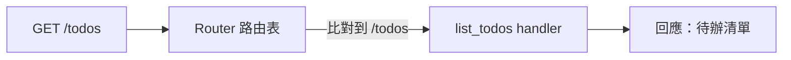

# [rust-9-2] 跑起第一個 HTTP 服務：用 Axum 設定路由與 handler

> **本章目標**：親手用 Axum 跑起一個能回應的 HTTP 伺服器，理解「路由」和「handler」這兩個 Web 後端最核心的概念。

## 你會學到

- 「路由（routing）」是什麼：把網址對應到處理函式
- 「handler」是什麼：處理請求、產生回應的函式
- 用 Axum 寫出最小可運行的伺服器
- 怎麼測試你的伺服器

## 概念說明

### 路由：總機把電話轉給對的人

[rust-9-1] 的心智模型裡，第 2 步是「根據網址決定由誰處理」。這就是**路由（routing）**。比喻：

```
路由像公司的總機：
    來電說「我要找業務部」 → 轉給業務部
    來電說「我要找客服」   → 轉給客服

Web 路由：
    GET  /          → 由「首頁 handler」處理
    GET  /todos     → 由「列出待辦 handler」處理
    POST /todos     → 由「新增待辦 handler」處理
```

每一條路由是「**HTTP 方法 + 路徑**」對應到「一個 **handler 函式**」。`GET`、`POST` 這些是 HTTP 方法（呼應 basic Part 4 / 課外讀物 E-3）——大致上 `GET` 是「拿資料」、`POST` 是「新增資料」。

### Handler：真正幹活的函式

**handler** 就是「**處理某條路由的函式**」——它收到請求，做事，回傳一個回應。最簡單的 handler 就是回傳一段文字。

## 程式碼範例

### 最小可運行的伺服器

把 [rust-9-1] 建好的 `todo_api` 專案，`src/main.rs` 改成：

```rust
use axum::{routing::get, Router};

// 一個 handler：回傳一段文字
async fn root() -> &'static str {
    "你好，這是我的 Rust 伺服器！"
}

#[tokio::main]                                  // 啟動 Tokio 執行器（rust-8-5）
async fn main() {
    // 建立路由表：GET / 交給 root handler
    let app = Router::new().route("/", get(root));

    // 綁定位址、啟動伺服器
    let listener = tokio::net::TcpListener::bind("127.0.0.1:3000")
        .await
        .unwrap();
    println!("伺服器跑在 http://127.0.0.1:3000");
    axum::serve(listener, app).await.unwrap();
}
```

逐項說明：

- `async fn root() -> &'static str`：一個 handler。它是 `async`（[rust-8-5]），回傳一段靜態字串當回應。
- `Router::new().route("/", get(root))`：建立路由表。`.route("/", get(root))` 的意思是「**`GET /` 這條路由，交給 `root` 函式處理**」。
- `#[tokio::main]`：讓 `main` 成為非同步進入點，啟動 Tokio（[rust-9-1]）。
- `TcpListener::bind("127.0.0.1:3000")`：在本機的 3000 埠監聽。`127.0.0.1` 是「本機」。
- `axum::serve(listener, app)`：把路由表 `app` 跑起來，開始接受請求。

### 跑起來、測測看

```bash
cargo run
```

看到「伺服器跑在 http://127.0.0.1:3000」後，**打開瀏覽器**輸入 `http://127.0.0.1:3000`，你會看到那段文字！或用終端機（[課外讀物 E-1](../../../課外讀物/E-1-terminal/E-1-1-what-is-terminal.md)）：

```bash
curl http://127.0.0.1:3000
# 你好，這是我的 Rust 伺服器！
```

恭喜——你的第一個 Rust Web 伺服器跑起來了。`Ctrl + C` 可以停掉它。

### 加更多路由

一個真實的 API 有很多條路由。用 `.route()` 串接即可：

```rust
use axum::{routing::get, Router};

async fn root() -> &'static str { "首頁" }
async fn about() -> &'static str { "關於我們" }
async fn list_todos() -> &'static str { "（待辦清單，之後接資料庫）" }

#[tokio::main]
async fn main() {
    let app = Router::new()
        .route("/", get(root))
        .route("/about", get(about))
        .route("/todos", get(list_todos));     // 多條路由

    let listener = tokio::net::TcpListener::bind("127.0.0.1:3000")
        .await.unwrap();
    axum::serve(listener, app).await.unwrap();
}
```

說明：每條 `.route(路徑, 方法(handler))` 加一條路由。現在 `/`、`/about`、`/todos` 各由不同 handler 處理。`cargo run` 後分別用瀏覽器或 `curl` 試試這三個網址。



這張圖在說：請求進來，Router 依「方法 + 路徑」比對，轉給對應的 handler，handler 產生回應送回。這就是每個 Web 框架的核心運作。

## 小練習

1. 跑起最小伺服器，用瀏覽器和 `curl` 兩種方式確認看到回應。
2. 加一條 `/hello` 路由，handler 回傳「Hello, Rust Web!」，測試它。
3. 把某個 handler 的回傳文字改一改，重新 `cargo run`，確認改動生效。觀察：每次改程式都要重新編譯啟動（之後可查 `cargo watch` 自動重啟）。

## 課外讀物

> HTTP 方法（GET/POST…）、請求與回應的完整概念 → [課外讀物 E-3：網路通訊基礎](../../../課外讀物/E-3-network/E-3-3-http-protocol.md)、**basic 課程 Part 4**

> 下一節：怎麼接收請求帶來的資料、回傳 JSON → [rust-9-3]
