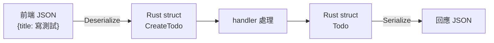

# [rust-9-3] 處理請求與回應：路徑/查詢參數、用 `serde` 做 JSON

> **本章目標**：學會從請求中取出參數，並用 `serde` 把 Rust 的 struct 和 JSON 互相轉換——這是寫 REST API 的日常核心。

## 你會學到

- 從路徑取參數（`/todos/3` 的 `3`）
- 用 struct 描述「一筆資料」，並用 serde 轉成 JSON 回傳
- 從請求的 JSON body 解析出 struct
- `Json` 這個 Axum 提取器（extractor）

## 概念說明

### API 都在傳 JSON

現代 Web API 多半用 **JSON** 當資料格式（你在 basic Part 4 看過）——前端傳 JSON 給後端、後端回 JSON。例如一筆待辦事項長這樣：

```json
{ "id": 1, "title": "學 Rust", "done": false }
```

問題是：Rust 內部用的是 **struct**（[rust-3-1]），JSON 是文字。中間需要「翻譯」：

```
回應時：Rust struct  →（序列化 serialize）→ JSON 文字 → 送給前端
接收時：前端來的 JSON →（反序列化 deserialize）→ Rust struct
```

這個翻譯工作由 **`serde`**（**ser**ialize/**de**serialize）這個 crate 處理——它是 Rust 生態的標準。你只要在 struct 上加 derive 標註（呼應 [rust-5-5]），serde 就自動幫你雙向翻譯。

> JSON 是什麼、為什麼 API 用它 → [課外讀物 E-3：網路通訊基礎](../../../課外讀物/E-3-network/E-3-3-http-protocol.md)、**basic 課程 Part 4**

## 程式碼範例

### 用 struct + serde 回傳 JSON

```rust
use axum::{routing::get, Json, Router};
use serde::Serialize;

#[derive(Serialize)]            // 讓這個 struct 能被「序列化」成 JSON
struct Todo {
    id: u32,
    title: String,
    done: bool,
}

// handler 回傳 Json<Todo> → Axum 自動轉成 JSON 回應
async fn get_todo() -> Json<Todo> {
    let todo = Todo {
        id: 1,
        title: String::from("學 Rust"),
        done: false,
    };
    Json(todo)                 // 包進 Json(...)
}

#[tokio::main]
async fn main() {
    let app = Router::new().route("/todo", get(get_todo));
    let listener = tokio::net::TcpListener::bind("127.0.0.1:3000")
        .await.unwrap();
    axum::serve(listener, app).await.unwrap();
}
```

逐項說明：

- `#[derive(Serialize)]`：一行讓 `Todo` 能被 serde 轉成 JSON（就像 [rust-5-5] 的 `#[derive(Debug)]`，這裡是 serde 提供的）。
- handler 回傳 `Json<Todo>`——把 struct 用 `Json(...)` 包起來，**Axum 會自動序列化成 JSON 回應**，並設好正確的 `Content-Type`。

測試：

```bash
curl http://127.0.0.1:3000/todo
# {"id":1,"title":"學 Rust","done":false}
```

你的 Rust struct 變成 JSON 送出來了。

### 從路徑取參數：`/todos/3`

常見需求：`/todos/3` 想拿「id 為 3」的待辦。用 Axum 的 `Path` 提取器：

```rust
use axum::extract::Path;

// 路由寫成 /todos/:id，:id 是會變動的部分
async fn get_one(Path(id): Path<u32>) -> String {
    format!("你要找 id = {} 的待辦", id)
}

// 路由註冊：.route("/todos/:id", get(get_one))
```

說明：路由路徑裡的 `:id` 是「路徑參數」（會變動的部分）。handler 參數寫 `Path(id): Path<u32>`，Axum 就自動把網址裡的那段抓出來、轉成 `u32` 給你。訪問 `/todos/3` 時 `id` 就是 `3`。

這種「函式參數宣告你要什麼，框架自動幫你準備好」的東西，Axum 叫 **提取器（extractor）**——很優雅，型別還幫你檢查。

### 接收請求的 JSON body：反序列化

前端「新增一筆待辦」時，會 `POST` 一段 JSON 過來。我們用 `Deserialize` + `Json` 提取器把它變成 struct：

```rust
use axum::{routing::post, Json, Router};
use serde::Deserialize;

#[derive(Deserialize)]          // 讓這個 struct 能從 JSON「反序列化」
struct CreateTodo {
    title: String,
}

// 用 Json 提取器：自動把請求 body 的 JSON 解析成 CreateTodo
async fn create_todo(Json(payload): Json<CreateTodo>) -> String {
    format!("已收到新待辦：{}", payload.title)
}

// 路由：.route("/todos", post(create_todo))
```

說明：

- `#[derive(Deserialize)]`：讓 `CreateTodo` 能**從 JSON 解析出來**（和 `Serialize` 相反方向）。
- handler 參數 `Json(payload): Json<CreateTodo>`：Axum 自動把請求的 JSON body 解析成 `CreateTodo`。如果 JSON 格式不對，Axum 會自動回一個錯誤回應——你不用自己處理。

測試（送一段 JSON）：

```bash
curl -X POST http://127.0.0.1:3000/todos \
  -H "Content-Type: application/json" \
  -d '{"title":"寫測試"}'
# 已收到新待辦：寫測試
```



這張圖在說：serde 在「進」和「出」兩個方向上，把 JSON 和 Rust struct 互相翻譯，你的 handler 只需專心處理「乾淨的 struct」。

## 小練習

1. 定義一個 `User` struct（`id`、`name`、`email`），derive `Serialize`，寫一個 handler 回傳一個 `Json<User>`，用 `curl` 確認拿到 JSON。
2. 加一條 `/users/:id` 路由，用 `Path<u32>` 取出 id，回傳「使用者 #id」。
3. 寫一個 `POST /users` 的 handler，用 `Json<CreateUser>`（含 `name`、`email`）接收資料，回傳「已建立使用者 name」。

## 課外讀物

> JSON、HTTP body、Content-Type 的完整概念 → [課外讀物 E-3：網路通訊基礎](../../../課外讀物/E-3-network/E-3-3-http-protocol.md)、**basic 課程 Part 4**

> struct 與 derive → 複習 [rust-3-1]、[rust-5-5]

> 下一節：讓資料真正存進資料庫 → [rust-9-4]
