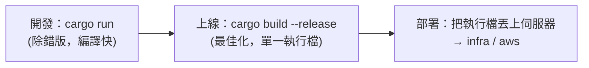

# [rust-9-6] 🏆 整合專案：完整的 REST API（CRUD + 資料庫 + 測試 + 發布）

> **本章目標**：把整本書學到的東西全部串起來，做出一個完整、能上線的待辦事項 REST API——具備完整的 CRUD、資料庫、測試，並打包成正式發布版。這是你的 Rust 畢業專案。

## 你會學到

- 「CRUD」與 REST API 的完整樣貌
- 把前幾節的片段組成一個結構良好的專案
- 為 API 寫測試
- 用 `cargo build --release` 打包正式版

## 概念說明

### 目標：一個完整的 Todo REST API

我們要做的 API 提供對「待辦事項」的完整操作，也就是 **CRUD**——任何資料管理服務的四大基本功：

| 動作 | 全名 | HTTP | 路由 | 意思 |
|------|------|------|------|------|
| **C**reate | 建立 | `POST` | `/todos` | 新增一筆待辦 |
| **R**ead | 讀取 | `GET` | `/todos`、`/todos/:id` | 列出全部 / 查單一筆 |
| **U**pdate | 更新 | `PUT` | `/todos/:id` | 修改一筆 |
| **D**elete | 刪除 | `DELETE` | `/todos/:id` | 刪除一筆 |

這就是 **REST API** 的典型樣貌——用「HTTP 方法 + 資源路徑」表達「對什麼資源做什麼操作」。學會這個模式，任何資源（使用者、商品、訂單…）都是一樣的套路。

> REST、CRUD 的完整概念 → **basic 課程 Part 4（前後端串接）**

## 程式碼範例

### 專案結構

把程式碼依職責分檔（呼應 [rust-7-1] 模組、[課外讀物 E-7-2 單一職責](../../../課外讀物/E-7-solid/E-7-2-srp.md)）：

```
todo_api/
├── Cargo.toml
└── src/
    ├── main.rs       # 啟動：建連線池、組路由、跑伺服器
    ├── models.rs     # 資料型別：Todo、CreateTodo（struct + derive）
    └── handlers.rs   # 各個 handler：list/get/create/update/delete
```

這種「啟動、資料模型、處理邏輯分開」的結構，讓專案清楚好維護。

### models.rs：資料型別

```rust
use serde::{Serialize, Deserialize};

#[derive(Serialize, sqlx::FromRow)]
pub struct Todo {
    pub id: i32,
    pub title: String,
    pub done: bool,
}

#[derive(Deserialize)]
pub struct CreateTodo {
    pub title: String,
}

#[derive(Deserialize)]
pub struct UpdateTodo {
    pub title: String,
    pub done: bool,
}
```

說明：三個 struct 分別對應「回傳的待辦」「建立時收的資料」「更新時收的資料」。`Serialize` 給回傳用、`Deserialize` 給接收用（[rust-9-3]）。記得 `pub`（[rust-7-1]）讓其他模組能用。

### handlers.rs：CRUD handler（節選）

```rust
use axum::{extract::{State, Path}, http::StatusCode, Json};
use sqlx::PgPool;
use crate::models::{Todo, CreateTodo, UpdateTodo};

// R：列出全部
pub async fn list(State(pool): State<PgPool>)
    -> Result<Json<Vec<Todo>>, StatusCode>
{
    let todos = sqlx::query_as::<_, Todo>("SELECT id, title, done FROM todos ORDER BY id")
        .fetch_all(&pool).await
        .map_err(|_| StatusCode::INTERNAL_SERVER_ERROR)?;
    Ok(Json(todos))
}

// C：新增
pub async fn create(State(pool): State<PgPool>, Json(input): Json<CreateTodo>)
    -> Result<(StatusCode, Json<Todo>), StatusCode>
{
    let todo = sqlx::query_as::<_, Todo>(
        "INSERT INTO todos (title) VALUES ($1) RETURNING id, title, done")
        .bind(&input.title)              // 參數化查詢，防 SQL injection（rust-9-4）
        .fetch_one(&pool).await
        .map_err(|_| StatusCode::INTERNAL_SERVER_ERROR)?;
    Ok((StatusCode::CREATED, Json(todo)))    // 201 Created
}

// D：刪除
pub async fn delete(State(pool): State<PgPool>, Path(id): Path<i32>)
    -> StatusCode
{
    let result = sqlx::query("DELETE FROM todos WHERE id = $1")
        .bind(id).execute(&pool).await;
    match result {
        Ok(r) if r.rows_affected() > 0 => StatusCode::NO_CONTENT,  // 204 刪除成功
        Ok(_) => StatusCode::NOT_FOUND,                            // 404 沒這筆
        Err(_) => StatusCode::INTERNAL_SERVER_ERROR,              // 500
    }
}
// get（查單一）、update 同理，留作練習
```

說明：每個 handler 對應一個 CRUD 操作，整合了你學過的一切——`State`（[rust-9-5]）、`Path`/`Json` 提取器（[rust-9-3]）、`sqlx` 參數化查詢（[rust-9-4]）、`Result` → 狀態碼（[rust-9-5]）。`create` 成功回 `201 Created`、`delete` 成功回 `204 No Content`，都是 REST 的慣例。

### main.rs：組裝起來

```rust
mod models;
mod handlers;

use axum::{routing::{get, post, put, delete}, Router};
use sqlx::postgres::PgPoolOptions;

#[tokio::main]
async fn main() {
    let db_url = std::env::var("DATABASE_URL").expect("請設定 DATABASE_URL");
    let pool = PgPoolOptions::new().max_connections(5)
        .connect(&db_url).await.expect("資料庫連線失敗");

    let app = Router::new()
        .route("/todos", get(handlers::list).post(handlers::create))
        .route("/todos/:id",
            get(handlers::get_one)
            .put(handlers::update)
            .delete(handlers::delete))
        .with_state(pool);

    let listener = tokio::net::TcpListener::bind("127.0.0.1:3000")
        .await.unwrap();
    println!("Todo API 跑在 http://127.0.0.1:3000");
    axum::serve(listener, app).await.unwrap();
}
```

說明：`mod models; mod handlers;` 載入兩個模組（[rust-7-1]）。路由用 `.route()` 把不同 HTTP 方法綁到對應 handler——注意同一個路徑 `/todos/:id` 可以串 `get`/`put`/`delete` 不同方法。`.with_state(pool)` 分享連線池。整個 API 就這樣組起來了。

### 測試 API

為 handler 邏輯寫測試（[rust-7-3]）。也可以啟動伺服器後用 `curl` 跑一輪完整流程：

```bash
# 新增
curl -X POST localhost:3000/todos -H "Content-Type: application/json" -d '{"title":"學 Rust"}'
# 列出
curl localhost:3000/todos
# 刪除 id=1
curl -X DELETE localhost:3000/todos/1
```

走一遍 CRUD，確認每個操作都正常、狀態碼正確。這種「端對端」的手動測試配上單元測試，能給你信心。

### 打包正式發布版

開發時 `cargo run` 跑的是「除錯版」（編譯快、但執行較慢、檔案大）。要上線，編譯**正式版**：

```bash
cargo build --release
```

產物在 `target/release/todo_api`——一個**獨立的執行檔**。Rust 後端部署的一大優勢就在這：你不用在伺服器裝一整套執行環境（不像 Node 要裝 node_modules），**把這一個檔案丟上去就能跑**。`--release` 版開了完整最佳化，跑得飛快。



這張圖在說：開發時用 `cargo run` 快速迭代，要上線時 `--release` 打包成最佳化的單一執行檔，接著就能用 **infra 課程**（自架）或 **aws 課程**（雲端）的方法部署。

## 小練習

1. 把這個 Todo API 完整跑起來：補完 `get_one`（查單一，404 處理）和 `update`（PUT 更新）兩個 handler，讓整套 CRUD 都能用。
2. 為至少一個 handler 寫單元測試（[rust-7-3]），或寫一個腳本用 `curl` 跑完整的「新增→查詢→更新→刪除」流程。
3. 用 `cargo build --release` 打包，找到產生的執行檔，直接執行它（記得先設好 `DATABASE_URL`），確認不靠 `cargo` 也能跑。

## 課外讀物

> 🎓 **恭喜你完成 Rust 課程！** 從所有權到 Web 後端，你已經掌握了 Rust 的核心。

> 接下來把這個 API 部署上線 → **infra 課程**（自架伺服器、Nginx、容器）或 **aws 課程**（雲端部署）

> 讓你的服務「跑得可靠」（監控、告警、SLO）→ **sre 課程**

> 為 API 加上快取以提升效能 → **快取課程**

> REST、前後端串接的完整脈絡 → **basic 課程 Part 4**；API 安全 → [課外讀物 E-10：Web Security](../../../課外讀物/E-10-security/E-10-1-web-security-overview.md)
