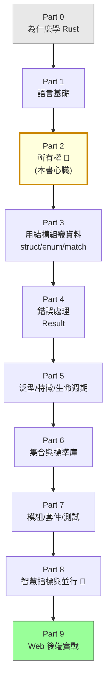

# Rust 程式設計課程大綱

> **核心理念**：Rust 想同時做到兩件「以前很難兼得」的事——**像 C/C++ 一樣快**，又**像有 GC 的語言一樣安全**（不會有記憶體洩漏、不會讀到已釋放的記憶體）。
> 它靠的是一套獨特的「所有權（Ownership）」系統，讓編譯器在你按下編譯的當下就幫你抓出一整類記憶體與並行的 bug。這門課假設你**沒寫過 Rust**，從零開始，慢慢把最難的「所有權」講透，最後你能用 Rust 寫出安全、高效、可上線的程式。

---

## 這門課的定位

| | 說明 |
|---|------|
| **適合對象** | 想學一門「又快又安全」的系統級語言的人；想理解記憶體到底怎麼回事的人；想用 Rust 寫**高效能 Web 後端**的人（也適用 CLI、嵌入式、WebAssembly）。**沒寫過 Rust 也能從頭學起。** |
| **目標** | 學完能：理解並駕馭 Rust 的**所有權、借用、生命週期**；用 struct / enum / trait 組織程式；用 `Result` 做穩健的錯誤處理；寫測試、用 Cargo 管理專案；並用 **Axum + 資料庫做出一個能上線的 Web 後端 API**。 |
| **建議（非必須）** | 有 **basic 課程**的程式基礎（變數、函式、流程控制）會更好上手。若先讀過 **cs 課程（計算機概論）** 的「記憶體、堆疊與堆積、作業系統」（Part 3、5），會更快看懂 Rust 為什麼這樣設計。 |
| **這門課 vs basic / csharp** | basic（TypeScript）、csharp（C#）是**有垃圾回收（GC）的應用層語言**；Rust 是**沒有 GC 的系統層語言**——你要自己（在編譯器協助下）管理記憶體。這正是它快、也是它難的原因。 |

> 通用知識（測試、SOLID、錯誤處理設計、Git）在頂層 `課外讀物/`（E-6、E-7、E-9、E-8），本課會在需要時交叉引用，不重複造輪子。
> 標 🦀 的是**Rust 獨有、別的語言沒有的硬核概念**（要慢慢嚼），標 🏆 的是**整合專案**。

> **本課的深度設計**：Part 2「所有權」是整本書的心臟，會用最多篇幅、最多圖解慢慢講——這裡卡住是正常的，每個人都會卡。撐過去之後，後面的一切都會變得順理成章。

---

## 學習路徑總覽

> 脈絡：**先打好語言基礎 → 翻過「所有權」這座山（本書心臟）→ 用 struct/enum/trait 組織程式、穩健處理錯誤 → 進階到泛型、並行 → 最後做一個完整專案。** 過了 Part 2，後面就是下坡。

---

## Part 0 — 開始之前：為什麼是 Rust

### 章節列表

- `rust-0-1` 為什麼學 Rust？它想同時解決「快」與「安全」這對老冤家
- `rust-0-2` Rust 站在哪：和 C/C++、Go、TypeScript/C# 的定位比較
- `rust-0-3` 環境準備：安裝 `rustup`、`cargo`，跑出第一個 Hello World
- `rust-0-4` Cargo 入門：建專案、編譯、執行、加套件（crate）的日常流程

---

## Part 1 — 語言基礎

> 先把「不靠所有權也能懂」的語法基礎打好，下一個 Part 再進入硬核。

### 章節列表

- `rust-1-1` 變數與不可變性：為什麼 Rust 預設變數「不能改」（`let` vs `let mut`）
- `rust-1-2` 基本型別：整數、浮點數、布林、字元，與「為什麼型別這麼講究」
- `rust-1-3` 複合型別：tuple（元組）與 array（陣列）
- `rust-1-4` 函式與「表達式導向」：為什麼 Rust 的 if 可以當值用
- `rust-1-5` 控制流程：`if` / `loop` / `while` / `for`
- `rust-1-6` 巨集初探：`println!` 後面那個 `!` 是什麼

---

## Part 2 — 所有權（Ownership）：Rust 的心臟 🦀

> 這是 Rust 最獨特、最難、也最重要的部分。別人用 GC 或手動 `free` 解決的記憶體問題，Rust 用「所有權」在編譯期解決。整個 Part 用大量圖解，慢慢來。

### 章節列表

- `rust-2-1` 記憶體的根本問題：堆疊 vs 堆積，為什麼別的語言要嘛 GC、要嘛容易出錯（呼應 cs 課程 Part 3、5）
- `rust-2-2` 🦀 所有權三原則：每個值都有唯一的「擁有者」
- `rust-2-3` 🦀 Move（移動）：為什麼把變數賦值給別人後，原本的就「不能用了」
- `rust-2-4` Clone 與 Copy：什麼時候是深拷貝、什麼時候是廉價複製
- `rust-2-5` 🦀 借用（Borrowing）與參考 `&`：不奪走所有權地「借來用一下」
- `rust-2-6` 🦀 可變借用與借用規則：為什麼「同時只能有一個可變借用」能防止一整類 bug
- `rust-2-7` Slice（切片）：安全地借用「一部分」（字串與陣列）
- `rust-2-8` 生命週期初探（Lifetimes）：參考不能活得比它指向的資料還久

---

## Part 3 — 用結構組織資料

> 學會把資料包成有意義的型別，並用 Rust 招牌的 `enum` + `match` 處理各種情況。

### 章節列表

- `rust-3-1` Struct：定義你自己的資料型別
- `rust-3-2` 方法與 `impl`：把行為綁到型別上
- `rust-3-3` 🦀 Enum：列舉的真正威力（每個變體還能帶資料）
- `rust-3-4` 🦀 `Option`：Rust 怎麼用型別系統「消滅 null」
- `rust-3-5` 模式比對 `match`：強大又安全的分支（編譯器逼你處理每種情況）
- `rust-3-6` `if let` / `while let`：更簡潔的模式比對

---

## Part 4 — 錯誤處理

> Rust 不用例外（exception），而是用型別把錯誤「攤在陽光下」，強迫你面對它。

### 章節列表

- `rust-4-1` 兩種錯誤：可恢復的（`Result`）vs 不可恢復的（`panic!`）
- `rust-4-2` `Result` 與 `?` 運算子：優雅地把錯誤往上傳
- `rust-4-3` 錯誤處理的好習慣：有意義的錯誤、別吞掉錯誤（呼應課外讀物 E-6-8）

---

## Part 5 — 泛型、特徵、生命週期

> Rust 抽象與複用的三大支柱。特徵（trait）特別重要——它是 Rust 版的「介面」。

### 章節列表

- `rust-5-1` 泛型（Generics）：同一段邏輯，適用多種型別
- `rust-5-2` 🦀 特徵（Traits）：Rust 的「介面」——定義「能做什麼」（呼應課外讀物 E-7-5 ISP）
- `rust-5-3` 特徵作為參數與回傳值：寫出彈性的函式
- `rust-5-4` 生命週期進階：標註語法與「省略規則」為什麼大多時候不用寫
- `rust-5-5` 常用標準特徵：`Debug` / `Clone` / `PartialEq` / `Default` 與 `#[derive]`

---

## Part 6 — 常用集合與標準函式庫

> 日常寫 Rust 最常用到的工具——以及那個讓無數新手困惑的 `String` vs `&str`。

### 章節列表

- `rust-6-1` `Vec`：可成長的動態陣列（呼應 dsa 課程的動態陣列）
- `rust-6-2` 🦀 `String` vs `&str`：Rust 字串的兩面，與最常見的初學困惑
- `rust-6-3` `HashMap`：鍵值對的集合
- `rust-6-4` 迭代器（Iterator）：`map` / `filter` / `collect` 的函式式威力（零成本抽象）
- `rust-6-5` 閉包（Closures）：能捕捉環境的匿名函式

---

## Part 7 — 模組、套件與測試

> 把程式碼組織好、用上整個生態系、並寫測試保證正確——讓專案能長大。

### 章節列表

- `rust-7-1` 模組系統：`mod` / `use` / `pub` 怎麼組織與隱藏程式碼
- `rust-7-2` Crate 與 crates.io：怎麼找、加、用別人的套件
- `rust-7-3` 寫測試：`#[test]`、`cargo test`、單元 vs 整合測試（呼應課外讀物 E-9）
- `rust-7-4` 文件註解與 `cargo doc`：讓程式碼自我說明

---

## Part 8 — 進階：智慧指標與並行 🦀

> Rust 的進階武器——更靈活的記憶體模型，以及它最自豪的「無懼並行（fearless concurrency）」。

### 章節列表

- `rust-8-1` 智慧指標 `Box`：把資料放到堆積上、遞迴型別
- `rust-8-2` 🦀 `Rc` 與 `RefCell`：共享所有權與「內部可變性」
- `rust-8-3` 並行（Concurrency）：執行緒，與「為什麼 Rust 的並行『無懼』」（編譯期擋掉資料競爭）
- `rust-8-4` 執行緒間共享資料：`Arc` 與 `Mutex`（呼應 cs 課程 Part 5 的並行問題）
- `rust-8-5` 非同步初探：`async` / `await` 是什麼、何時用（概念）

---

## Part 9 — Web 後端實戰

> 把學到的全部串起來，用 Rust 做一個能跑、能連資料庫、能上線的 **Web 後端 API**。這是本書的最終目標。

### 章節列表

- `rust-9-1` Rust 做 Web 後端的全景：生態系與框架選擇（Axum / Actix），以及 `async` runtime `Tokio` 在背後做什麼（接 `rust-8-5`）
- `rust-9-2` 跑起第一個 HTTP 服務：用 Axum 設定路由與 handler，回傳第一個回應
- `rust-9-3` 處理請求與回應：路徑/查詢參數、用 `serde` 做 JSON 序列化與反序列化
- `rust-9-4` 接資料庫：用 `sqlx` 連 PostgreSQL、做查詢與寫入（呼應 basic Part 5、課外讀物 E-4）
- `rust-9-5` 共享狀態與錯誤處理：應用程式狀態、把 `Result` 轉成乾淨的 HTTP 錯誤回應（呼應 `rust-4-x`、課外讀物 E-6-8）
- `rust-9-6` 🏆 整合專案：做一個完整的 REST API（CRUD + 資料庫 + 測試 + `cargo build --release` 發布）

---

## 與其他課程 / 課外讀物的對照

| Rust 章節 | 對應的課程 / 課外讀物 | 關係 |
|---------|---------------------|------|
| `rust-2-x` 所有權、堆疊堆積 | **cs 課程** Part 3、5（記憶體、作業系統） | cs 講原理，Rust 是「把原理變成語言規則」 |
| `rust-5-2` 特徵（Traits） | 課外讀物 E-7-5（ISP）、basic OOP | Rust 用 trait + 組合，而非繼承 |
| `rust-4-x` 錯誤處理 | 課外讀物 E-6-8 | 錯誤處理設計原則的 Rust 實踐 |
| `rust-6-1` `Vec`、`rust-6-3` `HashMap` | **dsa 課程** Part 2、3 | 用 Rust 對照資料結構的實作 |
| `rust-7-3` 測試 | 課外讀物 E-9 | 測試觀念的 Rust 實踐 |
| `rust-8-x` 並行 | **cs 課程** Part 5、**sre 課程** | 並行問題的語言級解法 |
| `rust-9-x` Web 後端 | **basic 課程** Part 4-5、**csharp 課程** | 用 Rust 做後端 API，對照 TS/C# 的另一條路線 |
| `rust-9-6` 發布部署 | **infra 課程**、**aws 課程** | 後端做好後可接自架或上雲部署 |

> 想先懂「記憶體、堆疊堆積、並行」的底層原理 → 先讀 **cs 課程（計算機概論）** Part 3、5
> 想對照資料結構的實作 → 參見 **dsa 課程**
> 想深入錯誤處理 / 測試 / 介面設計的通用原則 → 參見 **課外讀物 E-6、E-9、E-7**
> 後端 API 做好後想部署上線 → 參見 **infra 課程**（自架）或 **aws 課程**（雲端）

---

## 課程統計

| Part | 主題 | 章節數 | 標記 |
|------|------|--------|:---:|
| 0 | 為什麼學 Rust | 4 | |
| 1 | 語言基礎 | 6 | |
| 2 | 所有權（本書心臟） | 8 | 4 🦀 |
| 3 | 用結構組織資料 | 6 | 2 🦀 |
| 4 | 錯誤處理 | 3 | |
| 5 | 泛型/特徵/生命週期 | 5 | 1 🦀 |
| 6 | 集合與標準庫 | 5 | 1 🦀 |
| 7 | 模組/套件/測試 | 4 | |
| 8 | 智慧指標與並行 | 5 | 2 🦀 |
| 9 | Web 後端實戰 | 6 | 🏆 |
| **合計** | | **52** | **10 🦀 + 🏆** |
