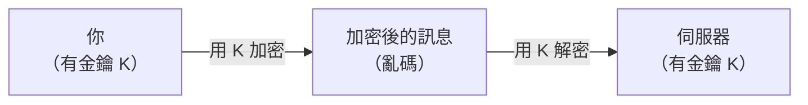
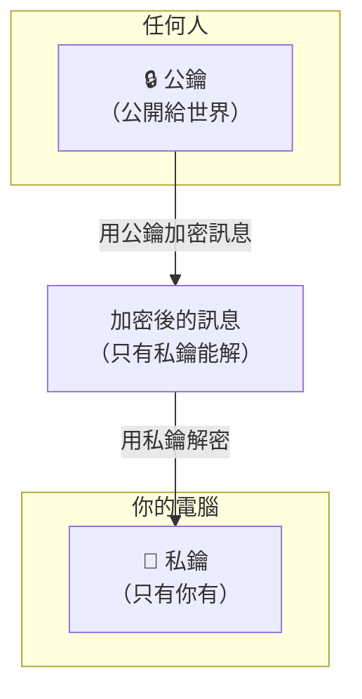
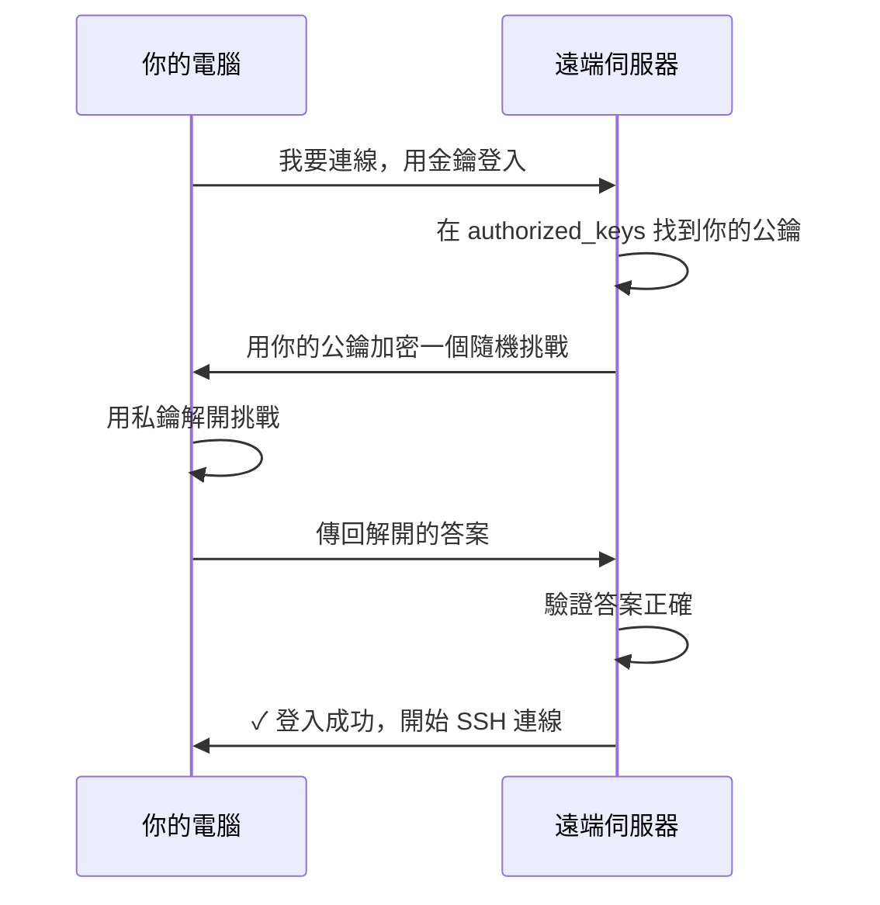

# [E-1-7] SSH 是什麼：從「怎麼說悄悄話」到「連進遠端伺服器」

> **你會了解**：加密通訊的核心概念（對稱加密 vs 非對稱加密）、SSH 如何利用公私鑰保護連線，以及為什麼用金鑰登入比密碼更安全。

---

## 你在東京有一台電腦

假設你在台灣，但你的應用程式跑在東京的一台伺服器上。現在伺服器出問題了，你需要進去看 log、重啟服務。

你不可能飛去東京坐到那台機器前面。

你需要的，是一種方法——讓你在台灣的鍵盤輸入指令，跨越幾千公里的網路，在東京那台機器上執行。而且要**安全**，不能讓路上的任何人偷看你輸入了什麼、竄改你的指令。

這就是 **SSH**（Secure Shell）解決的問題。

但要理解 SSH 怎麼做到「安全」，要先從更基本的問題說起：**怎麼在網路上說悄悄話？**

---

## 第一步：加密是什麼

最直覺的加密概念，從古羅馬就有了。

凱薩大帝傳遞軍事情報時，會把每個字母往後移三位：`A → D`、`B → E`、`HELLO → KHOOR`。

敵人截到信，看到的是 `KHOOR`，不知道是什麼意思。接收方知道「往回移三位」的規則，就能解讀。

這個「移三位」就是**金鑰（key）**。知道金鑰才能解密。

現代的加密算法複雜一百萬倍，但核心概念是一樣的：**用金鑰把資料變成亂碼，用金鑰把亂碼還原回來**。

---

## 第二步：對稱加密的致命問題

你和遠端伺服器要加密通訊，最直覺的方式是：

```
雙方事先講好一個密碼（金鑰）
→ 傳資料前用這個密碼加密
→ 對方收到後用同一個密碼解密
```

這叫做**對稱加密**——加密和解密用的是**同一把金鑰**。



這張圖說的是：雙方都持有同一把金鑰 K，資料加密後傳輸，對方再用同一把金鑰解密。

對稱加密**速度很快**，現代傳輸大量資料用的也是這類加密。問題只有一個，但這個問題是致命的：

> **金鑰怎麼傳給對方？**

你總要有個辦法告訴伺服器「金鑰是 abc123」。但如果有人在監聽你們的通訊，他也會知道金鑰是 abc123，之後的加密就全部破防了。

用加密的方式傳金鑰？那你要先有另一把金鑰……這是個無限迴圈。

第一次連線的時候，雙方要怎麼在公開的網路上，協商出一個「只有彼此知道的秘密」？

這個問題困擾了密碼學家幾千年，直到 1970 年代才有人想出一個天才的解法。

---

## 第三步：非對稱加密的魔術

1976 年，Diffie 和 Hellman 提出了一個反直覺的想法：

> 如果加密和解密，用的是**不同的兩把鑰匙**呢？

這就是**非對稱加密**，又叫做**公私鑰加密**。

它的運作方式是這樣的：

```
你生成一對鑰匙：
  - 公鑰（Public Key）：可以公開給任何人
  - 私鑰（Private Key）：絕對不能給任何人，只有你自己保管

規則：
  用公鑰加密的東西，只有私鑰能解開
  用私鑰加密的東西，只有公鑰能解開
```

這兩把鑰匙是數學上綁定的一對，但知道其中一把，幾乎不可能推算出另一把。

用一個具體的比喻來說明：

```
想像你做了一個特殊的掛鎖：
  - 這個掛鎖（公鑰）可以大量複製，隨便給人
  - 但鑰匙（私鑰）只有你有一把

任何人拿到掛鎖，可以把訊息鎖進盒子裡
但只有你手上的鑰匙能打開
```



這張圖說的是：公鑰公開讓任何人加密，但只有持有私鑰的你才能解密。

這個設計解決了金鑰交換的問題：你可以把公鑰貼到網路上、廣播給全世界，完全不怕被人截走——因為沒有私鑰，截走的人什麼也做不到。

---

## 第四步：SSH 怎麼用這個

SSH 連線建立時，大致分兩個階段：

**第一階段：建立加密通道**

雙方協商一把臨時的對稱金鑰（Session Key），之後的通訊都用它加密。這個協商過程本身用了非對稱加密來保護，所以協商內容不會被監聽。

**第二階段：驗證你是誰**

通道建好了，但伺服器還不知道你是不是被允許進來的人。這裡有兩種方式：

---

### 方式一：密碼登入

最直觀。你輸入密碼，透過加密通道傳給伺服器，伺服器驗證。

問題是：
- 密碼可以被暴力破解（試很多次）
- 密碼容易被釣魚詐騙騙走
- 伺服器要儲存你的密碼（或其 hash），這是一個攻擊面

### 方式二：金鑰登入（更安全）

這才是真正的 SSH 精髓。流程是這樣的：

```
事前準備：
  1. 你在自己電腦上生成一對公私鑰
  2. 把公鑰複製到伺服器的 ~/.ssh/authorized_keys 檔案裡

連線時：
  1. 你連上伺服器，說「我要用金鑰登入」
  2. 伺服器從 authorized_keys 找到你的公鑰
  3. 伺服器生成一個隨機挑戰（challenge），用你的公鑰加密後傳給你
  4. 只有你的私鑰能解開它——你解開之後回傳給伺服器
  5. 伺服器確認你能解開，代表你確實持有私鑰，登入成功
```



這張圖說的是：整個驗證過程，你的私鑰從來不需要離開你的電腦——伺服器只需要確認「你能解開只有私鑰才能解的東西」。

為什麼這比密碼更安全？

- **私鑰永遠不傳出去**：就算通道被監聽，也沒有可以被截走的密碼
- **無法暴力破解**：現代私鑰的長度讓暴力破解在宇宙熱寂前都算不完
- **伺服器不儲存你的秘密**：authorized_keys 裡只有公鑰，就算伺服器被入侵，攻擊者拿到公鑰也沒用

---

## 第五步：那些檔案是什麼

執行 `ssh-keygen` 之後，你的 `~/.ssh/` 資料夾裡會多出兩個檔案：

```
~/.ssh/
  id_ed25519        ← 私鑰（這個絕對不能給別人）
  id_ed25519.pub    ← 公鑰（可以公開）
```

打開 `.pub` 檔案看看，裡面長這樣：

```
ssh-ed25519 AAAAC3NzaC1lZDI1NTE5AAAAI... your_email@example.com
```

這一串看起來像亂碼的東西，就是你的公鑰。你把它貼到 GitHub 的 SSH Keys 設定頁面，GitHub 就會把它存進 `authorized_keys`——之後你每次 `git push`，走的就是上面那個金鑰驗證流程。

`ed25519` 是目前推薦的加密算法（你也可能看過舊的 `rsa`）。Ed25519 的優點是金鑰短、速度快、安全性高。

---

## 一個加密算法為什麼叫 Ed25519？

小補充：`ed25519` 是「Edwards-curve Digital Signature Algorithm on Curve25519」的縮寫。Curve25519 是一條橢圓曲線，由密碼學家 Daniel J. Bernstein 在 2005 年設計。

這條曲線的特性讓它在同樣的安全等級下，可以用比傳統 RSA 短得多的金鑰達成——RSA 要 4096 bits 才安全，Ed25519 只要 256 bits。

取名為 25519 是因為這條曲線的方程式建立在 **2²⁵⁵ − 19** 這個質數上。純粹數學美感。

---

## 小結

```
古典加密：同一把金鑰加解密
    ↓ 問題：金鑰怎麼安全地傳給對方？

非對稱加密：公鑰加密、私鑰解密
    ↓ 解法：公鑰公開、私鑰自己保管

SSH 的連線流程：
  1. 協商加密通道（保護所有後續通訊）
  2. 用金鑰驗證身份（比密碼更安全）

金鑰登入為什麼安全：
  私鑰永不離開你的電腦
  伺服器只存公鑰
  無法暴力破解
```

下次你執行 `git push`，背後走的就是這整套機制——你的私鑰對伺服器的挑戰簽名，GitHub 用公鑰驗證，確認是你本人，然後推送。

整個過程幾百毫秒，你感覺不到。

---

## 延伸閱讀

> 想了解 HTTPS 和 TLS 如何保護你的網路瀏覽 → [課外讀物 E-3-2：HTTPS 與 TLS：為什麼網址前面要有那把鎖](../../課外讀物/E-3-network/E-3-2-https-tls.md)

> 想設定 GitHub 多帳號的 SSH 金鑰 → [GitHub SSH 多帳號設定筆記](../../notes/github-ssh-setup.md)
